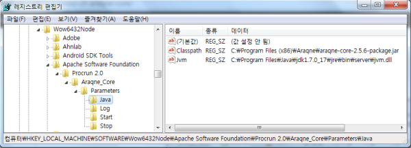

# 1장. 로그프레소 설치 #

## 1.1. JVM 실행 옵션 ##

아라크네 코어는 로그프레소를 구동하는 OSGi 애플리케이션 서버입니다. 로그프레소가 설치될 환경(CPU 코어 수, 물리 메모리 크기, 실시간 로그 입력량)에 맞추어 실행 매개변수를 조정할 수 있습니다.

자바 가상머신의 실행 매개변수에 따라 성능이 큰 폭으로 좌우될 수 있습니다:

### 1.1.1. 메모리 설정 ###

 * -Xms: 최소 자바 힙 메모리 양을 지정합니다. 최대치와 같게 설정하면, 실행 초기에 메모리 영역을 확장 및 재배치하면서 발생하는 성능 저하를 최소화 할 수 있습니다.
 * -Xmx: 최대 자바 힙 메모리 양을 지정합니다. 캐시로 사용할 크기는 제외한 최대 메모리 크기를 지정합니다. 일반적으로 코어 수가 많을수록 메모리를 크게 잡아야 합니다. 하지만 100GB 단위로 너무 크게 잡아도 GC로 인한 큰 지연시간이 발생하므로, 시스템 사양에 따라 시험 및 조정이 필요합니다.
 * -XX:MaxPermSize: Jython 스크립트 등 클래스 동적 생성을 자주 사용한다면 PermGen 영역을 크게 잡아야 합니다. 일반적으로는 300M 정도면 충분합니다.
 * -XX:MaxDirectMemorySize: 다이렉트 버퍼를 사용하여 직접 메모리 할당이 가능한 메모리 영역의 최대 크기를 지정합니다. 이후에 다루겠지만, 캐시되는 데이터는 다이렉트 버퍼를 사용하므로 전체 캐시 용량의 총합보다 크게 지정해야 합니다. 만약 지정하지 않으면 -Xmx 설정과 동일한 값을 사용하게 됩니다. 다이렉트 버퍼 메모리가 모자라면 실행 중 OutOfMemoryException이 발생할 수 있습니다.
 * -XX:NewRatio: YoungGen과 OldGen의 비율을 설정합니다. 예를 들어, NewRatio가 2이면 YoungGen과 OldGen이 1:2의 비율로 설정됩니다. 이 비율은 수명주기가 짧은 개체와 긴 개체의 비율이 어느 정도이냐에 따라 달라지는데, GC 통계를 보고 튜닝할 수 있습니다. 일반적으로 코어 수가 많을수록 YoungGen을 크게 설정할 필요가 있습니다. 물리 코어 수가 16개 이상일 때는 NewRatio를 1이나 2로 설정할 것을 권장합니다.

리눅스의 경우 glibc 메모리 풀 관련해서 반드시 아래 환경변수를 미리 설정해야 합니다:

~~~~
	export MALLOC_ARENA_MAX=1 (링크1, 링크2)
~~~~

CPU 코어 수에 따라 가변적이지만 일반적인 구성은 아래와 같습니다:

| 물리메모리	| 운영체제/기타 | 자바 힙 | 다이렉트 버퍼 | 역인덱스 캐시 | 블룸필터 L0 캐시 | 블룸필터 L1 캐시 |
|----------|-------------|-------|------------|-------------|----------------|----------------|
| 8G       |  2G         |	4G   | 2G          | 0G         | 0.5G           | 0.5G           |
| 16G      | 4G          |  6G   | 6G          | 0G         | 2.5G           | 2.5G           |
| 32G      | 4G          |  8G   | 20G         | 7G         | 6G             | 5G             |
| 64G      | 8G          |  12G  | 44G         | 24G        | 9G             | 7G             |
| 128G     | 12G         |  16G  | 100G        | 67G        | 15G            | 12G            |
| 256G     | 16G         |  25G  | 215G        | 175G       | 15G            | 15G            |

### 1.1.2. GC 설정 ###

JVM은 다양한 GC 방식을 지정하는데, 기본적으로 ParallelGC나 ConcurrentGC 중 하나를 사용하는 것이 좋습니다. G1GC는 100GB 이상의 대용량 힙을 사용하는 시나리오에서 불가피할 때 고려해볼 수 있으나 추천되는 설정은 아닙니다. ParallelGC는 GC를 수행할 때 다수의 스레드를 사용하여 병렬로 GC를 수행합니다. 기본적으로는 YoungGen 영역만 병렬로 GC를 수행하지만, 설정에 따라 OldGen 영역도 병렬로 GC를 수행하게 할 수 있습니다. GC 시간이 최소화 되기 때문에 로그프레소처럼 Throughput 위주의 응용에 적합합니다:

 * -XX:+UseParallelGC: ParallelGC를 사용하도록 설정합니다.
 * -XX:+UseParallelOldGC: OldGen 영역도 병렬로 GC하도록 설정합니다. ConcurrentGC는 최대한 응용프로그램의 스레드가 동작하고 있는 상태에서 GC를 병행합니다. 응용프로그램이 동작하고 있을 때도 GC가 동작하므로 다른 GC에 비해 상대적으로 Throughput이 떨어지고, 대신 메모리가 빠르게 자주 회수되기 때문에 응용프로그램의 응답성이 좋아지는 효과가 있습니다. 물리 코어 수가 16개 이상으로 많을 때는 고려해 볼 수 있으나 기본 설정으로 권장하지는 않습니다:
 * -XX:+UseConcMarkSweepGC: ConcurrentGC를 사용하도록 설정합니다.
 * -XX:+UseParNewGC: YoungGen 영역의 메모리 재배치를 수행할 때 다수의 코어를 사용해서 병렬로 복사를 수행합니다. GC로 인한 정지 시간이 최소화 됩니다. 시스템 사양과 환경에 맞추어 다양한 GC 옵션을 시험해서 최적의 설정을 찾으시기 바랍니다.

### 1.1.3. 디렉터리 설정 ###

 * -Daraqne.dir: 아라크네 코어가 실행되는 기본 디렉터리 경로를 지정합니다. 뒤에 나오는 cache, data, log, download, home, plugin 디렉터리는 araqne.dir 경로 이하에 각각의 이름으로 된 디렉터리를 기본값으로 사용합니다.
 * -Daraqne.cache.dir: 실행 바이너리가 저장되는 디렉터리의 경로를 지정합니다.
 * -Daraqne.data.dir: 설정, 로그, 인덱스 데이터가 저장되는 디렉터리 경로를 지정합니다.
 * -Daraqne.log.dir: 아라크네 코어의 운영 로그가 저장되는 디렉터리 경로를 지정합니다.
 * -Daraqne.download.dir: 아라크네 번들 및 패키지 다운로드 시 사용되는 임시 디렉터리 경로를 지정합니다.
 * -Daraqne.home.dir: SFTP 서버에 접속 시 각 사용자의 디렉터리가 위치할 홈 디렉터리 경로를 지정합니다.
 * -Daraqne.plugin.dir: 아라크네 코어 부팅 시 설치할 플러그인 디렉터리 경로를 지정합니다. 플러그인으로 설치되는 번들은 심볼릭 이름으로 기존의 번들이 없을 때에만 설치됩니다. 번들의 버전만 다른 경우에는 설치되지 않습니다. (araqne-core 2.6.2 버전부터 지원)

### 1.1.4. IP 바인딩 및 포트 설정 ###

 * -Daraqne.ssh.address: SSH 서버를 바인딩할 IP를 지정합니다. 기본값은 0.0.0.0 입니다.
 * -Daraqne.ssh.port: SSH 포트를 지정합니다. 기본값은 7022입니다.
 * -Daraqne.telnet.address: 텔넷 서버를 바인딩할 IP를 지정합니다. 기본값은 0.0.0.0 입니다.
 * -Daraqne.telnet.port: 텔넷 포트를 지정합니다. 기본값은 7004입니다.

### 1.1.5. 트러블슈팅 ###

 * -XX:+PrintClassHistogram: SIGQUIT 시그널을 전달하면 클래스별 메모리 사용 히스토그램을 출력합니다. 메모리 고갈 상태를 진단할 때 사용할 수 있습니다.

### 1.1.6. 윈도우 레지스트리 설정 ###

아라크네 코어를 NT 서비스로 구동하는 경우에는 레지스트리의 매개변수를 추가 또는 수정할 수 있습니다.

