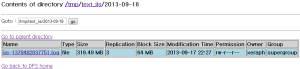

# 11장. 하둡 커넥터

## 11.1. 하둡 연동 설정

hadoop-core-osgi 1.1.2 버전, logpresso-hdfs 0.1.0 버전 이상 필요

로그프레소 하둡 커넥터가 설치된 경우, 하둡 클러스터를 연동하여 사용할 수 있습니다. 실시간으로 HDFS에서 원본 데이터를 수집하거나, 반대로 로그프레소를 통해 수집된 로그를 실시간으로 HDFS에 적재할 수 있습니다. 또한 쿼리를 사용하여 HDFS에 있는 파일을 즉시 조회 및 분석할 수 있으며, 로그프레소 쿼리 결과를 HDFS에 파일로 출력할 수 있습니다.

아래와 같이 로그프레소에서 하둡 연동 설정을 관리할 수 있습니다.

### 11.1.1. HDFS 사이트 목록 조회

`logpresso.hdfsSites` 명령어를 사용하여 기존에 설정된 HDFS 사이트 목록을 조회합니다.

~~~
    araqne@bombom demo> logpresso.hdfsSites
     HDFS Sites
    ————
    name=vm, filesystem=hdfs://192.168.87.2:9000
~~~

### 11.1.2. HDFS 사이트 추가

`logpresso.createHdfsSite [이름] [네임노드 주소]` 명령을 이용하여 HDFS 사이트를 추가합니다. 중복된 이름이 존재하는 경우 명령이 실패합니다.

~~~
    araqne@bombom demo> logpresso.createHdfsSite vm hdfs://192.168.87.2:9000
     created
~~~

### 11.1.3. HDFS 사이트 삭제

`logpresso.removeHdfsSite [이름]` 명령을 이용하여 기존의 HDFS 사이트 설정을 삭제합니다. 존재하지 않는 이름의 경우 명령이 실패합니다.

~~~
araqne@bombom demo> logpresso.removeHdfsSite vm
 removed
~~~

## 11.2. 실시간 HDFS 로그 수집 설정

HDFS 사이트 설정이 완료된 후, 로그 수집 설정을 통해 HDFS에 적재되는 파일을 실시간으로 수집할 수 있습니다. 다른 프로세스에서 HDFS 파일을 아직 닫지 않았거나 마지막 HDFS 블럭이 디스크로 플러시되지 않은 상태이더라도, 해당 데이터를 읽어들일 수 있습니다. (이 때 네임노드에서 조회되는 파일 크기는 실제 읽히는 크기보다 작습니다.)

### 11.2.1. HDFS 텍스트 파일 수집 설정

HDFS 텍스트 파일 수집 (hdfs-text) 로거는 HDFS에서 읽어온다는 점을 제외하면 디렉터리 로그 파일 수집 설정과 동일합니다.
* [필수] HDFS 사이트: 미리 설정한 HDFS 사이트 이름을 지정합니다.
* [필수] 디렉터리 경로: 로그 파일이 위치하는 HDFS 경로를 의미합니다.
* [필수] 파일이름 정규표현식 패턴: HDFS 디렉터리 경로에 존재하는 파일 중 파일 이름이 정규표현식 패턴에 일치하는 경우에만 수집합니다. 정규표현식 그룹을 쓰는 경우 파일 이름에서 날짜 문자열을 추출합니다.
* [선택] 날짜 추출 정규표현식 패턴: 로그에서 날짜 문자열을 추출합니다. 정규표현식 그룹으로 묶인 모든 부분을 이어붙여서 하나의 날짜 문자열을 만들어냅니다. 파일이름 정규표현식의 그룹으로 추출된 날짜문자열은 가장 앞 부분에 위치합니다.
* [선택] 날짜 파싱 포맷: 날짜 문자열을 파싱하는데 사용할 날짜 포맷을 설정합니다. (예: yyyy-MM-dd HH:mm:ss)
* [선택] 날짜 로케일: 날짜 문자열의 로케일. 가령 날짜 파싱 포맷의 지시자 중 MMM의 해석은 로케일에 따라 “Jan” 혹은 “1월”로 해석됩니다.  기본값은 en입니다.
* [선택] 로그 시작 정규식:  로그의 시작 부분을 인식하는 정규표현식을 지정합니다. 멀티라인 로그의 경우에 사용되며, 지정하지 않으면 줄 단위로 읽어들입니다.
* [선택] 로그 끝 정규식:  로그의 끝 부분을 인식하는 정규표현식을 지정합니다. 멀티라인 로그의 경우에 사용되며, 지정하지 않으면 줄 단위로 읽어들입니다.
* [선택] 문자집합: 텍스트 파일 해석에 사용할 문자집합 코드를 입력합니다. 기본값은 utf-8입니다.

여러 개의 파일이 수집 대상인 경우, 파일 이름을 사전순으로 정렬하여 순서대로 읽어들입니다. 설정 예시는 디렉터리 로그 파일 수집 설정을 참고하시기 바랍니다.

## 11.3. 실시간 HDFS 로그 파일 출력 설정

로그프레소에서 수집하는 로그를 HDFS 파일로 실시간 출력할 수 있습니다. 지정된 파일 경로가 존재하지 않으면 자동으로 생성합니다. 또한 일정 파일 크기, 로그 갯수, 유휴 시간에 도달하면 자동으로 파일을 닫고 새로운 파일에 쓰도록 설정할 수 있습니다. 동작 주기마다 HDFS 플러시를 수행합니다.

HDFS 경로, 파일 이름 접두어, 파일 이름 접미어에 아래와 같은 지시자를 사용하면 시간 값으로 치환됩니다. 시간 값은 HDFS에 파일이 생성되는 시점의 로그프레소 서버 시각을 기준으로 합니다. 모든 월, 일, 시, 분, 초 값은 0 패딩을 포함한 문자열로 표시됩니다:
* %Y: 년도
* %m: 월
* %d: 일
* %H: 시
* %M: 분
* %S: 초

만약 권한 문제로 디렉터리 생성이나 파일 생성이 실패하면, 즉시 로그 파일 출력 로거가 정지됩니다. 이는 반복적인 예외 발생과 이로 인한 성능 저하를 방지하고, HDFS 설정을 다시 점검하도록 하기 위한 것입니다.

### 11.3.1. HDFS 텍스트 파일 출력 설정

HDFS 텍스트 파일 출력 로거 (hdfs-totext)는 다음과 같은 설정을 입력받습니다:
* [필수] 원본 로거 이름 목록: 출력할 원본 수집 설정 이름 목록을 쉼표로 구분하여 입력합니다. HDFS 텍스트 파일 출력 로거는 원본으로 지정한 수집기에서 수집되는 모든 로그를 HDFS 파일로 출력합니다.
* [필수] HDFS 사이트: 미리 설정한 HDFS 사이트 이름을 지정합니다.
* [필수] HDFS 경로: 출력할 HDFS 디렉터리 경로를 지정합니다.
* [필수] 파일 이름 접두어: 파일 이름 타임스탬프 앞에 붙일 문자열을 지정합니다.
* [필수] 파일 이름 접미어: 파일 이름 타임스탬프 뒤에 붙일 문자열을 지정합니다. 주로 .을 포함한 확장자를 설정합니다.
* [선택] 롤링 기준 파일 크기: 파일을 닫고 새로 여는 기준 파일 크기를 바이트 단위로 설정합니다. 미설정 시 파일 크기 기준으로는 롤링하지 않습니다.
* [선택] 롤링 기준 건수: 파일을 닫고 새로 여는 기준 로그 건수를 설정합니다. 미설정 시 로그건수 기준으로는 롤링하지 않습니다.
* [선택] 유휴 기준 시간 (초): 로그가 들어오지 않는 상태로 기준 시간이 지나면 파일을 닫고 새로 열도록 설정합니다. 미설정 시 유휴 시간 기준으로는 롤링하지 않습니다.

예시) IIS 원본 로그를 수집하여 HDFS에 텍스트 로그 파일로 적재
* 원본 로거 이름 목록: local\\source_iis
* HDFS 사이트: vm
* HDFS 경로: /tmp/text_iis/%Y-%m-%d
* 파일 이름 접두어: iis-
* 파일 이름 접미어: .log
* 롤링 기준 크기: 671088640
* 유휴 시간 기준 (초): 600

### 11.3.2. HDFS 시퀀스 파일 출력 설정

HDFS 시퀀스 파일 포맷은 하둡의 맵리듀스 작업 시 기본으로 사용되는 바이너리 파일입니다. 개체 타입을 보존하기 때문에 쉽게 자바 개체 스트림을 쓰고 읽을 수 있으며, 레코드 단위, 블럭 단위 압축을 지원합니다.

HDFS 시퀀스 파일 출력 로거 (hdfs-toseq)는 다음과 같은 설정을 입력받습니다:
* [필수] 원본 로거 이름 목록: 출력할 원본 수집 설정 이름 목록을 쉼표로 구분하여 입력합니다. HDFS 텍스트 파일 출력 로거는 원본으로 지정한 수집기에서 수집되는 모든 로그를 HDFS 파일로 출력합니다.
* [필수] HDFS 사이트: 미리 설정한 HDFS 사이트 이름을 지정합니다.
* [필수] HDFS 경로: 출력할 HDFS 디렉터리 경로를 지정합니다.
* [필수] 파일 이름 접두어: 파일 이름 타임스탬프 앞에 붙일 문자열을 지정합니다.
* [필수] 파일 이름 접미어: 파일 이름 타임스탬프 뒤에 붙일 문자열을 지정합니다. 주로 .을 포함한 확장자를 설정합니다.
* [선택] 키 타입: 시퀀스 파일의 키 타입을 지정합니다. 미설정 시 LongWritable로 기록됩니다.
* [선택] 키 필드 이름: 시퀀스 파일에 기록할 키 필드 이름을 지정합니다. 미설정 시 1부터 증가하는 카운터가 키 값으로 기록됩니다.
* [선택] 값 타입: 시퀀스 파일의 값 타입을 지정합니다. 미설정 시 MapWritable로 기록됩니다.
* [선택] 값 필드 이름: 시퀀스 파일에 기록할 값 필드 이름을 지정합니다. 미설정 시 데이터 전체가 MapWritable로 묶여 기록됩니다.
* [선택] 압축 유형: record 혹은 block을 설정합니다. 미설정 시 압축하지 않습니다.
* [선택] 롤링 기준 건수: 파일을 닫고 새로 여는 기준 로그 건수를 설정합니다. 미설정 시 로그 건수 기준으로는 롤링하지 않습니다.
* [선택] 유휴 기준 시간 (초): 로그가 들어오지 않는 상태로 기준 시간이 지나면 파일을 닫고 새로 열도록 설정합니다. 미설정 시 유휴 시간 기준으로는 롤링하지 않습니다.

