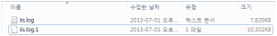

# 7장. 실시간 로그 출력 설정

## 7.1. 롤링 로그 파일 쓰기 설정

(araqne-log-api 2.2.6부터 지원)

로그프레소에서 수집되는 로그를 특정 로그 파일에 실시간으로 출력할 수 있습니다. 또한 일정 파일 크기에 도달하면 자동으로 번호를 붙여서 백업 파일을 생성하고, 설정한 갯수만큼의 백업 파일만 유지하도록 할 수 있습니다. tofile 로거는 아래와 같은 설정을 입력받습니다:
* [필수] 원본 로거: 파일에 쓸 로그를 수집하는 원본 로거 이름 (namespace\\name 형식)
* [필수] 파일 경로: 파일의 경로
* [필수] 최대 파일 크기: 백업본 파일을 생성하는 기준 파일 크기 (바이트 단위)
* [선택] 최대 백업 갯수: 백업본 파일 유지 갯수, 기본값은 1
* [선택] 파일 문자집합: 기본값은 utf-8

가령 최대 파일 크기가 10485760인 경우 (10MB), 파일 크기가 10MB를 넘기 직전에 확장자에 .N이 붙은 백업본 파일로 이름을 변경한 후 새로운 파일을 열고 쓰기 시작합니다. 만약, 기존 백업본 .1이 있는 상태에서 파일 크기를 넘게 되면, 기존의 .1은 .2로 이름이 바뀌고 쓰고 있던 파일 이름이 .1로 변경됩니다. 이 때 만약 최대 백업 갯수를 초과하게 되면 가장 오래된 백업본 파일이 삭제됩니다. 가령 최대 백업 갯수가 1개인 경우, .1 파일은 삭제되고 쓰고 있던 파일 이름이 .1로 변경됩니다.

예시) 최대 파일 크기가 10485760이고 최대 백업 갯수가 1인 경우

## 7.2. 시간대별 파일 쓰기 설정

(araqne-log-api 2.3.2부터 지원)

totimefile 로거는 로그프레소에서 수집되는 로그를 특정 로그 파일에 실시간으로 시간 또는 일 단위로 출력할 수 있습니다. totimefile 로거는 아래와 같은 설정을 입력받습니다:
* [필수] 원본 로거: 파일에 쓸 로그를 수집하는 원본 로거 이름 (namespace\\name 형식)
* [필수] 파일 경로: 로그 파일 경로 (파일 이름 끝에 시간을 추가하여 생성하게 됨)
* [필수] 파일 교체 주기: day (일) 혹은 hour (시간)
* [선택] 문자집합: 출력할 파일 인코딩, 기본값 utf-8

line 필드가 있는 경우에는 line 필드 값만 줄 단위로 기록하며, 그렇지 않은 경우에는 key1=”value1″, key2=”value2″ 와 같은 방식으로 모든 키/값 쌍을 기록합니다. 운영체제가 윈도우인 경우에는 개행 시 캐리지 리턴(CR)을 추가합니다.

예시) 일 단위로 d:/output 디렉터리 위치에 sample.log.yyyy-MM-dd 파일을 생성하는 로거 생성

~~~
araqne> logapi.createLogger totimefile local timefile-sample
 Source logger name (required)? local\source
 file path (required)? d:/output/sample.log
 rotate interval (required)? day
 charset (optional)? utf-8
 transformer (optional, enter to skip)?
 logger created: name=local\timefile-sample, factory=local\totimefile, status=stopped
 (passive), log count=0, last start=null, last run=null, last log=null
~~~

로거를 시작하면, 그 때부터 원본 로거로 수집되는 모든 로그에 대한 파일 쓰기를 시작합니다.

## 7.3. 시스로그 전송자 로거

시스로그 전송자 (syslog-send) 로거는 다른 로거에서 수집하는 데이터를 시스로그 서버로 전송합니다. 시스로그 전송자 로거는 아래와 같은 설정을 입력 받습니다.
* [필수] 원본 로거 이름: 네임스페이스를 포함한 원본 로거 이름을 입력합니다.
* [필수] 시스로그 서버 IP: 시스로그 서버의 IP를 입력받습니다.
* [선택] 시스로그 서버 포트: 시스로그 서버의 포트를 지정합니다. 지정하지 않을 경우 514로 지정됩니다.
* [선택] 인코딩: 데이터의 인코딩 형식을 지정합니다. 지정하지 않을 경우 UTF-8로 지정됩니다.
* [선택] 필드: 전송할 필드 이름 목록을 쉼표로 구분하여 입력합니다. 미지정 시 모든 필드가 전달됩니다.
* [선택] 형식: 데이터의 형식을 지정합니다. TXT, CSV, JSON 형식을 지원하며 미지정 시 TXT로 지정됩니다.
* [선택] 태그 지정 여부: true로 설정한 경우 원본 로거의 이름을 태깅하여 전달합니다. 미지정 시 false로 지정됩니다.

예시) 이름이 SOURCE_LOGGER인 디렉토리 와치 (dirwatch) 로거로부터 받은 로그를 시스로그 서버 SYSLOG_IP로 전달하는 시스로그 전달자 로거 local\\syslog_send 생성

~~~
araqne@darkluster logpresso> logapi.createLogger syslog-send local syslog_send
 Source logger name (required)? SOURCE_LOGGER
 syslog remote ip (required)? SYSLOG_IP
 syslog server port (optional)?
 encoding (optional)?
 fields (optional)?
 format (optional)?
 use source logger tag (optional)?
 transformer (optional, enter to skip)?
 logger created: name=local\syslog-send, factory=local\syslog-send, status=stopped (passive),
 log count=0, last start=null, last run=null, last log=null
~~~

