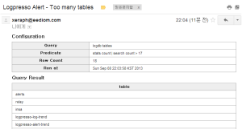

# 8장. 쿼리 관리
## 8.1. 스트림 쿼리

개요

스트림 쿼리는 데이터 스트림을 입력으로 하는 쿼리를 설정하여, 실시간으로 이벤트 처리나 통계 분석을 수행할 수 있습니다. 일정 기간마다 실행되는 스케줄 쿼리와 달리, 스트림 쿼리는 연속적으로 입력 순서를 보장하면서 쿼리를 수행하는 특징을 가지고 있습니다.

예를 들어 10분마다 스트림에 대한 통계를 생성하려는 경우, 스케줄 쿼리로는 미묘한 시간 차이로 인해 10분 마다 생성된 결과의 합이 전체와 일치하지 않을 수 있습니다. 반면, 스트림 쿼리는 연속적인 데이터 입력에 대해 쿼리가 실행되므로 순서와 정합성을 보장합니다.

스트림 쿼리를 사용하여 특정 시간 단위의 통계를 산출하여 중간 통계 테이블에 저장하고, 이 테이블을 쿼리하여 최종적인 통계 결과를 쿼리하도록 설계하면, 디스크를 거의 사용하지 않으면서 대용량 데이터 스트림에 대하여 실시간으로 통계 결과를 계산할 수 있습니다. 특히, 그루비 스크립팅을 이용하면 고도로 복잡한 실시간 분석 및 가공이 가능합니다.

스트림 쿼리는 입력으로 3가지의 스트림 유형을 지원합니다:
* 로거: 로그 수집 설정을 통해 생성한 로거를 입력으로 사용합니다. 수집되는 모든 로그가 스트림 쿼리에 입력됩니다.
* 테이블: 테이블에 새로운 행(row)이 쓰여질 때마다 스트림 쿼리에 입력됩니다. 관계형 데이터베이스(RDBMS)에서 사용하던 트리거의 진화된 사용 예로 생각할 수 있습니다.
* 스트림 쿼리: 다른 스트림 쿼리의 출력을 입력으로 사용할 수 있습니다. 비정형 로그에 대하여 파싱을 수행하는 스트림 쿼리를 앞단에 두고, 해당 스트림 쿼리를 입력으로 사용하는 다수의 분석용 스트림 쿼리를 배치하는 시나리오를 예로 들 수 있습니다.

## 8.1.1. 스트림 쿼리 생성

스트림 쿼리는 생성되는 즉시 실행됩니다.

~~~
	logpresso.createStreamQuery 이름 입력유형
~~~

* 이름: 다른 스트림 쿼리와 구별되는 유일한 스트림 쿼리 이름을 지정합니다.
* 입력유형: logger, table, stream 중 하나를 지정합니다.

아래는 local\\netscreen 로거를 입력으로 하여 10분마다 방화벽 출발지, 목적지별 통계를 netscreen_ip_stats 테이블에 입력하는 예입니다.

~~~
    araqne> logpresso.createStreamQuery netscreen_ip_stats logger
     interval? 600
     query? parsekv | stats count by src, dst | import netscreen_ip_stats
     loggers? local\netscreen
     owner? root
     created
~~~

위의 예시에서 interval은 초 단위인데, 0으로 설정하는 경우에는 쿼리의 종료가 없으므로 스트리밍 처리가 가능한 쿼리 커맨드만 사용할 수 있습니다. 가령 eval, rex, search 같은 부류의 커맨드들은 스트리밍이 가능하지만, sort나 stats와 같이 입력 끝을 필요로 하는 커맨드들은 스트리밍 처리가 불가능합니다. 

query는 데이터소스 커맨드를 제외한 쿼리를 입력합니다. loggers (입력유형에 따라 tables 혹은 streams)는 쉼표로 구분된 식별자 목록을 입력합니다. owner는 쿼리를 실행하는 DB 계정을 의미합니다.

## 8.1.2. 스트림 쿼리 삭제

~~~
	logpresso.removeStreamQuery 이름
~~~

지정된 이름의 스트림 쿼리를 삭제합니다.

## 8.1.3. 스트림 쿼리 목록 조회

~~~
	logpresso.streamQueries
~~~

현재 설정된 모든 스트림 쿼리의 실행 상태를 조회합니다.

실행 예:

~~~
Stream Queries
 ----------------
|     name    | input count |     last refresh    | running | enabled |
|-------------|-------------|---------------------|---------|---------|
| pcap-stream |           0 | 2014-02-27 16:38:23 |    true |    true |
~~~

## 8.1.4. 스트림 쿼리 목록 상세 조회

~~~
	logpresso.streamQueries -v
~~~

앞서 실행한 명령어에 “-v”를 추가해, 현재 설정된 모든 스트림 쿼리의 실행 상태를 상세 조회합니다.

실행 예:

~~~
Stream Queries
—————-
name=pcap-stream, interval=60, query_string=eval min = string(_time, “yyyyMMddHHmm”) | 
stats count by min, src_ip, src_port, dst_ip, dst_port, proto, path | eval _time = 
date(min, “yyyyMMddHHmm”) | fields – min | import pcap_summary, loggers=[local\pcap], 
enabled=true, owner=root, created=2014-02-24 19:35:26, modified=2014-02-24 19:35:26, 
description=null, input count=0, last refresh=2014-02-27 17:00:26, running=true
~~~

## 8.2. 예약된 쿼리 경보

logpresso-core 0.6.5 버전부터 지원

예약된 쿼리를 통해 주기적으로 쿼리를 실행하고, 그 결과에 대해 조건을 걸어 경보 메일을 발송할 수 있습니다.

### 8.2.1. 예약된 쿼리 목록 조회

현재 예약된 쿼리 목록을 조회합니다. 예약된 쿼리는 경보 설정을 선택적으로 포함할 수 있습니다.

~~~
    araqne@bombom demo> logpresso.scheduledQueries
     Scheduled Queries
    ——————
    [5df7705c-6254-4557-8474-ffce1846e55d] Too many tables * * * * *
~~~

### 8.2.2. 예약된 쿼리 상세 조회

현재 예약된 쿼리의 모든 설정을 상세하게 조회합니다.

~~~
    araqne@bombom demo> logpresso.scheduledQuery 5df7705c-6254-4557-8474-ffce1846e55d
     Scheduled Query Details
    ————————-
    guid: 5df7705c-6254-4557-8474-ffce1846e55d
     title: Too many tables
     schedule type: cron
     cron scheudle: * * * * *
     owner: root
     query: logdb tables
     use alert: true
     alert query: stats count | search count > 17
     suppress interval: 120secs
     mail profile: googleapps
     mail from: xeraph@eediom.com
     mail to: xeraph@eediom.com
     mail subject: Logpresso Alert
     created at: Sun Sep 08 21:59:49 KST 2013
~~~

### 8.2.3. 예약된 쿼리 경보 생성

아래와 같이 예약된 쿼리 경보를 생성합니다.

~~~
    araqne@bombom demo> logpresso.createScheduledQuery
     title? Too many tables
     cron schedule? * * * * *
     owner? root
     query? logdb tables
     use alert? true
     alert query? stats count | search count > 17
     suppress interval? 600
     mail profile? googleapps
     mail from? xeraph@eediom.com
     mail to? xeraph@eediom.com
     mail subject? Logpresso Alert
     created
~~~

각 설정 항목의 의미는 아래와 같습니다:
* title: 예약된 쿼리의 제목, 메일 전송 시 메일 제목에도 표시됩니다.
* cron schedule: CRON 문법으로 실행 주기를 설정합니다.
* owner: 예약된 쿼리를 실행하는 주체가 될 DB 계정을 설정합니다.
* query: 쿼리 문자열을 입력합니다.
* use alert: 경보를 설정하려면 true를 입력합니다. 단순히 예약된 쿼리를 실행하고 쿼리 결과를 저장해두려면 false를 입력합니다.
* alert query: 경보 조건 쿼리를 설정합니다. 쿼리 결과에 대하여 경보 조건 쿼리를 적용했을 때 결과가 존재한다면 경보가 발생합니다.
* suppress interval: 동일한 경보가 반복적으로 발생하지 않도록 억제하려면 경보를 무시할 주기를 설정해야 합니다. 초 단위로 설정합니다.
* mail profile: SMTP 설정 프로파일 이름을 입력합니다.
* mail from: 보낸 사람 메일 주소를 입력합니다.
* mail to: 받을 사람 메일 주소를 입력합니다.
* mail subject: 메일 제목을 입력합니다.

### 8.2.4. 예약된 쿼리 삭제

인자로 예약된 쿼리의 식별자를 전달하여 삭제합니다.

~~~
    araqne@bombom demo> logpresso.removeScheduledQuery d5e06505-791d-45bc-a65a-b82c66aab244
     removed
~~~

### 8.2.5. 예약된 쿼리 즉시 실행

경보 설정 후 정상적으로 동작하는지 확인하고 싶을 때 아래와 같이 즉시 실행할 수 있습니다.

~~~
    araqne@bombom demo> logpresso.runScheduledQuery 5df7705c-6254-4557-8474-ffce1846e55d
     completed
~~~

### 8.2.6. 경보 메일 예시

경보 메일은 본문에 경보 설정과 최대 1000건의 쿼리 결과를 포함합니다.

