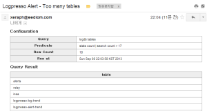

# 9장. 경보설정
## 9.1. SMTP 설정
경보 메일을 설정할 때 MTA 설정을 담고 있는 SMTP 프로파일을 참조하므로, 미리 SMTP 프로파일을 설정해두어야 합니다.

### 9.1.1. SMTP 프로파일 목록 조회

현재 SMTP 프로파일 목록을 조회합니다.

~~~
    araqne@bombom demo> mailer.list
     Configurations
    ——————
     smtp, smtp.gmail.com:587 user: xeraph@eediom.com
~~~

### 9.1.2. SMTP 프로파일 생성

새로운 MTA 설정을 추가합니다.

~~~
    araqne@bombom demo> mailer.register
     Name? googleapps
     SMTP Server? smtp.gmail.com
     SMTP Port? 587
     SMTP User? xeraph@eediom.com
     SMTP Password?
     new configuration added
~~~

### 9.1.3. SMTP 프로파일 삭제

기존의 프로파일을 삭제합니다.

~~~
    araqne@bombom demo> mailer.unregister googleapps
     smtp configuration removed
~~~

### 9.2. 예약된 쿼리 경보

logpresso-core 0.6.5 버전부터 지원

예약된 쿼리를 통해 주기적으로 쿼리를 실행하고, 그 결과에 대해 조건을 걸어 경보 메일을 발송할 수 있습니다.

### 9.2.1. 예약된 쿼리 목록 조회

현재 예약된 쿼리 목록을 조회합니다. 예약된 쿼리는 경보 설정을 선택적으로 포함할 수 있습니다.

~~~
    araqne@bombom demo> logpresso.scheduledQueries
     Scheduled Queries
    ——————
    [5df7705c-6254-4557-8474-ffce1846e55d] Too many tables * * * * *
~~~

### 9.2.2. 예약된 쿼리 상세 조회

현재 예약된 쿼리의 모든 설정을 상세하게 조회합니다.

~~~
    araqne@bombom demo> logpresso.scheduledQuery 5df7705c-6254-4557-8474-ffce1846e55d
     Scheduled Query Details
    ————————-
    guid: 5df7705c-6254-4557-8474-ffce1846e55d
     title: Too many tables
     schedule type: cron
     cron scheudle: * * * * *
     owner: root
     query: logdb tables
     use alert: true
     alert query: stats count | search count > 17
     suppress interval: 120secs
     mail profile: googleapps
     mail from: xeraph@eediom.com
     mail to: xeraph@eediom.com
     mail subject: Logpresso Alert
     created at: Sun Sep 08 21:59:49 KST 2013
~~~

### 9.2.3. 예약된 쿼리 경보 생성

아래와 같이 예약된 쿼리 경보를 생성합니다.

~~~
    araqne@bombom demo> logpresso.createScheduledQuery
     title? Too many tables
     cron schedule? * * * * *
     owner? root
     query? logdb tables
     use alert? true
     alert query? stats count | search count > 17
     suppress interval? 600
     mail profile? googleapps
     mail from? xeraph@eediom.com
     mail to? xeraph@eediom.com
     mail subject? Logpresso Alert
     created
~~~

각 설정 항목의 의미는 아래와 같습니다:

* title: 예약된 쿼리의 제목, 메일 전송 시 메일 제목에도 표시됩니다.
* cron schedule: CRON 문법으로 실행 주기를 설정합니다.
* owner: 예약된 쿼리를 실행하는 주체가 될 DB 계정을 설정합니다.
* query: 쿼리 문자열을 입력합니다.
* use alert: 경보를 설정하려면 true를 입력합니다. 단순히 예약된 쿼리를 실행하고 쿼리 결과를 저장해두려면 false를 입력합니다.
* alert query: 경보 조건 쿼리를 설정합니다. 쿼리 결과에 대하여 경보 조건 쿼리를 적용했을 때 결과가 존재한다면 경보가 발생합니다.
* suppress interval: 동일한 경보가 반복적으로 발생하지 않도록 억제하려면 경보를 무시할 주기를 설정해야 합니다. 초 단위로 설정합니다.
* mail profile: SMTP 설정 프로파일 이름을 입력합니다.
* mail from: 보낸 사람 메일 주소를 입력합니다.
* mail to: 받을 사람 메일 주소를 입력합니다.
* mail subject: 메일 제목을 입력합니다.

### 9.2.4. 예약된 쿼리 삭제

인자로 예약된 쿼리의 식별자를 전달하여 삭제합니다.

~~~
    araqne@bombom demo> logpresso.removeScheduledQuery d5e06505-791d-45bc-a65a-b82c66aab244
     removed
~~~

### 9.2.5. 예약된 쿼리 즉시 실행

경보 설정 후 정상적으로 동작하는지 확인하고 싶을 때 아래와 같이 즉시 실행할 수 있습니다.

~~~
    araqne@bombom demo> logpresso.runScheduledQuery 5df7705c-6254-4557-8474-ffce1846e55d
     completed
~~~

### 9.2.6. 경보 메일 예시

경보 메일은 본문에 경보 설정과 최대 1000건의 쿼리 결과를 포함합니다.

