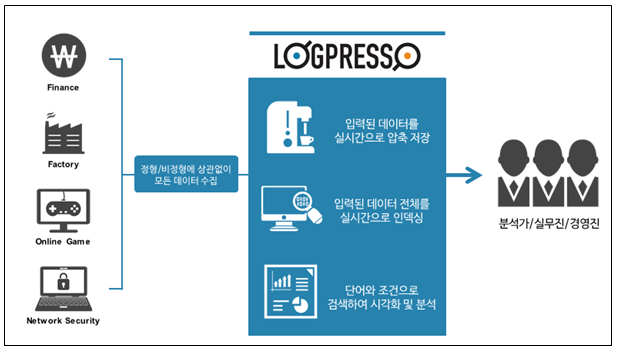

# 1장. 개요

## 1.1. 로그프레소 개요

로그프레소는 모든 IT 시스템과 인프라에서 생성되는 로그를 고속으로 수집하고 인덱싱합니다. 방대한 양의 로그를 수 분 안에 검색하여 문제 원인 조사에 필요한 시간이 획기적으로 줄어듭니다. 사용자 정의 가능한 대시보드를 통해 쉽게 모든 지표들을 한 눈에 모니터링 할 수 있습니다. 로그 쿼리를 통해 복잡한 통계 분석을 손쉽게 수행할 수 있으며, 보고서 작성에 필요한 시간도 크게 단축됩니다.
로그프레소는 대용량 비정형 데이터를 수집, 검색, 분석, 시각화하여 신속한 의사결정을 돕는 플랫폼입니다.

