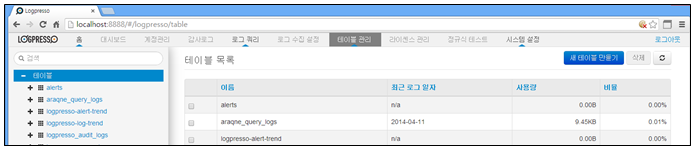

# 10장. 테이블 관리

테이블은 수집한 데이터를 저장하는 공간입니다. 메뉴는 "테이블관리" 메뉴를 선택하여 테이블의 모니터링/생성/삭제 관리 할 수 있습니다.

테이블 관리 메뉴는 아래의 항목으로 확인 및 관리됩니다.

* 선택 항목 : 테이블 선택 사용
* 이름 : 생성된 테이블의 대표 이름
* 최근로그일자 : 테이블에 저장된 가장 최근 로그일자 표시
* 사용량 : 테이블의 디스크 사용량 표시
* 비율 : 저장된 전체 테이블 크기에 대한 각 테이블의 사용률 표시

