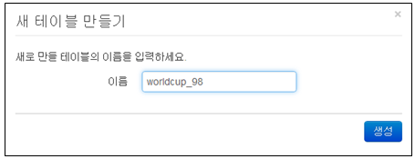

## 10.1. 테이블

### 10.1.1. 테이블 생성

* 테비블 관리 메뉴에서 "새 테이블 만들기" 메뉴를 선택합니다.

* "새 테이블 만들기" 화면에 생성할 테이블의 이름을 입력한 후 "생성' 메뉴를 선택하여 생성을 완료합니다.
	\- 테이블에 사용할 이름은 "영어, 숫자, \_ " 로 구성되어야 합니다.
	\- 이름 규칙에 위배될 경우 테이블이 생성되지 않습니다.

### 10.1.2. 테이블 삭제

등록된 테이블이 더이상 필요없을 경우에 테이블을 삭제할 수 있습니다. 테이블을 삭제할 경우 해당 테이블 및 관련된 인덱스도 동시에 자동 삭제됩니다.

* 테이블 관리 메뉴에서 삭제할 대상 테이블 이름의 선택 항목을 선택 한 후 "삭제" 메뉴를 선택합니다.

* "삭제" 메뉴를 선택하여 테이블 삭제를 완료합니다.

### 10.1.3. 테이블 상세 정보

테이블에 대한 상세한 정보를 제공합니다. 테이블에 대한 상세 정보를 보기 위해서는 "테이블관리" 메뉴의 테이블 트리에서 원하는 테이블을 선택하여야 테이블에 대한 상세 정보를 볼 수 있습니다.

제공되는 상세정보는 "기본정보", "인덱스", "최근로그"의 정보를 제공합니다.

* 기본 정보 : 테이블의 기본적으로 제공되는 정보로 파서, 접근권한, 디스크 사용량 표시
* 인덱스 : 테이블에 적용된 인덱스 정보 표시
* 최근로그 : 테이블에서 수집된 최근 로그 20건 표시

1) 기본정보

테이블의 DB 타입, 파서 적용여부 표시, 접근권한 목록 표시, 디스크 사용량, 15분단위의 로그추이를 제공합니다. 기본정보의 "테이블메타데이터" 화면에서 테이블에 적용할 파서와 같은 테이블관련 메타데이터를 추가/변경/삭제할 수 있는 기능을 제공합니다.

2) 인덱스

선택한 테이블에 인덱스 적용 내용을 표시 및 관리할 수 있는 기능을 제공합니다.

3) 최근로그

테이블에 저장된 최근로그 20건을 표시하여 수집/저장된 로그의 내용을 확인할 수 있습니다.

### 10.1.4. 테이블 데이터 삭제

최근로그의 "삭제" 메뉴를 사용하여 테이블에 저장되어 있는 특정 기간의 로그 데이터를 지정하여 파기할 수 있습니다.

* 삭제할 기간을 선택 후 "로그 삭제" 메뉴를 선택하여 로그를 삭제합니다.

