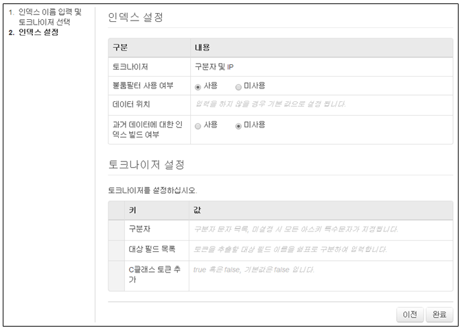
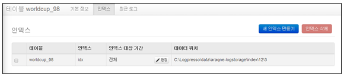

## 10.2. 인덱스

인덱스는 데이터를 빠르게 검색 및 추출하기 위하여 사용 되어지며 다양한 풀텍스트 인덱스 설정을 지원합니다.

인덱스에 대한 관리는 "테이블 관리" 메뉴의 왼쪽 테이블 트리에서 테이블을 선택한 후 표시되는 "인덱스"를 선택하여 인덱스에 대한 생성/삭제/변경에 대한 관리를 수행합니다. 하나의 테이블에는 여러개의 인덱스를 적용할 수 있습니다.

* 테이블 관리 메뉴 : 테이블에 적용된 인덱스 정보 표시

### 10.2.1. 인덱스 생성

* "테이블관리" 메뉴의 왼쪽 테이블 트리에서 테이블을 선택 한 후 "새 인덱스 만들기" 메뉴를 선택합니다.

* 인덱스 이름과 토크나이저를 선택합니다.
	\- 이름은 영어, 숫자, '\_' 로 구성되어야 합니다.
	\- 토크나이저는 원본 로그를 풀텍스트 인덱싱할 때 사용될 풀텍스트 토큰을 만드는 역할을 수행합니다.

* 인덱스 이름과 토크나이저를 선택한 후 "다음"을 선택합니다.

* 인덱스 설정 내용을 입력/선택 한 후 "완료"를 선택하여 생성을 완료합니다.
	\- 불룸필터 사용여부: 사용을 선택합니다.
	\- 데이터 위치: 인덱스 데이터가 저장될 디렉토리 위치 입력
	\- 과거데이터에 대한 인덱스 빌드 여부: 테이블에 과거 데이터가 있을 경우 선택합니다.

* 인덱스 생성 완료 화면에서 생성된 결과를 확인합니다.

### 10.2.2. 인덱스 삭제

* 테이블 관리 메뉴에서 테이블을 선택한 후 테이블의 "인덱스" 메뉴를 선택합니다.

* 인덱스 리스트에서 삭제할 인덱스를 선택한 후 "인덱스삭제" 메뉴를 선택합니다.

* 인덱스 삭제 메뉴에서 "삭제" 메뉴를 선택하여 삭제를 완료합니다.

### 10.2.3. 인덱스 대상 기간 변경

현재 입력이 수행중인 테이블에 대해 데이터를 보존하면서 특정 인덱스가 지정한 기간에 대해서만 인덱싱을 수행하도록 지정할 수 있습니다.

* 테이블의 인덱스 메뉴의 인덱스 리스트에서 기간을 변경할 인덱스의 "편집"을 선택합니다.

* 시작과 끝 항목에 기간을 입력하거나 월력을 사용하여 기간을 선택한 후 "변경" 메뉴를 선택합니다.

* 기간 변경이 정상적으로 적용되었는지 확인합니다.

### 10.2.4. 설정 입력값 및 토크나이저 설명

공통 사항

* 토크나이저: 원본 로그에서 인덱싱할 대상 토큰들을 추출하는 토크나이저의 이름을 지정합니다. 토크나이저에 따라 다른 설정을 추가로 입력받게 됩니다.
* 블룸필터 사용 여부: 로그 량이 많은 경우 블룸필터를 생성하면 디스크 공간을 추가로 소모하지만 높은 검색 성능을 얻을 수 있습니다.
* 데이터 위치: 인덱스 루트 경로를 입력합니다. 기본적으로는 $araqne.data.dir 경로 하에 생성됩니다.
* 인덱싱 대상 기간: 아래에서 과거 데이터에 대해 인덱스 빌드를 선택한 경우 어느 일자부터 인덱싱할 것인지 지정할 수 있습니다. 미래의 날짜를 지정할 경우 해당 일자 이하에 대해서는 인덱싱을 수행하지 않습니다.
* 과거 데이터에 대한 인덱스 빌드 여부: 인덱스 생성 시점 이후에 들어오는 로그만 인덱싱할 것인지, 이전에 쌓인 로그도 인덱싱 할 것인지 설정합니다. 만약 과거 데이터에 대하여 인덱싱을 선택하면 배치로 인덱스가 빌드된 다음 실시간 인덱스와 자동으로 병합됩니다.

구분자 토크나이저

* 구분자를 명시적으로 지정할 수 있는 경우에는 구분자 토크나이저를 사용합니다. 인덱스 되는 토큰 수가 줄어들면 더 작은 디스크 사용량과 빠른 검색을 기대할 수 있습니다.

정규표현식 토크나이저

* 정규표현식을 사용하여 특정한 패턴의 토큰만 인덱싱 할 수 있습니다.

고정 길이 토크나이저

* 고정 길이 토크나이저는 글자 수로 된 필드 별 길이와 구분자를 입력 받아 풀텍스트 인덱싱을 수행합니다. 입력 받은 길이대로 필드를 자른 후, 구분자를 이용해 각각의 필드를 토크나이징 합니다. 로그의 길이가 입력 받은 길이의 총 합 보다 길 경우, 남은 길이를 추가 필드로 취급합니다.

인덱스 기간 지정

* 특정 인덱스가 지정한 기간에 대해서만 인덱싱을 수행하도록 지정할 수 있습니다. 현재 입력이 수행중인 테이블에 대해 데이터를 보존하면서, 앞으로의 데이터에 대해 다른 토크나이저 설정을 사용하는 인덱스를 추가하고 싶을 때 사용합니다.

