# 11장. 라이센스

라이센스는 하드웨어 고유키, 사용기간, EPS (초당 로그 건수), 일별 로그량으로 구성됩니다. EPS가 제한된 상태에서 속도를 초과하게 되면 제한 속도에 맞추어 지연 처리 됩니다. 일별 원본 로그량은 바이트 단위입니다.

* 라이센스 미설치 시 일일 원본 로그량 기준으로 500MB까지 허용
* 일일 원본 로그량을 초과한 경우, 라이센스 위반 경고 발생
* 최근 30일간 라이센스 위반 경고가 5회 누적된 경우 라이센스 잠금
* 라이센스가 잠기면 fulltext 쿼리 시 라이센스 예외가 반환되며, table 쿼리는 아무 결과를 반환하지 않음
* 라이센스 설치 시 일일 허용 원본 로그량 이하의 이전 라이센스 위반 경고는 무시됨

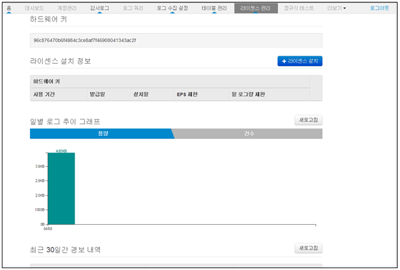

## 11.1. 하드웨어 키 확인

프로그램 구동 후 웹으로 접속하여 메인메뉴의 "라이센스관리"를 선택하여 표시되는 하드웨어 키 값을 개발사에 전달하여 정식 라이센스를 발급 받을 수 있습니다.

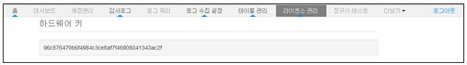

## 11.2. 라이센스 설치

* "라이센스관리" 화면의 "라이센스설치" 메뉴를 선택합니다.

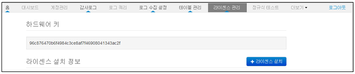

* "찾아보기" 메뉴를 선택합니다.

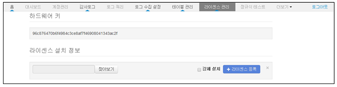

* 발급받은 라이센스 파일을 선택합니다.

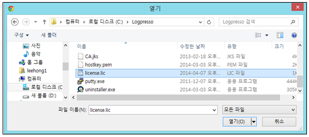

* "라이센스등록" 메뉴를 선택하여 선택한 라이센스 파일을 등록합니다.

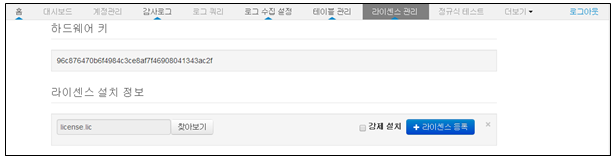

* 라이센스 등록 성공 메시지

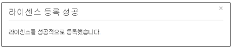

* "라이센스 설치 정보" 내용을 확인하여 정상 등록 여부 확인합니다.

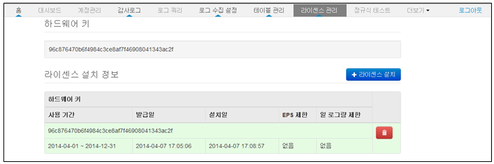

* 라이센스 등록 오류 메시지
	\* 하드웨어키 재 확인 후 라이센스 파일을 재 발급을 받아야 합니다.

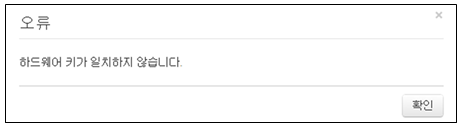

## 11.3. 라이센스 강제 설치

하드웨어 키와 일치하지 않지만 등록할 필요가 있을 경우 강제로 라이센스를 등록할 필요가 있을 경우 "라이센스 등록" 메뉴에서 "강제설치"를 체크하여 등록 합니다.

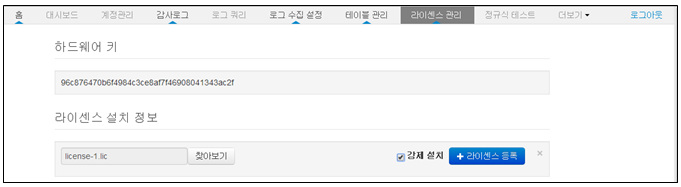

## 11.4. 라이센스 삭제

등록된 라이센스가 여러개 있을 경우 불필요하게 등록된 라이센스 파일을 삭제할 때 사용합니다.

* 라이센스 설치 정보 화면에서 삭제할 라이센스를 선택합니다.

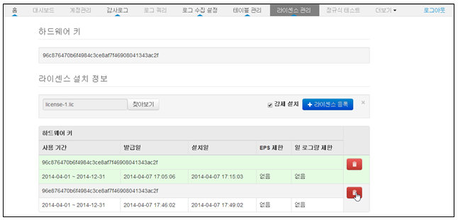

* "삭제" 메뉴를 선택하여 라이센스 삭제를 완료합니다.

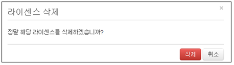

