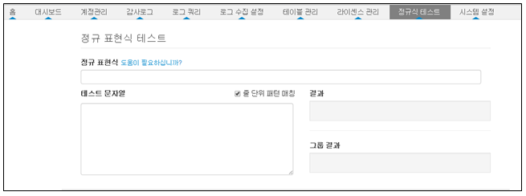
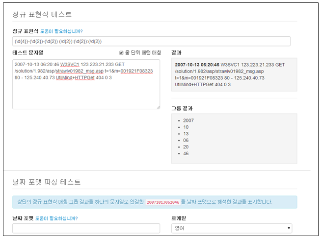
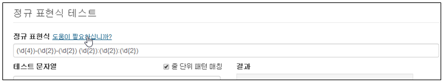
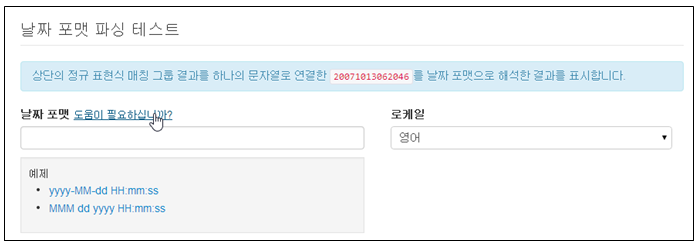
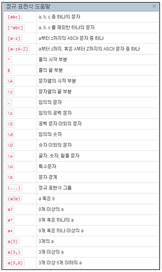

# 12장. 정규식 테스터

정규표현식을 테스트할 수 있는 기능을 제공합니다. "테스트문자열" 항목에 테스트하기위한 데이터 문자열을 입력한 후 "정규표현식" 항목에 표현식을 입력하면 테스트 문자열 중에서 정규  표현식에 매칭되는 결과가 "결과" 항목에 표시됩니다.

정규식으로 로그를 필터링하거나 수집로그의 데이터 중에서 날짜 포멧을 적용하기전에 테스트로 확인 후 적용할 수 있는 기능을 제공합니다.

* "테스트문자열" 값 및 "정규표현식" 값을 입력하여 매칭 결과 확인

* 정규표현식 도움말을 사용하기 위해 "도움말이필요하십니까?"를 선택합니다.

* 정규 표현식에서 사용되는 도움말 제공

