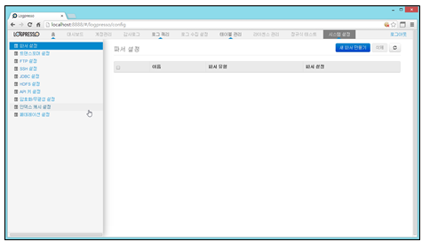
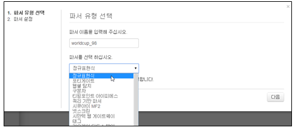
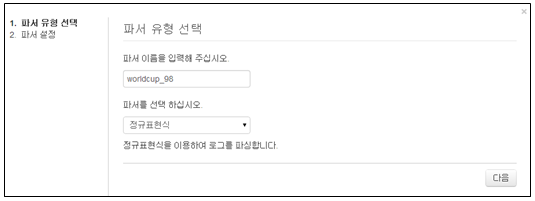
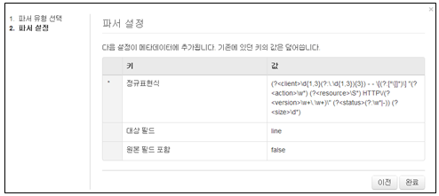
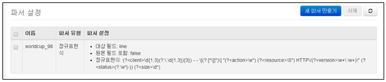
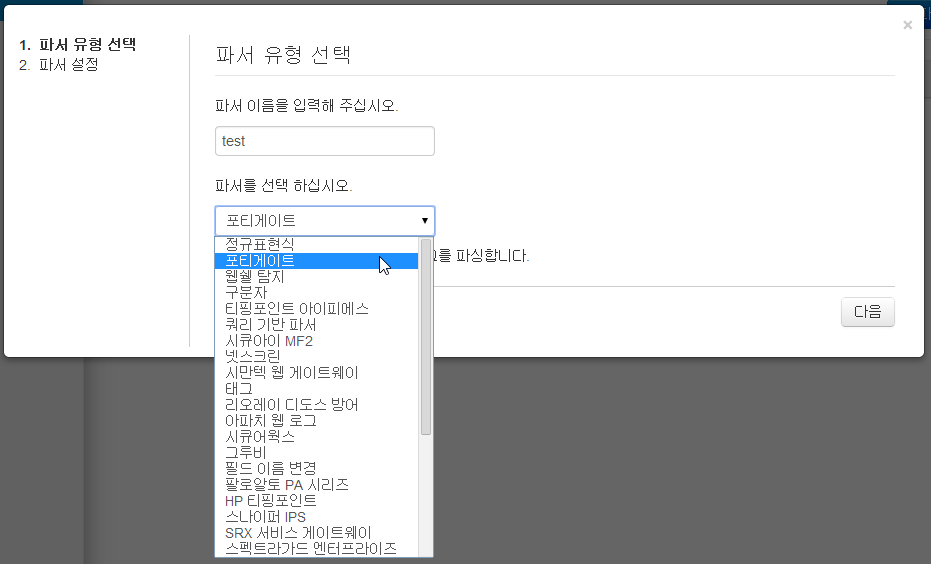
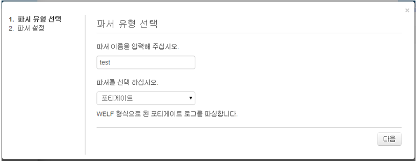
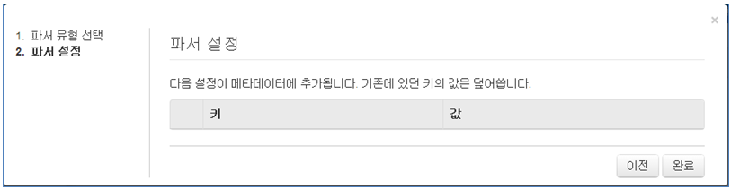
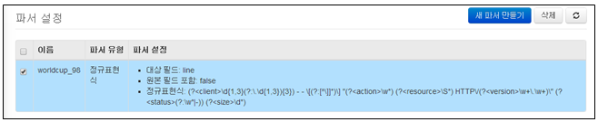
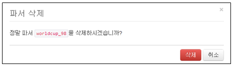

## 13.1. 파서 설정

파서는 테이블에 저장되어 있는 데이터를 쿼리 명령어로 추출할 때 사용됩니다. 쿼리 명령어로 추출할 때 적용되므로 원본 로그에 영향을 주지 않습니다.

파서는 로그DB 저장 테이블의 로그를 쿼리할 경우 필드를 구분하여 매칭 시키는데 사용되며 프로그램으로 코딩되어 번들에 내장되어 있거나 사용자가 쿼리 혹은 정규표현식을 사용하여 생성할 수 있습니다.

파서 관리는 메인 메뉴의 "시스템설정"에서 "파서 설정" 메뉴를 선택하여 사용합니다.

파서설정 메뉴는 아래의 항목으로 확인 및 관리됩니다.

* 선택메뉴 : 삭제기능을 사용할 경우 선택 기능
* 이름 : 등록된 파서의 대표 이름
* 파서유형 : 등록된 파서의 유형 표시
* 파서설정 : 파서 유형에 따른 입력값의 내용을 표시

새로운 신규 파서를 생성하기 위하여 "파서 설정" 메뉴에서 "새 파서만들기" 메뉴를 선택합니다.

* 파서 이름 : 영어, 숫자, \_ 로 구성되어야 하며 동일한 이름을 사용할 수 없습니다.
* 파서 선택 : 선택 항목에 따라서 입력을 요구하는 내용은 다릅니다.

### 13.1.1. 파서 생성

1) 정규표현식 파서 생성

* 파서 이름 및 적용할 파서를 선택합니다.

* 선택이 완료되었으면 "다음" 메뉴를 선택합니다.

* 파서설정 메뉴에서 입력값을 설정 한 후 "완료" 메뉴를 선택합니다.
	\- 정규 표현식 : 파서로 사용할 정규 표현식을 입력합니다.
	\- 대상필드: 파서를 적용할 필드명을 입력합니다.
	\- 원본필드포함: 원본필드를 표현할지 true, false로 입력합니다.

* 파서 생성이 정상적으로 완료되었는지 확인합니다.

2) 내장된 로그파서를 사용한 파서 생성

* 파서 이름 및 적용할 파서를 선택합니다.

* "다음" 메뉴를 선택합니다.

* 수정할 사항이 있을 경우 "이전" 메뉴를 선택하여 수정하고, 마치려면 "완료" 메뉴를 선택합니다.

### 13.1.2. 파서 삭제

등록된 파서가 더이상 필요없을 경우 삭제 기능을 사용하여 등록된 파서를 삭제할 수 있습니다.

* 삭제할 파서 목록을 선택 후 "삭제" 메뉴를 선택합니다.

* "삭제" 메뉴를 선택하여 등록된 파서를 삭제합니다.

