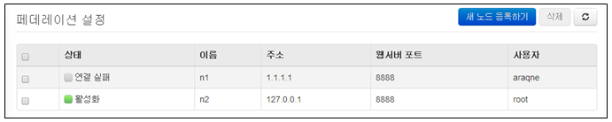
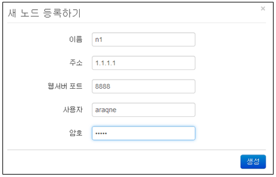
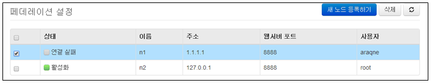
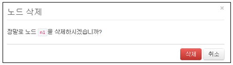

## 13.10. 페더레이션 설정

페더레이션 구성은 독립적인 다수의 로그프레소 서버를 하나로 묶어서 쿼리할 수 있도록 지원합니다. 페더레이션을 구성하는 각 노드는 설정한 이름으로 된 고유한 이름공간(namespace)을 가지게 되고, 각 노드의 테이블을 대상으로 쿼리할 때 콜론(:)으로 구분되는 한정자를 사용할 수 있습니다.

가령, 검색을 전담하는 노드에 n1 이름의 원격 노드를 등록한다면, n1 노드의 weblogs 테이블을 n1:weblogs 라는 이름으로 지칭할 수 있습니다. 이름공간에 와일드카드(*)를 사용하면 일치하는 모든 노드에서 검색 및 조회를 수행할 수 있습니다. 가령, table *:weblogs 쿼리를 실행하면 쿼리를 실행하는 로컬 노드를 포함하여 등록된 모든 원격 노드의 weblogs 테이블에서 로그를 조회하게 됩니다.

페더레이션 구성은 각기 독립적인 로그프레소 서버를 연계하므로 DB 계정이나 권한 역시 별도로 관리됩니다. 따라서 노드 간 계정 위임 및 가장(impersonation)은 지원되지 않으며, 등록된 계정과 암호로 로그프레소 서버에 로그인하여 원격 쿼리를 실행하게 됩니다.

table 혹은 fulltext 쿼리를 시도할 때 지정된 대상 테이블의 이름공간에 와일드카드(*)가 포함되어 있으면, 분산 쿼리 플래너가 쿼리 실행 계획을 재작성하고 원격 쿼리가 포함된 쿼리 커맨드 파이프라인을 실행하게 됩니다. 분산 쿼리 플래너는 eval, search, rex 같은 쿼리 커맨드 뿐 아니라, stats나 timechart 처럼 그룹 함수가 포함된 쿼리 커맨드를 최대한 각 원격 노드에서 병렬로 실행하게 하여 전체 수행 시간이 최소화되도록 실행 계획을 재작성합니다. 또한 원격 노드 쿼리 시 등록된 노드 이름을 _node 필드로 추가하여 노드별 통계 쿼리를 수행할 수 있도록 합니다.

메뉴는 "시스템설정" "페더레이션 설정" 메뉴를 선택하여 사용합니다.

페더레이션 설정 메뉴는 아래의 항목으로 확인 및 관리됩니다.

* 선택메뉴: 삭제기능을 사용할 경우 선택
* 상태: 연결 상태 표시
* 이름: 노드 이름을 표시.
* 주소: 노드 서버 주소 표시
* 웹서버포트: 포트 표시
* 사용자: 사용자 표시

### 13.10.1. 노드 등록

새로운 페더레이션 노드를 등록하기 위하여 "새노드 등록하기" 메뉴를 선택합니다.

설정에 필요한 입력값을 입력한 후 "생성" 메뉴를 선택합니다.

* 이름: 노드를 식별하는데 사용할 유일한 이름을 부여.
* 주소: 서버 주소 입력.
* 웹서버포트: 서버의 웹 서비스 포트 입력.
* 사용자: 서버의 DB 사용자 계정 입력.
* 암호: 사용자 암호 입력.

### 13.10.2. 노드 삭제

* 페더레이션 설정 화면에서 등록된 프로파일 이름 중에서 삭제하고자 하는 이름을 선택한 후 "삭제" 메뉴를 선택합니다.

* "삭제" 메뉴를 선택하여 삭제를 완료합니다.

