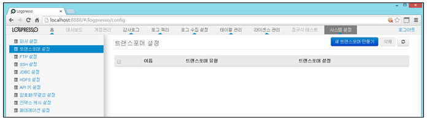
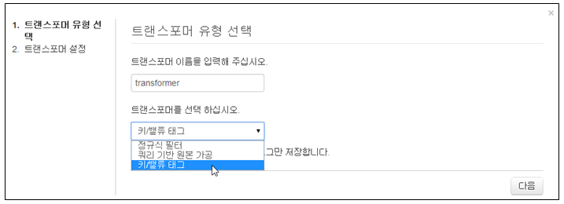
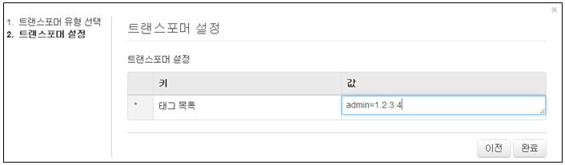
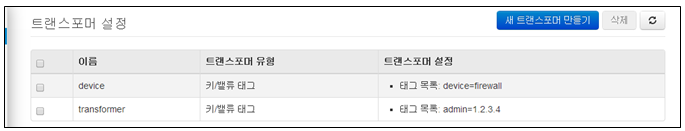
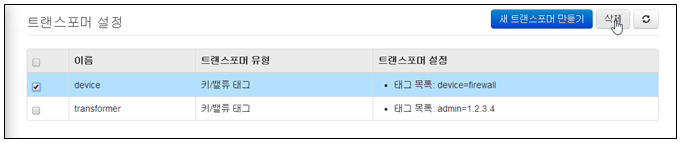
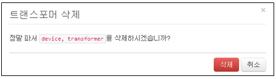

## 13.2. 트랜스포머 설정

원본 로그에 추가적인 데이터를 태깅하거나 원본 로그에 특정한 변형을 가하고 싶은 경우에 트랜스포머를 사용할 수 있습니다.

메뉴는 "시스템설정"에서 트랜스포머 설정" 메뉴를 선택하여 사용합니다.

트랜스포머 설정 메뉴는 아래의 항목으로 확인 및 관리됩니다.

* 선택메뉴 : 삭제기능을 사용할 경우 선택 기능
* 이름 : 등록된 트랜스포머의 대표 이름
* 트랜스포머 유형 : 등록된 트랜스포머의 유형 표시
* 트랜스포머 설정 : 트랜스포머 유형에 따른 입력값의 내용을 표시

### 13.2.1. 트랜스 포머 생성

새로운 트랜스포머를 생성하기 위하여 "새 트랜스포머만들기" 메뉴를 선택합니다.

* 트랜스포머 이름 : 영어, 숫자, \_ 로 구성되어야 합니다.

	\- 이름은 동일한 이름을 사용할 수 없습니다.

* 트랜스포머 선택 : 정규식필터, 쿼리기반원본가공, 키/밸류태그 항목 중에서 선택합니다.

	\- 선택 항목에 따라서 입력을 요구하는 내용은 다릅니다.

트랜스 포머 생성은 아래의 과정으로 생성됩니다.

* 이름 및 트랜스포머 유형을 선택한 후 "다음" 메뉴를 선택합니다.

* 선택 유형에 따른 값을 입력합니다.

* 등록 완료 화면

### 13.2.2. 트랜스 포머 삭제

* 등록된 트랜스 포머 중에서 삭제할 이름을 선택한 후 "삭제" 메뉴를 선택합니다.

* "삭제" 메뉴를 선택하여 삭제를 완료합니다.

