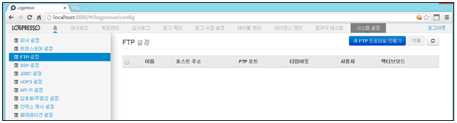
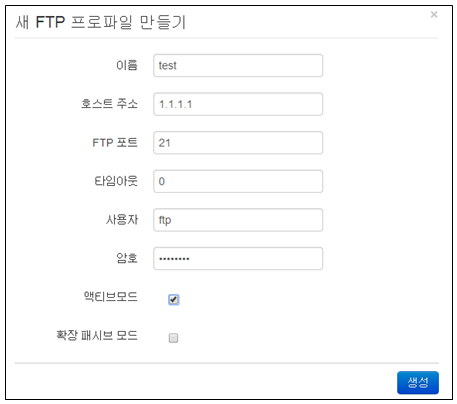
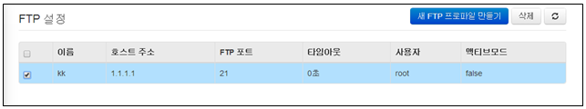
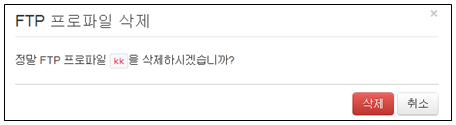

## 13.3. FTP 설정

FTP를 통해 로그를 수집하려는 경우 미리 FTP 프로파일을 설정해두어야 합니다. 설정한 프로파일은 로그수집 설정을 적용할 때 수집 유형이 FTP 방식일 경우 사용됩니다.

메뉴는 "시스템설정"에서 "FTP 설정" 메뉴를 선택하여 사용합니다.

FTP 설정 메뉴는 아래의 항목으로 확인 및 관리됩니다.

* 선택메뉴 : 삭제기능을 사용할 경우 선택 기능
* 이름 : 기존의 FTP 프로파일과 중복되지 않는 유일한 이름
* 호스트 주소 : FTP로 접속할 호스트 주소 표시
* FTP 포트 : FTP 포트 번호 표시. 기본값은 21
* 타임아웃 : 연결 대시 시간 표시
* 사용자 : 계정 이름 표시
* 액티브모드 : FTP 접속 방식 표시

### 13.3.1. FTP 프로파일 생성

새로운 FTP 프로파일을 생성하기 위하여 "새FTP 프로파일 만들기" 메뉴를 선택합니다.
설정에 필요한 입력값을 입력한 후 "생성" 메뉴를 선택합니다.

* 이름: 기존의 FTP 프로파일과 중복되지 않는 유일한 이름을 부여.
	\- 이름은 영어, 숫자, \_ 로 구성되어야 합니다.
* 호스트 주소: FTP로 접속할 호스트 주소를 입력합니다.
* FTP 포트: FTP 포트 번호를 입력. 기본값은 21.
* 타임아웃 : 대기시간 입력.(단위:초)
* 사용자: 계정 이름을 입력. 익명 로그인의 경우 건너뜀.
* 암호: 계정 암호를 입력. 익명 로그인의 경우 건너뜀.
* 액티브 모드: 접속하는 클라이언트 측 방화벽이 없는 경우 선택을하면 액티브 모드로 설정. 최근 대부분 클라이언트  측 방화벽이 존재하므로 기본적으로 FTP 접속 후에 패시브 모드로 동작.

### 13.3.2. FTP 프로파일 삭제

* FTP설정 화면에서 등록된 프로파일 이름 중에서 삭제하고자 하는 이름을 선택합니다.

* "삭제" 메뉴를 선택하여 삭제를 완료합니다.

