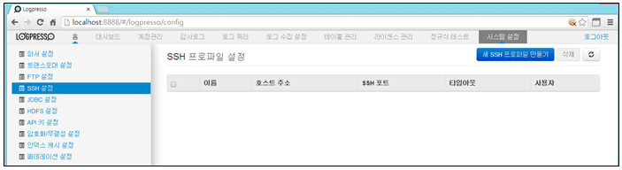
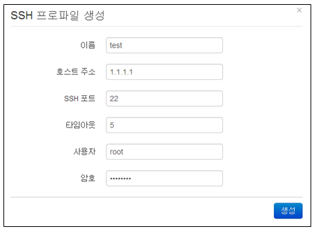
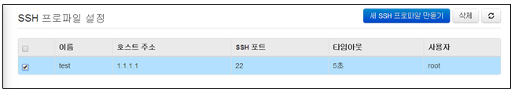
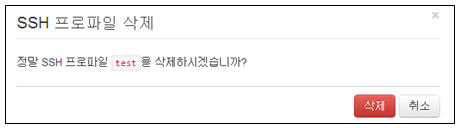

## 13.4. SSH 설정

sshfs 커맨드를 사용하여 원격지 텍스트 파일에 대한 쿼리를 수행하거나, SSH 혹은 SFTP를 통해 로그를 수집하려는 경우에는 SSH 프로파일을 미리 설정해두어야 합니다. 설정한 프로파일은 로그수집 설정을 적용할 때 수집 유형이 SFTP 방식일 경우 사용됩니다.

메뉴는 "시스템설정"의 "SSH 설정" 메뉴를 선택하여 사용합니다.

SSH 설정 메뉴는 아래의 항목으로 확인 및 관리됩니다.

* 선택메뉴 : 삭제기능을 사용할 경우 선택 기능
* 이름 : 기존의 FTP 프로파일과 중복되지 않는 유일한 이름
* 호스트 주소 : FTP로 접속할 호스트 주소 표시
* SSH 포트 : FTP 포트 번호 표시. 기본값은 21
* 타임아웃 : 연결 대시 시간 표시
* 사용자 : 계정 이름 표시

### 13.4.1. SSH 프로파일 생성

새로운 SSH 프로파일을 생성하기 위하여 "새SSH 프로파일 만들기" 메뉴를 선택합니다.

설정에 필요한 입력값을 입력한 후 "생성" 메뉴를 선택합니다.

* 이름: 기존의 SSH 프로파일과 중복되지 않는 유일한 이름을 부여.
	\- 이름은 영어, 숫자, \_ 로 구성되어야 합니다.
* 호스트 주소: SSH로 접속할 호스트 주소를 입력.
*  포트: SSH 포트 번호를 입력. 기본값은 22.
* 타임아웃 : 대기시간 입력.(단위:초)
* 사용자: 계정 이름을 입력.
* 암호: 계정 암호를 입력. 익명 로그인의 경우 건너뜀.

### 13.4.2. SSH 프로파일 삭제

* SSH 설정 화면에서 등록된 프로파일 이름 중에서 삭제하고자 하는 이름을 선택합니다.

* "삭제" 메뉴를 선택하여 삭제를 완료합니다.

