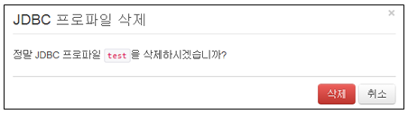

## 13.5. JDBC 설정

SQL을 사용하여 데이터베이스에 질의하려면 JDBC 프로파일을 미리 설정해두어야 합니다. 설정한 프로파일은 로그수집 설정을 적용할 때 수집 유형이 JDBC 방식일 경우 사용됩니다.

메뉴는 "시스템설정"의 "JDBC 설정" 메뉴를 선택하여 사용합니다.

JDBC 설정 메뉴는 아래의 항목으로 확인 및 관리됩니다.

* 선택메뉴: 삭제기능을 사용할 경우 선택 기능
* 이름: 프로파일을 이름을 표시.
* 접속 문자열: 문자열을 표시.
* 사용자: 사용자 표시
* 읽기 전용: 상태 표시

### 13.5.1. JDBC 프로파일 생성

새로운 JDBC 프로파일을 생성하기 위하여 "새JDBC 프로파일 만들기" 메뉴를 선택합니다.

설정에 필요한 입력값을 입력한 후 "생성" 메뉴를 선택합니다.

* 이름: 프로파일을 식별하는데 사용할 유일한 이름을 부여.
	\- 이름은 영어, 숫자, \_ 로 구성되어야 합니다.
* 접속 문자열: JDBC 스키마 형식으로 접속 문자열을 입력.
* 사용자: DB 계정 이름을 입력. 기본값은 null
* 암호: 암호를 입력. 기본값은 null
* 읽기전용 : JDBC 연결 생성 시 읽기 전용 모드로 설정. 사용이나 미사용을 선택할 수 있으며, 기본값은 미사용입니다.

### 13.5.2. JDBC 프로파일 삭제

* JDBC 설정 화면에서 등록된 프로파일 이름 중에서 삭제하고자 하는 이름을 선택한후 "삭제" 메뉴를 선택합니다.

* "삭제" 메뉴를 선택하여 삭제를 완료합니다.

### 13.5.3. JDBC 접속 문자열 예제

* 오라클 DB: jdbc:oracle:thin:@hostname:1521:dbname
* 마이크로소프트 SQL 서버: jdbc:sqlserver://hostname:1433;DatabaseName=dbname
* 마리아DB: jdbc:mariadb://hostname:3306/dbname
* MySQL: jdbc:mysql://hostname:3306/dbname
* 테라데이터 Aster: jdbc:ncluster://hostname:2406/dbname
* 티베로: jdbc:tibero:thin:@hostname:8629:dbname
* 아파치 하이브: jdbc:hive2://hostname:10000

