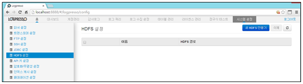
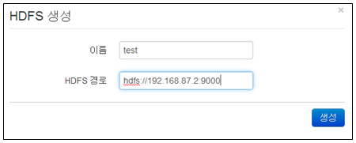
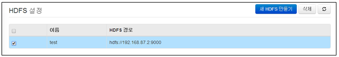
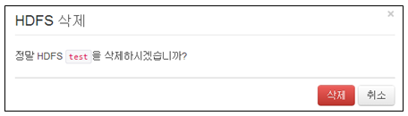

## 13.6. HDFS 설정

하둡 커넥터가 설치된 경우, 하둡 클러스터를 연동하여 사용할 수 있습니다. 실시간으로 HDFS에서 원본 데이터를 수집하거나, 반대로 로그프레소를 통해 수집된 로그를 실시간으로 HDFS에 적재할 수 있습니다. 또한 쿼리를 사용하여 HDFS에 있는 파일을 즉시 조회 및 분석할 수 있으며, 로그프레소 쿼리 결과를 HDFS에 파일로 출력할 수 있습니다.

메뉴는 "시스템설정"의 "HDFS 설정" 메뉴를 선택하여 사용합니다.

HDFS 설정 메뉴는 아래의 항목으로 확인 및 관리됩니다.

* 선택메뉴: 삭제기능을 사용할 경우 선택 기능
* 이름: 프로파일을 이름을 표시.
* HDFS 경로: HDFS 서버 주소 및 서비스포트 표시

### 13.6.1. HDFS 프로파일 생성

새로운 HDFS 프로파일을 생성하기 위하여 "새HDFS 프로파일 만들기" 메뉴를 선택합니다.

설정에 필요한 입력값을 입력한 후 "생성" 메뉴를 선택합니다.

* 이름: 프로파일을 식별하는데 사용할 유일한 이름을 부여.
* HDFS 경로: HDFS 서버 주소 및 서비스포트 입력.

### 13.6.2. HDFS 프로파일 삭제

* JDBC 설정 화면에서 등록된 프로파일 이름 중에서 삭제하고자 하는 이름을 선택한 후 "삭제" 메뉴를 선택합니다.

* "삭제" 메뉴를 선택하여 삭제를 완료합니다.

