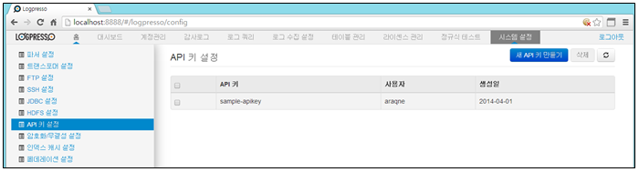
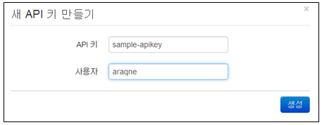
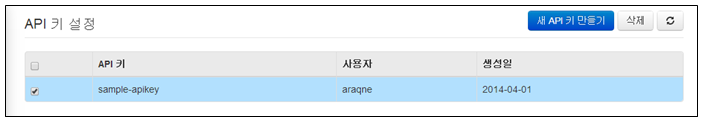
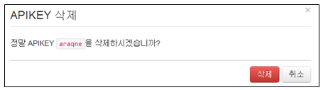

## 13.7. API키 설정

모든 기능이 갖춰진 전용 클라이언트 라이브러리를 사용하지 않더라도 HTTP를 이용하여 쉽게 연동할 수 있습니다. 간단한 스크립트, 혹은 기존의 HTTP 클라이언트 프로그램을 통하여 자동화된 쿼리를 수행하도록 구축할 수 있습니다. 이를 위해서는 먼저 API 키를 발급해야 합니다.

API 키는 임의의 랜덤한 문자열을 이용하여 권한을 부여하므로 사용자의 계정과 암호를 외부에 노출하지 않아야 합니다. 그러나 API 키 자체가 암호와 동일한 인증 수단의 역할을 하기 때문에 주의하여 관리하여야 하고, API 키와 연관되는 계정은 별도로 구성하여 최소한의 데이터 접근 권한만을 가지도록 해야 안전합니다.

메뉴는 "시스템설정" "API키 설정" 메뉴를 선택하여 사용합니다.

API키 설정 메뉴는 아래의 항목으로 확인 및 관리됩니다.

* 선택메뉴: 삭제기능을 사용할 경우 선택 기능
* API키: 키 이름을 표시.
* 사용자: 사용자 표시
* 생성일: 생성일자 표시

### 13.7.1. API키 프로파일 생성

새로운 API키 프로파일을 생성하기 위하여 "새API키 만들기" 메뉴를 선택합니다.

설정에 필요한 입력값을 입력한 후 "생성" 메뉴를 선택합니다.

* API키: 임의의 API 키 문자열
* 사용자: API 키를 통해 인증할 계정 이름

### 13.7.2. API키 프로파일 삭제

* API키 설정 화면에서 등록된 프로파일 이름 중에서 삭제하고자 하는 이름을 선택한 후 "삭제" 메뉴를 선택합니다.

* "삭제" 메뉴를 선택하여 삭제를 완료합니다.

### 13.7.3. REST API 쿼리

API 키가 등록되면 /logpresso/httpexport/query 경로를 통하여 쿼리를 수행할 수 있습니다. HTTP 쿼리스트링에 다음과 같은 매개변수를 포함해야 합니다.

* \_apikey: 등록된 API 키 문자열
* \_q: 로그프레소 쿼리 문자열, URLencode 필요 (가령, 공백문자는 +로 쓰여야 합니다.)
* \_limit: 최대 결과 행 갯수
* \_fields: 출력필드 순서 지정, 필드 이름들을 쉼표로 구분하여 순서대로 입력합니다. (logpresso-core 0.7.5 버전부터 지원)

또한, 경로 확장자에 따라 3종의 출력 포맷을 지원합니다. 확장자가 없는 경우 html 포맷으로 지정됩니다.

* /logpresso/httpexport/query.csv: CSV 포맷으로 출력.
* /logpresso/httpexport/query.xml: 엑셀 XML 포맷으로 출력.
* /logpresso/httpexport/query.html: HTML 포맷으로 출력.

HTML 및 CSV 출력 시 첫 행은 컬럼 헤더에 해당합니다.

### 13.7.4. 테스트 시나리오

아래와 같은 단계를 거쳐서 HTTP 쿼리 동작을 시험할 수 있습니다.

* 1.araqne> logpresso.createApiKey sample-apikey araqne
  sample-apikey API 키를 araqne 계정으로 인증되도록 설정합니다.

* 2.웹 브라우저를 사용하여 아래의 주소로 접속 테스트
	`http://hostname:port/logpresso/httpexport/query?_apikey=sample-apikey&_q=logdb+tables`

