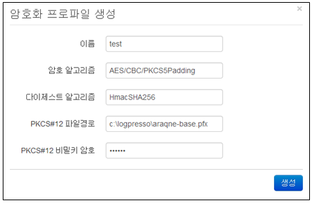

## 13.8. 암호화/무결성 설정

로그프레소는 데이터 원본을 실시간 압축하는 동시에 암호화 및 다이제스트 생성을 통하여 기밀성과 무결성을 보장합니다. 데이터 암호화를 설정하려면 먼저 암호화 프로파일을 만든 후, 테이블 생성 시 crypto 옵션으로 암호화 프로파일을 지정합니다.

로그프레소는 PKCS#12 인증서 파일에서 공개키와 비밀키를 읽어들여 사용합니다. 일자별 데이터 원본 파일(.dat)을 생성할 때 일자별 암호키 파일 (.key)을 생성합니다. 암호키 파일에는 해당 일자의 데이터 원본 파일을 암호화 및 HMAC 다이제스트 하는데 사용한 키, 암호 알고리즘, 다이제스트 알고리즘에 대한 정보가 포함됩니다. 암호키 파일은 PKCS#12 공개키를 사용하여 암호화되고 비밀키를 사용하여 복호화되므로, 사용자가 설정한 인증서가 없으면 로그 원본 데이터 파일이 유출되더라도 임의로 내용을 읽을 수 없습니다.

메뉴는 "시스템설정" "HDFS 설정" 메뉴를 선택하여 사용합니다.

HDFS 설정 메뉴는 아래의 항목으로 확인 및 관리됩니다.

* 선택메뉴: 삭제기능을 사용할 경우 선택 기능
* 사용자: 프로파일을 이름을 표시.
* 암호알고리즘: 이름 표시
* 다이제스트알고리즘: 이름 표시
* PKCS#12 파일경로: 인증서 경로 표시

### 13.8.1. 암호화 프로파일 생성

유효기간이 만료된 PKCS#12 파일이라도 데이터 암호화 하는데 문제 없이 사용할 수 있습니다. PKCS#12 비밀키를 읽어들이는데 필요한 암호를 입력하고, 이어서 암호 알고리즘과 다이제스트 알고리즘을 입력합니다. 암호알고리즘을 입력하지 않으면 데이터 암호화 없이 다이제스트만 생성하게 됩니다.

새로운 암호화/무결성 프로파일을 생성하기 위하여 "새암호화 프로파일 만들기" 메뉴를 선택합니다.
설정에 필요한 입력값을 입력한 후 "생성" 메뉴를 선택합니다.

* 이름: 프로파일을 식별하는데 사용할 유일한 이름을 부여.
* 암호알고리즘: 암호 알고리즘 방식 입력. 기본값 AES/CBC/PKCS5Padding 임.
* 다이제스트 알고리즘: 요약 알고리즘 입력. 기본값 HmacSHA256 임.
* PKCS#12 파일경로: 인증서 경로 입력.
* PKCS#12 비밀키 암호: 인증서 암호 입력.

### 13.8.2. 암호화 프로파일 삭제

* JDBC 설정 화면에서 등록된 프로파일 이름 중에서 삭제하고자 하는 이름을 선택한 후 "삭제" 메뉴를 선택합니다.

* "삭제" 메뉴를 선택하여 삭제를 완료합니다.

### 13.8.3. 테이블 암호화 설정

아래 예시와 같이 테이블 생성 시 암호화 프로파일 이름을 crypto 옵션으로 지정합니다.

~~~
    araqne> logstorage.createTable iis v3p crypto=aes
    table created
~~~

### 13.8.4. 무결성 검증

logcheck 쿼리 커맨드를 사용하여 데이터 원본의 무결성을 검증할 수 있습니다. from과 to 옵션을 사용하여 검사 대상 기간을 지정할 수 있습니다.

~~~
    logcheck from=yyyyMMdd to=yyyyMMdd table1 [, table2, table3, ... ]
    
    araqne@logdb> query logcheck iis
    {block_id=999, day=Tue Aug 06 00:00:00 KST 2013, 
    hash=29ae97b40f7008283e7c6f0be665621b489d53862dec326ba4c3ab0a25b3a2f9, 
    signature=29077f4653adb072120bd620edce149c7e362b2d9f00c1c6eab29d824cb08d87, 
      table=iis}
    total 1 rows, elapsed 0.9s
~~~

데이터 원본이 위조 혹은 변조된 경우, 위와 같이 무결성이 깨진 데이터 블럭에 대한 정보가 표시됩니다. signature는 초기 데이터 기록 시의 해시 값이며, hash는 현재 데이터를 기준으로 계산된 해시 값입니다.

