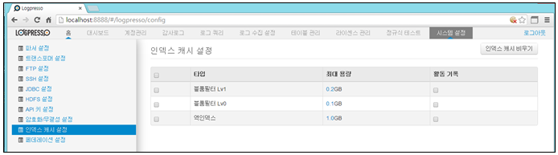
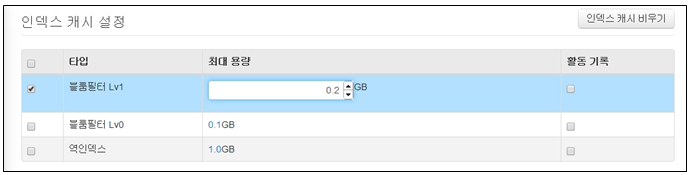
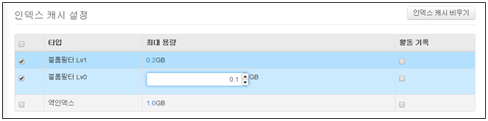
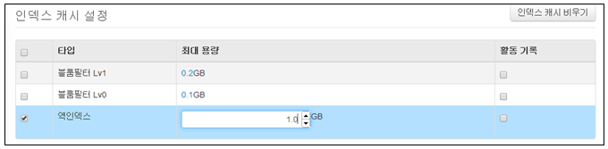
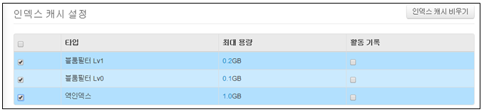

## 13.9. 인덱스 캐시 설정

검색 성능을 극대화하려면 캐시를 설정해야 합니다. 모든 캐시는 기본값으로 100MB가 지정되어 있습니다. 캐시는 다이렉트 버퍼를 사용하므로 JVM 실행 시 반드시 전체 캐시 용량보다 크게 최대 다이렉트 버퍼(MaxDirectMemorySize) 크기를 설정해야 합니다. 즉 JVM 파라메터인 MaxDirectMemorySize의 값에 설정한 크기보다 인덱스 캐시 항목을 모두 더한 값이 작게 설정되어야 합니다.

메뉴는 "시스템설정"의 "인덱스 캐시 설정" 메뉴를 선택하여 사용합니다.

인덱스 캐시 설정 메뉴는 아래의 항목으로 확인 및 관리됩니다.

* 선택메뉴: 캐시된 용량을 clear 할 경우 선택 메뉴 사용
* 타입: 캐시 타입 이름을 표시.
* 최대용량: 할당된 용량 표시
* 활동기록: 로그기록 여부 선택

### 13.9.1. 인덱스 캐시 최대용량 변경

인덱스 캐시 타입별로 용량을 적용하기 위해서 "최대용량" 항목의 용량을 입력합니다. 기본 단위는 GB이며 MB를 적용할 경우 용량을 0.1(100M)의 형식으로 입력합니다. 설정에 필요한 최대용량을 입력합니다.

* 블룸필터 LV1 최대용량입력

* 블룸필터 LV0 최대용량입력

* 역인덱스 최대용량입력

### 13.9.2. 인덱스 캐시 삭제

현재 캐시된 모든 항목을 버릴 수 있습니다. 캐시를 비울 경우 현재까지 캐시되어 쌓여있는 내용이 모두 초기화됩니다. 캐시 항목별로 적용된 최대용량이 변경되는 것이 아닌 최대용량의 공간 내에서 사용된 캐시가 초기화되는 것입니다.

* 캐시된 내용을 삭제하기 원하는 항목을 선택 후 "인덱스 캐시 비우기" 메뉴를 선택합니다.

