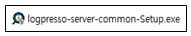
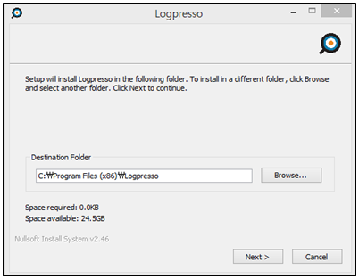
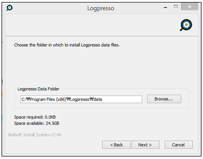
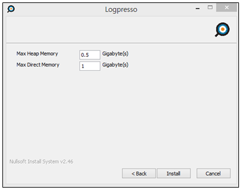
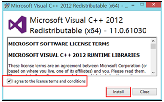
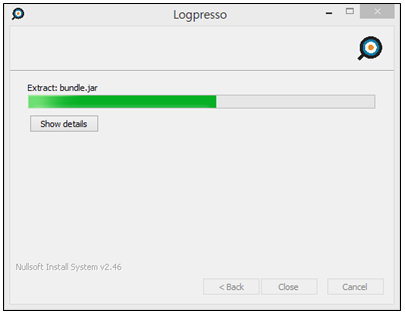
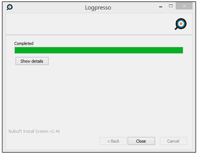
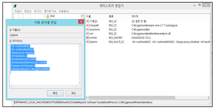
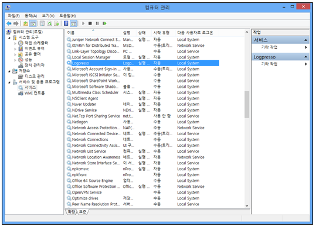

## 2.1. 로그프레소 서버 설치

로그프레소 서버 설치는 OS의 환경에 따라서 유닉스 계열 설치와 윈도우 계열 OS에 설치하는 2 종류로 분류됩니다. 로그프레소 서버는 java에 기반을 두고있기 때문에 패키지 설치에 특별한 제약이 없으며 jre 7 이상이 구동되는 OS 플랫폼 환경이면 설치가 가능합니다.

### 2.1.1 리눅스 설치

#### 2.1.1.1. 설치 환경

로그프레소는 java 플랫폼에 기반을 두고 운영되는 OSGi 번들 및 패키지 시스템입니다.

* 사용 Platform : Linux 서버 (Linux 64-bit 권장)
* Java 버전 : jre 7
* 구성 : 로그프레소, araqne DB

#### 2.1.1.2. 로그프레소 패키지 설치

1) 패키지 전송 및 설정

* 서버 설치 패키지를 설치할 서버의 프로그램 설치 디렉토리에 복사합니다.
* ftp, sftp 혹은 기타 제공되는 파일 전송 가능한 방법을 사용하여 패키지를 복사합니다.
* 압축을 해제한 후 시작/중지 스크립트에 필요한 설정을 합니다.
* 시작/중지 스크립트를 구동합니다.

2) 디렉토리 및 엔진 파일 설명

* cache : 설치된 OSGi 번들 캐시 저장 위치
* log : 일자별로 롤링되는 araqne.log 파일 (기본 7일치 보관)
* data : 번들 데이터 저장 위치(설정, 로그DB 데이터, DB 인덱스)(데이터 저장 위치는 옵션에 따라서 변경 가능.)
* araqne-core-2.7.8-package.jar : 로그프레소 엔진 파일 (파일 버전 번호는 다를 수 있음.)
* logpresso.sh : 패키지 시작/중지 스크립트

3) 프로그램 시작/중지 스크립트인 logpresso.sh 파일 내용 샘플

~~~
    #!/bin/bash

    #####################################################################################
    export MALLOC_ARENA_MAX=1
    export JAVA_HOME=/data/logpresso/jre1.7.0_45
    HOSTNAME=`hostname`
    SCRIPTNAME=$(basename $0)
    INSTANCE_ID="$HOSTNAME"
    #DATADIR="/data01"
    #JAVA_OPTS="$JAVA_OPTS -Daraqne.data.dir=$DATADIR/logpresso-data"

    ####################################################################################
    # MAYBE YOU DON'T NEED TO TOUCH BELOW HERE
    ####################################################################################
    # GENERAL CONFIGURATION
    JAVA_OPTS="$JAVA_OPTS -DINSTANCE_ID=$INSTANCE_ID"
    JAVA_OPTS="$JAVA_OPTS -Dipojo.proxy=disabled"
    JAVA_OPTS="$JAVA_OPTS -Daraqne.ssh.timeout=0"
    JAVA_OPTS="$JAVA_OPTS -XX:+UseParallelGC -XX:+UseParallelOldGC -XX:+PrintGCDetails"
    JAVA_OPTS="$JAVA_OPTS -XX:NewRatio=1"
    JAVA_OPTS="$JAVA_OPTS -Xms5G -Xmx5G"
    JAVA_OPTS="$JAVA_OPTS -XX:MaxPermSize=300M"
    JAVA_OPTS="$JAVA_OPTS -XX:MaxDirectMemorySize=16G"
    ..........
~~~

4) 제공 포트

로그프레소가 실행이 되면 기본적으로 제공되는 포트.(옵션 설정으로 변경 가능.)

* 로그프레소 엔진 및 DB 접속을 위한 제공 포트 텔넷 : (7004/tcp) 및 SSH (7022/tcp)
* 로그프레소 엔진 접속 방법 : ssh –p7022 localhost, telnet localhost 7004

5) 시작 및 중지

로그프레소 엔진은 `logpresso.sh` 스크립트를 사용하여 시작과 중지 기능을 수행합니다. 서버가 윈도우 OS인 경우는 윈도우 서비스를 사용하여 시작과 중지 기능을 수행합니다.

* `[start]`

~~~
    [root@logpresso]# ./logpresso.sh start
    starting araqne-core with INSTANCE_ID=centos..
    [root@logpresso]#
~~~

* `[stop]`

~~~
    [root@ logpresso]# ./logpresso.sh stop
    waiting for shutdown...done
    [root@logpresso]#
~~~

6) 시작 여부 점검

* `ps -ef` 명령어를 사용하여 java 프로세스가 정상적으로 구동되고 있는지 확인합니다.

~~~
    [root@logpresso]# ps -ef|grep java
    root      5259     1 90 05:31 pts/0    00:00:04 /usr/java/jdk1.7.0_25/bin/java 
    -Daraqne.data.dir=/home/logpresso/data -DINSTANCE_ID=centos -Dipojo.proxy=disabled
    -Daraqne.ssh.timeout=0 -XX:+UseParallelGC -XX:+UseParallelOldGC -XX:+PrintGCDetails
    -XX:NewRatio=1 -Xms500M -Xmx900M -XX:MaxPermSize=300M -XX:MaxDirectMemorySize=100M 
    -jar araqne-core-2.5.6-package.jar
    [root@logpresso]#
~~~

7) 로그 수집 룰 정상 동작 여부 확인

* 수집 로거의 상태를 `logapi.loggers` 명령어를 사용하여 확인합니다.

~~~
    araqne@leehong Logpresso> logapi.loggers
    Loggers
    ----------------------
    +----------+--------------+--------+-----------+----------+----------+-------------+
    |   name   |    factory   | status | intvl.(ms)|log count | last log | stop reason |
    +----------+--------------+--------+-----------+----------+----------+-------------+
    | ocal\118 |sftp-dirwatch| stopped |         0 |   35,638 |  ......  |             |
    +----------+--------------+--------+-----------+----------+----------+-------------+
    araqne@leehong Logpresso>
~~~

8) 로그 DB 저장 룰 등록 여부 확인

* 수집된 로그를 DB에 저장하는 로거의 상태를 `logpresso.loggers` 명령어를 사용하여 확인합니다.

~~~
    araqne@leehong Logpresso> logpresso.loggers
    Managed Loggers
    -------------------
    +--------+-------------------------+--------------+----------+------------+----------+
    |  type  |           name          |     table    | host tag |   HA mode  | HA logger|
    +--------+-------------------------+--------------+----------+------------+----------+
    | sentry | 172.20.20.3\leehong-sftp| leehong-sftp | null     | standalone | null     |
    | sentry | 172.20.20.3\snmpget     | snmpget      | null     | standalone | null     |
    | sentry | 172.20.20.3\snmpttt     | snmptest     | null     | standalone | null     |
    | local  | local\118               | test         | null     | standalone | null     |
    +--------+-------------------------+--------------+----------+------------+----------+
~~~

9) 로그  DB  저장 모니터링

* 초당 처리되는 로그 건수를 `logpresso.trends` 명령어를 사용하여 모니터링 합니다.

~~~
    araqne@centos logpresso> logpresso.trends
    Log Input Trend
    Press Ctrl-C to stop..
    0 logs/sec
    100 logs/sec
    ……
~~~

10) DB 테이블 정보 확인

* `logstorage.table` 명령어를 사용하여 DB 테이블 전체 리스트를 확인합니다.

~~~
	araqne@centos araqne> logstorage.tables
~~~

* `logstorage.table` 명령어를 사용하여 특정 DB 테이블에 적용되어 있는 정보를 확인합니다.

~~~
    araqne@centos araqne> logstorage.table 테이블명
    Table 테이블명
    Table Metadata
    ----------------
    _filetype=v3p
    compression=snappy
    parser=secure_chain
    Storage information
    ---------------------
    Data path: /home/araqne/logpresso-data/araqne-logstorage/log/11
    Consumption: 56 bytes
    araqne@centos araqne>
~~~

11) 로그수집하는 logapi  logger

* `logapi.loggers` 명령어를 사용하여 등록된 전체 로거 목록 및 상태를 확인합니다.

~~~
	araqne@centos araqne> logapi.loggers
~~~

* `logapi.startLoggers` 명령어를 사용하여 등록 전체 로그 수집 로거 일괄 시작. (시작 시 interval을 주어야 함. 단위:밀리세컨드)

	araqne@centos araqne> logapi.startLoggers * 1000

* `logapi.startLogger` 명령어를 사용하여 특정 로그 수집 로거를 시작합니다. (시작 시 interval을 주어야 함. 단위: 밀리세컨드)

	araqne@centos araqne> logapi.startLogger [로거이름] 1000

* `logapi.stopLoggers` 명령어를 사용하여 등록 전체 로그 수집 로거 일괄 중지합니다.

    araqne@centos araqne> logapi.stopLoggers *

* `logapi.stopLogger` 명령어를 사용하여 특정 로그 수집 로거를 중지합니다.

    araqne@centos araqne> logapi.stopLogger [로거이름]

* `logapi.removeLogger`  명령어를 사용하여 특정 로그 수집 로거 삭제합니다.

    araqne@centos araqne> logapi.removeLogger [로거이름]

12) DB에 수집한 데이터 저장하는 logpresso  logger

* `logpresso.loggers` 명령어를 사용하여 등록된 전체 로거 목록을 확인합니다.

~~~
	araqne@centos araqne> logpresso.loggers
~~~

* `logpresso.removeLogger` 명령어를 사용하여 등록된 로거를 삭제합니다.

	araqne@centos araqne> logpresso.removeLogger [로거이름]

### 2.1.2 윈도우 설치

#### 2.1.2.1. 설치 환경

로그프레소는 java 플랫폼에 기반을 두고 운영되는 OSGi 번들 및 패키지 시스템입니다.

* 사용 Platform : 윈도우 OS (64-bit 권장)
* Java 버전 : jre 7
* 구성 : 로그프레소, araqne DB

#### 2.1.2.2. 로그프레소 설치 준비

* 서버 설치 setup 파일을 설치할 서버의 프로그램 설치 디렉토리에 복사합니다.
* ftp, sftp 혹은 기타 제공되는 파일 전송 가능한 방법을 사용하여 패키지를 복사합니다.

#### 2.1.2.3. 설치 진행 과정

1)  로그프레소 setup 실행 파일 실행합니다.

2) 프로그램 설치 디렉토리를 선택합니다.

3) data 디렉토리를 선택합니다.

4) 메모리 파라메터를 설정합니다.

* Max Heap Memory : java MX 사용량 설정(단위: GB)
* Max Direct Memory : java Direct Memory 사용량 설정(단위: GB)
* 예) 500M를 사용량으로 설정하려면 입력값에 “0.5”를 입력

5) UDP 관련 필요 라이브러리를 설치합니다.

* Setup 파일에 포함되어있고, 설치 장비에 해당 프로그램이 설치되어있지 않을 경우 아래와 같이 나타나면 라이선스 항목 선택 후 Install합니다. 이미 설치되어 있을경우 설치 화면이 나타나날 경우는 "close"를 선택하면 됩니다.

6) 설치 진행 화면

7) 설치 완료 화면

* 설치완료 화면에서 “close”를 선택하여 로그프레소 프로그램 설치를 완료합니다.

8) Setup 완료 후 레지스트리 등록 값을 확인합니다.

9) 시작/중지

* 윈도우 서비스를 사용하여 시작과 중지를 수행합니다.
* 윈도우 서비스 명은 "Logpresso" 입니다.

10) 설치된 로그프레소 서버 프로그램 삭제는 윈도우 제어판의 "프로그램 추가/삭제" 메뉴를 사용하여 제거합니다.

