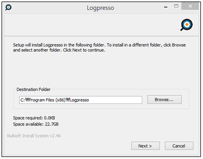
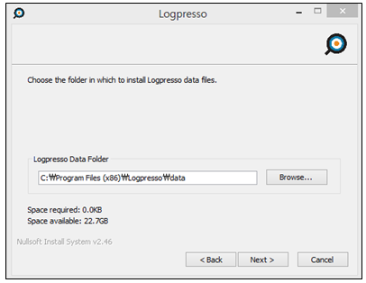
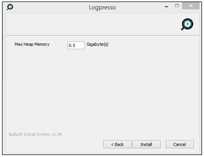
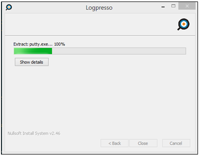
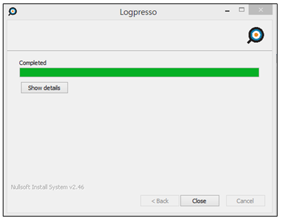
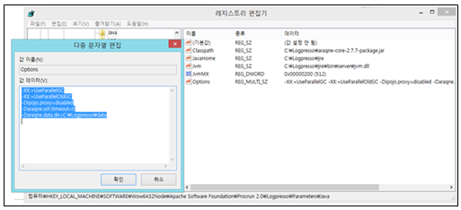

## 2.2. 로그프레소 센트리 설치

센트리(에이전트) 설치는 OS의 환경에 따라서 유닉스 계열 설치와 윈도우 계열 OS에 설치하는 2 종류로 분류됩니다. 로그프레소 서버는 java에 기반을 두고있기 때문에 패키지 설치에 특별한 제약이 없으며 jre 6 이상이 구동되는 OS 플랫폼 환경이면 설치가 가능합니다.

### 2.2.1 유닉스 센트리 설치

#### 2.2.1.1. 설치 환경

로그프레소 센트리는 java 플랫폼에 기반을 두고 운영되는 OSGi 번들 및 패키지 시스템입니다.

* 사용 Platform : 유닉스 OS
* Java 버전 : jre 6 이상
* 구성 : 로그프레소 센트리

#### 2.2.1.2. 로그프레소 센트리 설치

1) 패키지 전송 및 설정

* 센트리 설치 패키지를 설치할 서버의 프로그램 설치 디렉토리에 복사합니다.
* ftp, sftp 혹은 기타 제공되는 파일 전송 가능한 방법을 사용하여 패키지를 복사합니다.
* 압축을 해제한 후 시작/중지 스크립트에 필요한 설정을 합니다.
* 시작/중지 스크립트를 구동합니다.

2) 센트리 설치 디렉토리 및 엔진 파일 설명

* cache : 설치된 OSGi 번들 캐시 저장 위치
* log : 일자별로 롤링되는 araqne.log 파일 (기본 7일치 보관)
* data : 번들 데이터 설정 저장 위치(데이터 저장 위치는 옵션에 따라서 변경 가능.)
* araqne-core-2.7.8-package.jar : 로그프레소 엔진 파일 (파일 버전 번호는 다를 수 있음.)
* logpresso.sh : 패키지 시작/중지 스크립트

3) 프로그램 시작/중지 스크립트인 logpresso.sh 파일 내용 샘플

~~~
    #!/bin/sh

    # chkconfig: 2345 99 20
    ################################################################################
    export MALLOC_ARENA_MAX=1
    PKGDIR=/data/sentry_linux
    JAVA_HOME=/usr/java/jdk1.7.0_25
    export JAVA_HOME
    INSTANCE_ID="Araqne"
    #################################################################################
    # MAYBE YOU DON'T NEED TO TOUCH BELOW HERE
    #################################################################################
    # GENERAL CONFIGURATION

    JAVA_OPTS="$JAVA_OPTS -DINSTANCE_ID=$INSTANCE_ID"
    JAVA_OPTS="$JAVA_OPTS -Dipojo.proxy=disabled"
    JAVA_OPTS="$JAVA_OPTS -Daraqne.ssh.timeout=0"
    JAVA_OPTS="$JAVA_OPTS -XX:+UseParallelGC -XX:+UseParallelOldGC -XX:+PrintGCDetails"
    JAVA_OPTS="$JAVA_OPTS -Xms256M -Xmx256M"
    ###################################################################################
        ..........
~~~

4) 센트리 제공 포트

로그프레소가 실행이 되면 기본적으로 제공되는 포트.(옵션 설정으로 변경 가능.)

* 로그프레소 엔진 및 DB 접속을 위한 제공 포트 텔넷 : (7004/tcp) 및 SSH (7022/tcp)
* 로그프레소 엔진 접속 방법 : ssh –p7022 localhost, telnet localhost 7004

5) 센트리 시작 및 중지

로그프레소 엔진은 `logpresso.sh` 스크립트를 사용하여 시작과 중지 기능을 수행합니다.

6) 서버와 연결 설정을 수행하여 서버와 연결 작업을 수행합니다. 연결 설정은 센트리 엔진에 telnet(7004), ssh(7022) 포트로 접속하여 이루어진다. 서버와 연결되지 않으면 로그를 수집 관리할 수 없습니다.

* 서버에 등록할 센트리 이름을 설정합니다.

~~~
	사용법: sentry.setGuid [센트리이름]
    참고: 센트리 이름은 임의로 설정(이름 혹은 IP로 등록하여 관리)
    
	sentry_linux> sentry.setGuid linux
~~~

* 서버에대한 연결을 설정합니다.

~~~
	사용법: sentry.addBase [대표이름] [서버주소] [연결포트] [인증서alias] 
                 [신뢰인증서alias] [스왑용량]
	참고: 연결포트(7140), 인증서alias(rpc-agent), 신뢰인증서alise(rpc-ca)는 기본적으로
          고정되어있다.
          
    sentry_linux> sentry.addBase monitor 192.168.219.104 7140 rpc-agent rpc-ca 100000000
~~~

* 서버와 연결 상태를 확인합니다.

~~~
    sentry_linux> sentry.connections
    Connections
    --------------------
    [monitor] id=2809095, peer=(25eef146-25d5-4ec9-ba09-6c4963406557, /192.168.219.104:7140), 
      trusted level=Low, ssl=true, props={ping_failure=0, type=command}
    sentry_linux>
~~~

### 2.2.2 윈도우 센트리 설치

#### 2.2.2.1. 설치 환경

로그프레소 센트리는 java 플랫폼에 기반을 두고 운영되는 OSGi 번들 및 패키지 시스템입니다.

* 사용 Platform : 윈도우 OS
* Java 버전 : jre 6 이상
* 구성 : 로그프레소 센트리

#### 2.2.2.2. 설치 준비

* 센트리 설치 setup 파일을 설치할 서버의 프로그램 설치 디렉토리에 복사합니다.
* ftp, sftp 혹은 기타 제공되는 파일 전송 가능한 방법을 사용하여 패키지를 복사합니다.

#### 2.2.2.3. 설치 진행 과정

1)  로그프레소 센트리 setup 실행 파일을 실행합니다.

2) 프로그램 설치 디렉토리 선택

3) data 디렉토리 선택

4) 센트리 메모리 파라메터를 설정합니다.

* Max Heap Memory : java MX 사용량 설정(단위: GB)
* 예) 500M를 사용량으로 설정하려면 입력값에 “0.5”를 입력

4) 로그프레소 설치 진행 화면

5) 로그프레소 설치 완료 화면

* 설치완료 화면에서 “close”를 선택하여 로그프레소 센트리 프로그램 설치를 완료합니다.

6) Setup 완료 후 레지스트리 등록 값

7) 로그프레소 센트리 프로그램 삭제는 윈도우 제어판의 "프로그램 추가/제거"를 사용하여 제거합니다.

8) 서버와 연결 설정을 수행하여 서버와 연결 작업을 수행합니다. 연결 설정은 센트리 엔진에 telnet(7004), ssh(7022) 포트로 접속하여 이루어진다. 서버와 연결되지 않으면 로그를 수집 관리할 수 없습니다.

* 서버에 등록할 센트리 이름을 설정합니다.

~~~
	사용법: sentry.setGuid [센트리이름]
    참고: 센트리 이름은 임의로 설정(이름 혹은 IP로 등록하여 관리)
    
	sentry_linux> sentry.setGuid linux
~~~

* 서버에대한 연결을 설정합니다.

~~~
	사용법: sentry.addBase [대표이름] [서버주소] [연결포트] [인증서alias] 
                 [신뢰인증서alias] [스왑용량]
	참고: 연결포트(7140), 인증서alias(rpc-agent), 신뢰인증서alise(rpc-ca)는 기본적으로 고정되어있다.
          
    sentry_linux> sentry.addBase monitor 192.168.219.104 7140 rpc-agent rpc-ca 100000000
~~~

* 서버와 연결 상태를 확인합니다.

~~~
    sentry_linux> sentry.connections
    Connections
    --------------------
    [monitor] id=2809095, peer=(25eef146-25d5-4ec9-ba09-6c4963406557, /192.168.219.104:7140), 
      trusted level=Low, ssl=true, props={ping_failure=0, type=command}
    sentry_linux>
~~~

