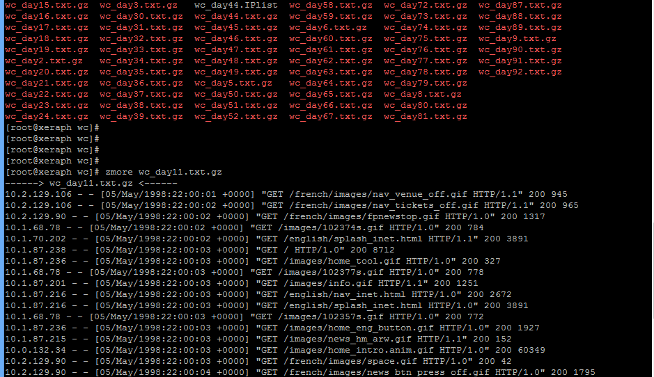

## 3.1. 대상 데이터 조사

로그프레소는 다양한 방식의 데이터 수집 방법으로 데이터를 수집할 수 있도록 기능을 제공합니다.
로그프레소의 로그수집 설정을 적용하기 전에 수집대상이되는 데이터의 데이터 수집을 위해 제공되는 방식 및 데이터의 포멧을 우선 확인을 해야 합니다. 그래야 데이터를 수집하기위한 적절한 방식으로 데이터를 수집할 수 있습니다.

데이터 수집 대상이 파일로 생성된 로그를 수집하는 경우라면 수집 대상이되는 로그 파일의 파일 생성 규칙 및 로그파일의 실제 로그포멧을 확인을 한 후 수집설정을 적용 해야 정확한 로그를 수집할 수 있습니다.

로그파일의 포멧을 확인하는 방법은 명령어(vi,cat,zmore,.....), 편집기, 로그파일의 내용을 확인할 수 있는 방법을 사용하여 로그의 포멧을 확인하면 됩니다.

아래는 특정 디렉토리에 gzip으로 압축되어 생성되는 로그 파일의 로그 포멧을 확인하는 예제입니다.

수집대상 데이터인 gzip 압축 파일이 저장되는 디렉토리로 이동하여 zmore 명령어를 사용하여 로그의 내용을 확인한 결과
아파치 웹로그이고 수집해야할 로그파일의 파일명 및 실제 로그의 내용에서 날짜포멧이 포함되어 있는 것을 확인 하였습니다.
이렇게 확인한 로그파일의 파일명 규칙 및 로그의 날짜포멧, 문자포멧 등은 로그프레소의 수집설정 적용 시 사용됩니다.

