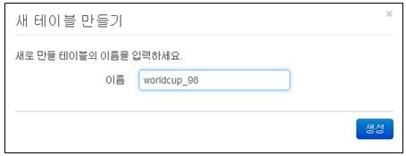

## 3.3. 테이블 생성

테이블은 수집한 데이터를 저장하는 공간이다. 신규 테이블 생성은 "테이블관리" 메뉴를 선택하여 생성 할 수 있습니다.

* 테비블 관리 메뉴에서 "새 테이블 만들기" 메뉴를 선택합니다.

* "새 테이블 만들기" 화면에 생성할 테이블의 이름을 입력한 후 "생성' 메뉴를 선택하여 생성을 완료합니다.
	\- 테이블에 사용할 이름은 "영어, 숫자, \_ " 로 구성되어야 합니다.
	\- 이름 규칙에 위배될 경우 테이블이 생성되지 않는다.

