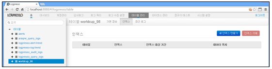
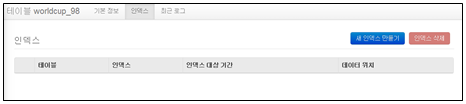
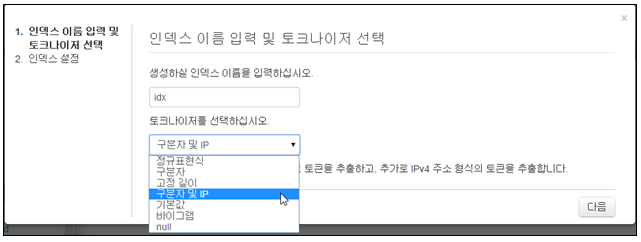
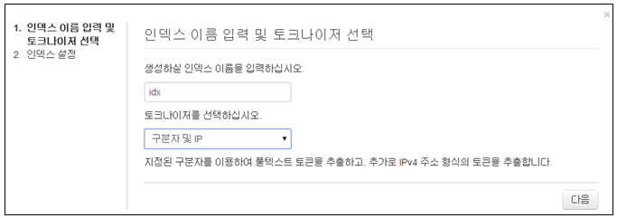
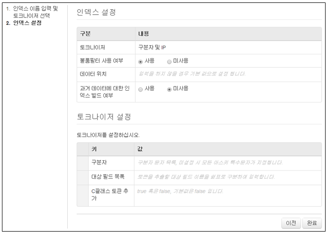
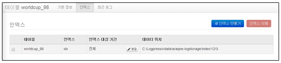

## 3.4. 인덱스 생성

인덱스는 데이터를 빠르게 검색 및 추출하기 위하여 사용 되어지며 다양한 풀텍스트 인덱스 설정을 지원합니다.

인덱스에 대한 관리는 "테이블 관리" 메뉴의 왼쪽 테이블 트리에서 테이블을 선택한 후 표시되는 "인덱스"를 선택하여 인덱스에 대한 생성/삭제/변경에 대한 관리를 수행합니다. 하나의 테이블에는 여러개의 인덱스를 적용할 수 있습니다.

* 테이블 관리 메뉴 : 테이블에 적용된 인덱스 정보 표시

### 3.4.1. 인덱스 생성

* "테이블관리" 메뉴의 왼쪽 테이블 트리에서 테이블을 선택 한 후 "새 인덱스 만들기" 메뉴를 선택합니다.

* 인덱스 이름과 토크나이저를 선택합니다.
	\- 이름은 영어, 숫자, '\_' 로 구성되어야 합니다.
	\- 토크나이저는 원본 로그를 풀텍스트 인덱싱할 때 사용될 풀텍스트 토큰을 만드는 역할을 수행합니다.

* 인덱스 이름과 토크나이저를 선택한 후 "다음"을 선택합니다.

* 인덱스 설정 내용을 입력/선택 한 후 "완료"를 선택하여 생성을 완료합니다.
	\- 불룸필터 사용여부: 사용을 선택합니다.
	\- 데이터 위치: 인덱스 데이터가 저장될 디렉토리 위치 입력
	\- 과거데이터에 대한 인덱스 빌드 여부: 테이블에 과거 데이터가 있을 경우 선택합니다.

* 인덱스 생성 완료 화면에서 생성된 결과를 확인합니다.

