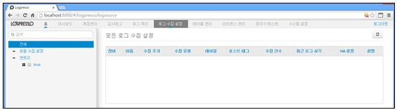

## 3.5. 데이터 입력

로그프레소는 "로그수집설정" 메뉴에서 로그수집에 대한 설정을 제공합니다. 로그수집을 할 경우 로그수집 방식 및 대상에 따라서 수집을 설정하는 방식이 차이가 있습니다. 로그 수집할 경우는 제공되는 로그수집 유형을 적절히 적용하여 수집을 하여야 합니다.

아래는 로컬 시스템의 특정 디렉토리에 gzip 압축파일이 저장되어 있을 경우 로그수집을 설정하여 로그를 수집하는 과정을 예제로 사용하여 설명합니다.

* 메인메뉴의 "로그수집설정" 메뉴를 선택합니다.

* "로그수집설정" 메인메뉴의 왼쪽 "로컬수집설정" 메뉴를 선택한 후 "수집설정추가" 메뉴의 "독립실행형/프라이머리로거" 메뉴를 선택합니다.

* 로그수집유형선택에서 "GZIP 디렉토리와처"를 선택한 후 "다음" 메뉴를 선택합니다.

* "로그수집설정" 메뉴에서 입력값을 입력한 후 "다음" 메뉴를 선택합니다.
	\- 디렉토리경로: 로그파일이 위치한 디렉토리를 입력합니다.
	\- 파일이름패턴: 수집대상 로그파일의 정규화 표현식을 입력합니다.
            이름 패턴: wc_day\d{1,2}\.txt.gz
	\- 날짜 정규표현식: 로그파일 내의 날짜 포멧 추출을 위한 정규 표현식을 입력합니다.
           정규표현식: \[(.*?)\]
	\- 날짜 포멧: 로그파일 내의 날짜 포멧을 입력합니다.
           날짜포멧: dd/MMM/yyyy:HH:mm:ss Z

* 로그기록설정 메뉴에서 "로거이름"을 입력한 후 "새테이블만들기" 메뉴를 선택합니다.
	\- 수집하는 로그를 저장할 테이블이 이미 만들어져 있을 경우는 "새 테이블 만들기"을 생략합니다.

* "새 테이블 만들기" 메뉴에서 "이름"을 입력한 후 "생성" 메뉴를 선택합니다.

* 로그기록설정에서 "refresh" 아이콘을 선택한 후 "테이블이름 선택" 아이콘을 선택하여 로그를 저장할 테이블을 선택한 후 "생성" 메뉴를 선택합니다.

* "로컬수집설정" 메뉴에서 등록 내용을 확인 후 "수집주기" 시간을 입력한 후 "상태" 항목의 "녹색" 버튼을 선택합니다.
	\- 수집주기 : 주기적으로 수집을 시도하는 시간(단위: 초)
	\- 상태: 로그수집 로거의 상태를 표시(녹색:중지상태, 빨간색:구동상태)

* "로컬수집설정" 메뉴에서 등록한 로거가 구동중이고, 로그를 수집하는지 확인합니다.
	\- 수집건수, 최근로그시간 항목을 확인하여 수집 및 날짜 포멧으로 로그 수집여부 확인.

