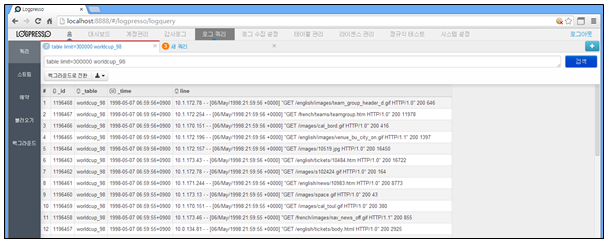
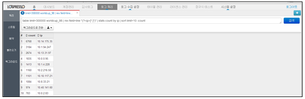
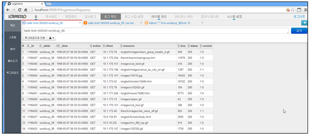
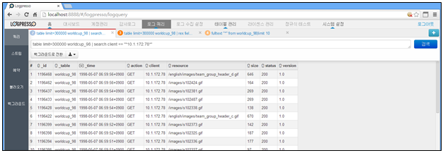
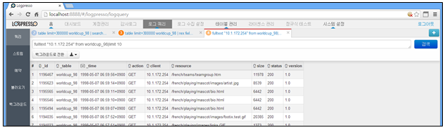

## 3.6. 쿼리 연습

로그프레소에서 수집한 데이터는 DB 테이블에 저장되어 있습니다. 테이블에 저장되어 있는 데이터를 추출하여 내용을 확인 및 분석하기 위해서는 제공되는 쿼리명령어와 함수를 사용하여야 합니다. 쿼리 명령어와 함수에 대한 사용법은 "쿼리명령어" 메뉴얼을 참조하여 사용하여야 합니다.

쿼리 명령어를 사용하기 위해서는 "로그쿼리" 메인메뉴의 왼쪽에 있는 "쿼리" 메뉴를 선택하여 사용할 수 있습니다.

아래 예제는 테이블에 저장된 테이블의 데이터를 추출하는 방법에 대한 예제입니다.

1) 테이블에 저장된 로그 추출 (원본 line 필드 대상 추출)

* 쿼리 명령어 : table limit=300000 worldcup\_98
	\- worldcup\_98 테이블에서 limit 건수 추출

* 쿼리 명령어 : table limit=300000 worldcup\_98 | rex field=line "(?\<ip>[^ ]\*)" | stats count by ip | sort limit=10 -count
	\- worldcup\_98 테이블에서 ip를 추출한 후 ip에 대한 건수를 정렬하여 10건을 추출

2) 테이블에 파서가 적용되어 있을 경우

테이블에 파서가 적용되어 있을 경우는 테이블의 내용이 쿼리명령어로 추출될 때 적용한 파서의 포멧으로 변환되어 추출됩니다. 그래서 필드명이 원본 line이 아닌 파서의 적용을 받은 필드로 결과가 추출됩니다.

* 쿼리 명령어 : table limit=300000 worldcup\_98
	\- 파서에 표현한 형식으로 데이터가 필드로 구분되어 추출됩니다.

* 쿼리 명령어 : table limit=300000 worldcup\_98 | search client=="\*10.1.172.78\*"
	\- worldcup\_98 테이블에서 client 필드를 대상으로 ip 추출

3) 테이블에 인덱스가 적용되어 있을 경우

테이블에 인덱스가 적용되어 있을 경우는 fulltext 명령어를 사용하여 테이블의 데이터를 추출합니다.

* 쿼리 명령어 : fulltext "10.1.172.254" from worldcup\_98 | limit 10

