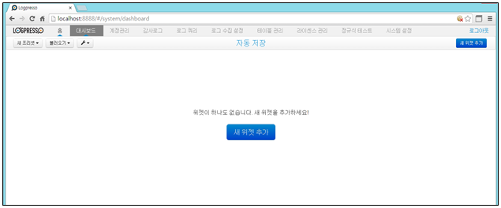

## 3.7. 대시보드 생성

대시보드 전체 화면을 하나의 "프리셋" 이라 합니다. 프리셋은 신규 생성/기존 프리셋 복사 생성 등의 방법을 통하여 여러개의 프리셋을 등록하여 사용할 수 있고, 메인메뉴의 "대시보드" 메뉴의 "불러오기" 메뉴를 선택하여 등록된 프리셋의 내용을 볼 수 있습니다.

대시보드를 실행하지 않을 경우는 프리셋에 등록된 도식화 내용이 업데이트되지 않고 중지 상태에 있으며 등록한 프리셋을 선택하여 활성화 시킬 경우에 도식화된 테이블 혹은 챠트의 내용을 업데이트하여 화면에 표시합니다. 하나의 대시보드(프리셋)는 하나 혹은 여러개의 위젯으로 구성됩니다.

새 위젯은 대시보드 메인화면의 "새 위젯 추가" 메뉴를 선택합니다.

### 3.7.1 테이블 위젯 생성

1) 위젯 종류 선택 메뉴에서 "테이블"을 선택한 후 "다음" 메뉴를 선택합니다..

* 테이블: 출력된 쿼리 결과에 대하여 테이블 형태로 표시되고, 필드를 재배치 할 수 있습니다.

2) 표현할 데이터를 쿼리하기 위하여 쿼리를 입력한 후 "검색" 메뉴를 선택합니다.

* 쿼리 명령어 : table limit=300000 worldcup\_98 | rex field=line "(?\<ip>[^ ]\*)" | stats count by ip | sort limit=10 -count 

3) 쿼리의 검색 결과를 확인 후 원하는 값이면 "다음" 메뉴를 선택합니다.

4) 출력된  컬럼을 원할 경우 재배치하고 "다음" 메뉴를 선택합니다.

* 표시할 필드는 드래그 & 드롭 기능을 사용하여 컬럼의 위치를 변경합니다.

5) 대시보드에 표시할 "이름"을 입력하고, 반복수행할 시간을 입력한 후 "완료" 메뉴를 선택합니다.

6) 대시보드 테이블 결과 화면

7) 결과 화면을 선택하여 대시보드의 위치를 지정하기 위해 상/하/좌/우 중에 위치할 방향을 선택합니다.

8) 대시보드에 등록된 완료 화면.

### 3.7.2 차트 위젯 생성

1) 위젯 종류 선택 메뉴에서 "차트"를 선택한 후 "다음" 메뉴를 선택합니다..

2) 현할 데이터를 쿼리하기 위하여 쿼리를 입력한 후 "검색" 메뉴를 선택합니다.

* 쿼리 명령어 : table limit=300000 worldcup\_98 | rex field=line "(?\<ip>[^ ]\*)" | stats count by ip | sort limit=10 -count 

3) 쿼리의 검색 결과를 확인 후 원하는 값이면 "다음" 메뉴를 선택합니다.

4) 차트의 종류와 컬럼을 선택한 후 "다음" 메뉴를 선택합니다.

5) 차트 미리보기 항목의 내용을 확인 후 "다음" 메뉴를 선택합니다.

6) 위젯에 표시할 "이름"을 입력하고, 반복수행할 시간을 입력한 후 "완료" 메뉴를 선택합니다.

7) 생성된 위젯을 선택한 상태에서 드래그하여 위치할 방향의 화살표을 선택합니다.

8) 대시보드에 표현된 결과를 확인합니다.

