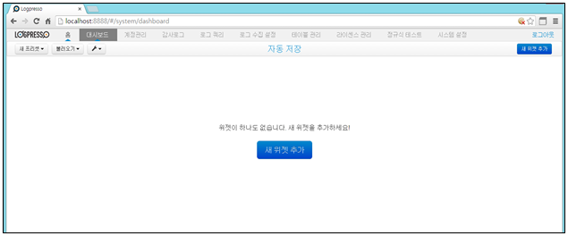

# 5장. 대시보드 #

로그를 수집하여 저장된 테이블의 데이터를 가공하여 수집된 로그에 대하여 필요한 값을 추출하여 값의 변화를 지속적으로 모니터링할 수 있는 기능을 제공합니다.
대시보드의 구성은 위젯을 생성하여 도식화된 챠트 그래프 혹은 테이블 형태로 표현됩니다.

대시보드는 메인메뉴의 "대시보드" 메뉴를 선택하여 사용합니다.

* 메인메뉴에서 "대시보드"를 선택합니다.

