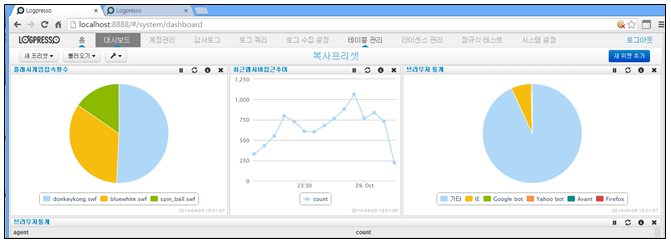

## 5.1. 프리셋

대시보드 전체 화면을 하나의 "프리셋" 이라 합니다. 프리셋은 신규 생성/기존 프리셋 복사 생성 등의 방법을 통하여 여러개의 프리셋을 등록하여 사용할 수 있고, 메인메뉴의 "대시보드" 메뉴의 "불러오기" 메뉴를 선택하여 등록된 프리셋의 내용을 볼 수 있습니다.

대시보드를 실행하지 않을 경우는 프리셋에 등록된 도식화 내용이 업데이트되지 않고 중지 상태에 있으며 등록한 프리셋을 선택하여 활성화 시킬 경우에 도식화된 테이블 혹은 챠트의 내용을 업데이트하여 화면에 표시합니다. 하나의 대시보드(프리셋)는 하나 혹은 여러개의 위젯으로 구성됩니다.

### 5.1.1. 프리셋 생성

1) 빈 프리셋 생성

* 대시보드 메인 화면의 "새 프리셋" 메뉴를 선택한 후 "빈프리셋"을 선택합니다. 프리셋에서 사용할 이름을 입력한 후 "확인" 메뉴를 선택하여 빈 프리셋 추가 생성을 완료합니다.

* 빈 프리셋 생성 완료 화면.

2) 현재 프리셋을 다른이름으로 저장

* 대시보드 메인 화면의 "새 프리셋" 메뉴를 선택한 후 "현재 프리셋을 다른이름으로 저장"을 선택합니다. 프리셋에서 사용할 이름을 입력한 후 "확인" 메뉴를 선택하여 현재 프리셋을 다른이름으로 저장 추가 생성을 완료합니다.

* 현재 프리셋을 다른이름으로 저장 생성 완료 화면.

### 5.1.2. 프리셋 불러오기

* 대시보드 화면에서 "불러오기" 메뉴를 선택하여 등록된 프리셋을 선택합니다.

* "불러오기" 메뉴를 사용하여 불러온 프리셋 화면.

### 5.1.3. 프리셋 삭제

* 대시보드 메인 메뉴에서 삭제 아이콘을 선택하여 "이 프리셋 삭제" 메뉴를 선택하여 삭제를 완료합니다.

