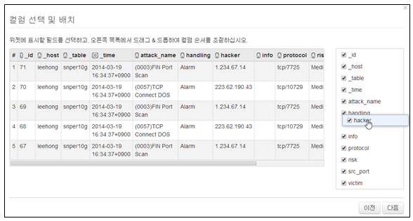
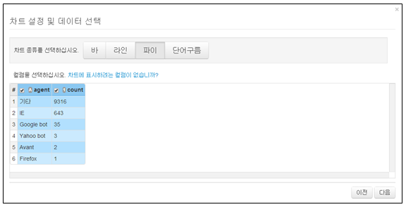
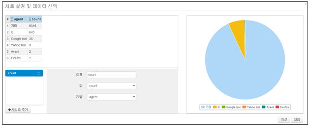
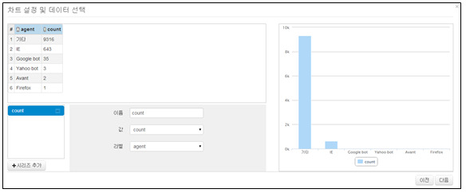

## 5.2. 위젯 타입

위젯은 생성 과정 중에 위젯을 표시할 타입을 선택할 수 있습니다. 선택할 수 있는 타입은 테이블, 챠트 2 종류이며 선택한 타입의 종류에 따라서 입력값 및 사용법의 차이가 있습니다.

### 5.2.1. 테이블 위젯 타입

위젯 생성 진행 중에 위젯 종류를 "테이블"로 선택할 경우 데이터 쿼리의 결과로 출력된 결과 값에 대한 컬럼의 순서를 임의로 변경하여 프리셋에 위젯을 표현합니다.

* 위젯 생성 진행 중에 쿼리결과에 대한 컬럼을 선택 후 원하는 위치로 이동할 수 있습니다.

### 5.2.2. 챠트 위젯 타입

위젯 생성 진행 중에 위젯 종류를 "차트"를 선택할 경우 데이터 쿼리의 결과로 출력된 결과 값에 대하여 프리셋에 표현할 차트의 종류를 선택하여 프리셋에 선택한 차트의 형태로 결과 값을 위젯에 표현합니다.

차트설정 및 데이터 선택 화면에서 사용하기위한 차트의 종류를 선택합니다. 선택한 차트의 종류에 따라서 표현되는 차트 모양만 다르고 진행 과정은 동일합니다.

데이터 컬럼의 데이터 내용에 따라서 표현하기 적합한 차트의 종류를 선택하면 됩니다.

1) 위젯 생성 진행 중 쿼리결과에 대해 표현할 차트의 종류 및 컬럼을 선택한 후 "다음" 메뉴를 선택합니다.

2) 선택한 차트의 종류 및 컬럼의 결과에 대한 미리보기 화면이며 "다음"을 선택하여 차트 구성을 완료합니다.

* 파이 차트 선택 화면

* 바 차트 선택 화면

* 라인 차트 선택 화면

