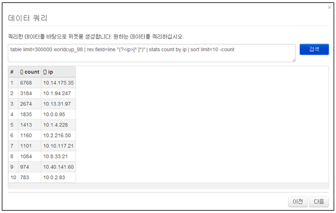
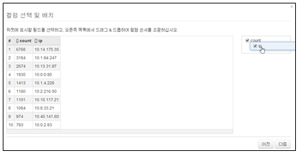
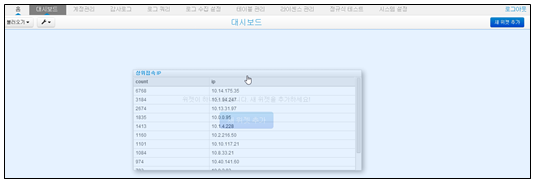
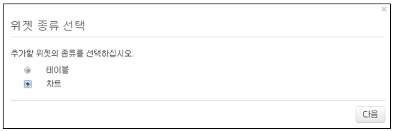
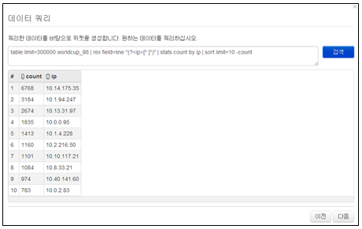
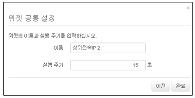
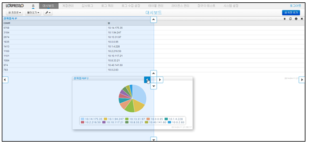
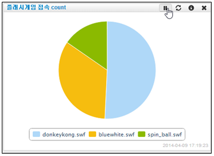

## 5.3. 위젯 생성/변경/삭제

### 5.3.1. 위젯 생성

새 위젯은 대시보드 메인화면의 "새 위젯 추가" 메뉴를 선택하여 사용합니다.

#### 5.3.1.1 테이블 위젯 생성

1) 위젯 종류 선택 메뉴에서 "테이블"을 선택한 후 "다음" 메뉴를 선택합니다..

* 테이블: 출력된 쿼리 결과에 대하여 테이블 형태로 표시되고, 필드를 재배치 할 수 있습니다.

2) 표현할 데이터를 쿼리하기 위하여 쿼리를 입력한 후 "검색" 메뉴를 선택합니다.

3) 쿼리의 검색 결과를 확인 후 원하는 값이면 "다음" 메뉴를 선택합니다.

4) 출력된  컬럼을 원할 경우 재배치하고 "다음" 메뉴를 선택합니다.

* 드래그 & 드롭 기능을 사용하여 컬럼의 위치를 변경할 수 있습니다.

5) 위젯에 표시할 "이름"을 입력하고, 반복수행할 시간을 입력한 후 "완료" 메뉴를 선택합니다.

6) 테이블 위젯 생성 결과 화면

7) 결과 화면을 선택하여 대시보드의 위치를 지정하기 위해 상/하/좌/우 중에 위치할 방향을 선택합니다.

8) 대시보드에 등록된 완료 화면.

#### 5.3.1.2 차트 위젯 생성

1) 위젯 종류 선택 메뉴에서 "차트"를 선택한 후 "다음" 메뉴를 선택합니다..

2) 표현할 데이터를 쿼리하기 위하여 쿼리를 입력한 후 "검색" 메뉴를 선택합니다.

3) 쿼리의 검색 결과를 확인 후 원하는 값이면 "다음" 메뉴를 선택합니다.

4) 차트의 종류와 컬럼을 선택한 후 "다음" 메뉴를 선택합니다.

5) 차트 미리보기 항목의 내용을 확인 후 "다음" 메뉴를 선택합니다.

6) 위젯에 표시할 "이름"을 입력하고, 반복수행할 시간을 입력한 후 "완료" 메뉴를 선택합니다.

7) 생성된 위젯을 선택한 상태에서 드래그하여 위치할 방향의 화살표을 선택합니다.

8) 대시보드에 표현된 결과를 확인합니다.

### 5.3.2. 위젯 위치 변경

대시보드는 각각의 위젯으로 구성이되어 크기조절 및 위치 변경이 가능하다. 각각의 위젯을 기준으로 하거나 프리셋 화면 전체에 대해서 위치를 변경 할 수 있습니다.

1) 위치를 변경할 위젯을 선택합니다.

2) 선택한 위젯을 이동하고자 하는 위젯 혹은 전체 화면의 방위를 표시하는 "화살표"에 매칭을 시킵니다.

3) 기존 위젯의 방위 "화살표"를 선택하여 위치를 변경한 프리셋 결과 화면.

4) 프리셋 전체 화면의 방위 "화살표"를 선택하여 위치를 변경한 프리셋 결과를 확인합니다.

### 5.3.3. 위젯 상태 변경

1) 위젯의 이름을 변경하기 위하여 위젯의 이름을 선택합니다.

* 이름을 선택합니다.

* 변경하고자 하는 이름으로 변경합니다.

2) 프리셋에 등록된 위젯의 내용은 주기적으로 업데이트된다. 업데이트를 중지하기 위해서 위젯의 "중지" 기능 아이콘을 선택하여 주기적 업데이트를 중지합니다.

3) 주기적으로 내용을 업데이트 하지만 수동으로 강제 업데이트를 하기위해서 "refresh" 기능의 아이콘을 선택하여 강제 업데이트를 수행합니다.

4) 도식화되어 표현되는 화면의 실제 쿼리 내용 확인 및 업데이트 주기를 변경할 수 있습니다. 쿼리의 내용을 변경할 수는 없습니다.

### 5.3.4. 위젯 삭제

프리셋 화면에 도식화 되어 등록된 위젯을 삭제하기 위해서 "삭제" 기능의 아이콘을 선택하여 삭제를 할 수있습니다. 삭제 기능 아이콘을 선택할 경우 "삭제여부 확인"을 하지 않으므로 삭제할 경우는 삭제 전에 확인을 한후 진행할 수 있도록 합니다.

