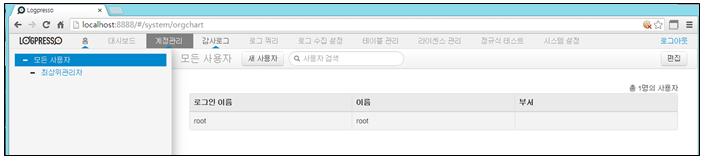

# 6장. 계정관리

웹UI 콘솔에 접속하여 기능을 사용할 수 있는 로그인 이름을 계정이라 합니다. 계정은 업무 권한에 따라서 생성하여 관리합니다. 계정에 대한 권한은 master, admin, member의 권한에 따라서 로그인하여 사용할 수 있는 기능이 제한됩니다.

master 권한 사용자인 root는 구축 시에 암호를 변경하여 사용하도록 권장합니다.

* master 권한 : 모든 기능을 사용할 수 있는 최상위 권한 유저로서 admin,member권한의 유저를 생성 할 수 있으며 계정이름은 root입니다.
* admin : 모든 기능을 사용할 수 있으며 master 권한의 root 사용자에의해 생성됩니다.  member  권한 유저를 생성할 수 있으며 admin 유저는 생성할 수 없습니다.
* member : master, admin 권한 사용자에 의하여 생성된 계정에 부여됩니다. 제한적인 모니터링 기능만 수행할 수 있습니다.

계정관리는 메인메뉴의 "계정관리" 메뉴를 선택하여 사용합니다.

* 메인메뉴에서 "계정관리" 메뉴를 선택합니다.

