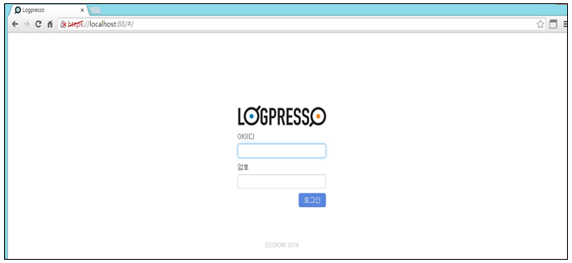
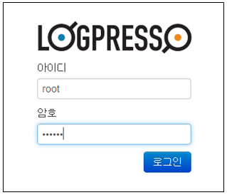

## 6.1. 로그인 인증

웹UI 콘솔의 기능을 사용하기 위해서는 프로그램에 생성/등록된 로그인 계정으로 아이디와 암호를 입력하여 로그인하여야 합니다. 웹 제공 프로토콜은 http, https 모두 지원하며 제공되는 포트는 관리자가 임의로 할당하여 사용할 수 있습니다.

### 6.1.1. 웹 프로토콜(http, https)

웹 프로토콜인 http, https 포트가 관리자에 의하여 서버에 open되었을 경우 웹브라우저의 URL 주소에 제공되는 프로토콜에 따른 URL 주소를 입력하여 서버에 접속할 수 있습니다.

* http 프로토콜 접속

* https 프로토콜 접속

### 6.1.2. 로그인

웹UI로 접속을 완료하기 위하여 로그인 계정과 계정에 대한 암호를 입력하여 등록된 사용자 인증을 획득하여야 정상적으로 로그인하여 콘솔의 메뉴를 사용할 수 있습니다.

* 로그인 계정/암호를 입력합니다.

* 로그인 계정에 대한 암호가 일치하지 않을경우 오류를 반환하고 로그인되지 않습니다.

