## 6.2. 사용자 관리

사용자 관리는 메인메뉴의 "계정관리" 메뉴를 선택하여 사용합니다.

* 메인메뉴에서 "계정관리" 메뉴를 선택합니다.

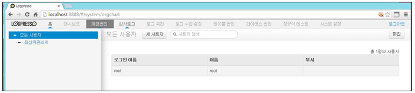

### 6.2.1. 사용자 추가

1) 계정관리 메뉴에서 "새 사용자" 메뉴를 선택합니다.

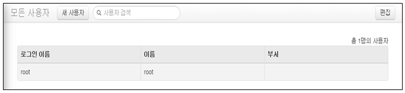

2) 사용자 생성에 필요한 내용을 입력 및 선택합니다.

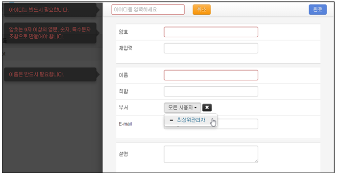

* 아이디: 로그인 계정으로 사용할 이름을 입력합니다.
* 암호: 로그인 계정에 대한 암호를 입력합니다.
* 재입력: 암호 확인을 위해 재 입력 합니다.
* 이름: 로그인 계정의 대표 이름을 입력합니다.
* 직함: 로그인 계정의 직급을 입력합니다.
* 부서: 로그인 계정이 포함될 그룹 이름을 선택합니다.( 6.3. 그룹 참조)
* 설명: 로그인 계정에 대한 상세 설명을 입력합니다.

3) 사용자의 권한을 선택합니다.

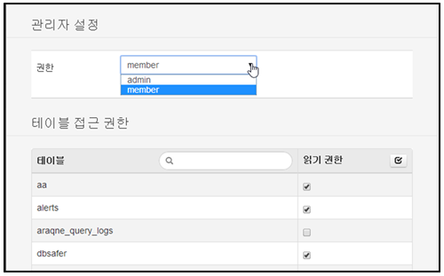

* 권한: 로그인 계정의 권한을 admin, member 중에서 선택합니다.
* 테이블 접근 권한: 생성되는 사용자가 모니터링할 테이블을 선택합니다. 테이블은 읽기만 허용됩니다.

4) 사용자 생성에 필요한 내용을 입력 및 선택 완료 후 "완료" 메뉴를 선택하여 사용자 추가를 위한 입력을 완료합니다.

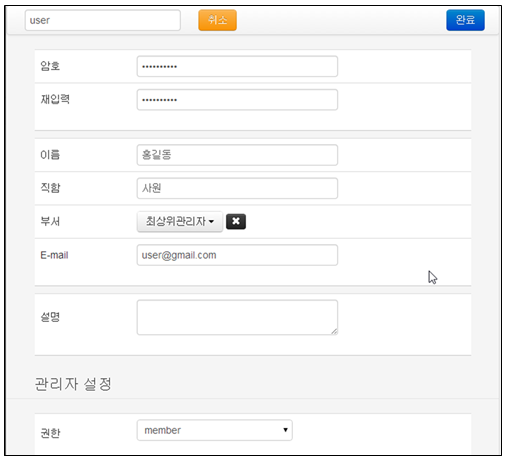

5) 사용자 생성 완료 화면에서 "닫기" 메뉴를 선택하여 사용자 추가를 완료합니다.

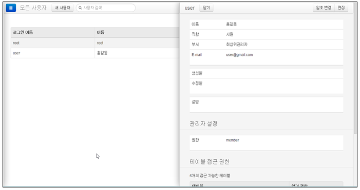

### 6.2.2. 사용자 변경

1) 계정관리 메뉴에서 변경하고자하는 사용자를 선택한 후 "편집" 메뉴를 선택합니다.

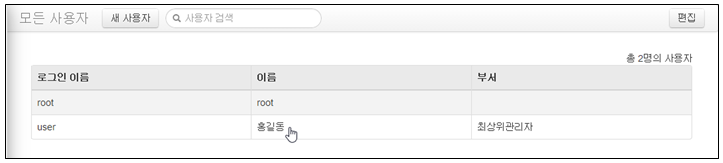

2) 사용자 편집 화면에서 "편집" 메뉴를 선택합니다.

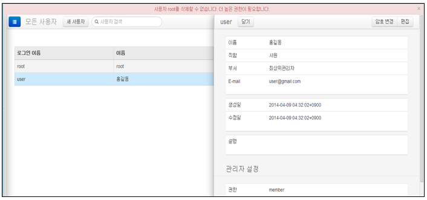

3) 사용자 계정 입력값에서 수정할 항목을 변경한 후 "완료" 메뉴를 선택합니다.
   - 화면의 아래에 있는 "이 사용자 삭제" 메뉴를 선택하여 삭제를 할 수 있습니다.

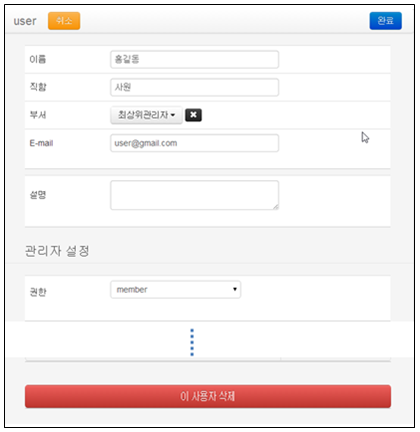

4) "닫기" 메뉴를 선택하여 사용자 변경을 완료합니다.

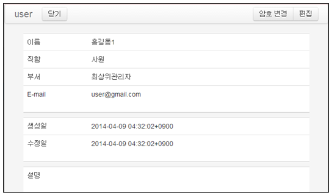

### 6.2.3. 사용자 암호 변경

1) 암호를 변경하고자하는 로그인 이름을 선택합니다.

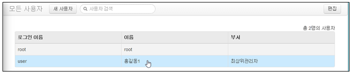

2) "암호변경" 메뉴를 선택합니다.

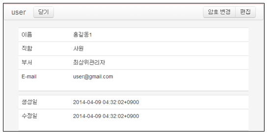

3) 변경하여 사용할 암호를 입력합니다.

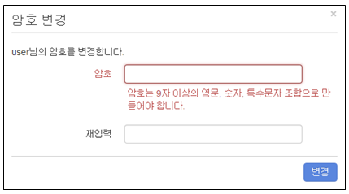

4) 변경 암호를 입력한 후 "변경" 메뉴를 선택합니다.

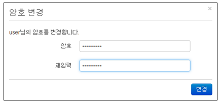

5) "닫기" 메뉴를 선택하여 사용자의 암호 변경을 완료합니다.

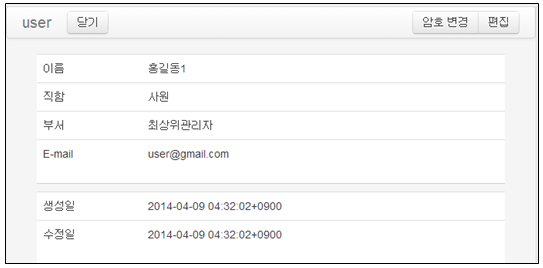

### 6.2.4. 사용자 삭제

1) 메인메뉴의 계정관리 메뉴에서 "편집" 메뉴를 선택합니다.

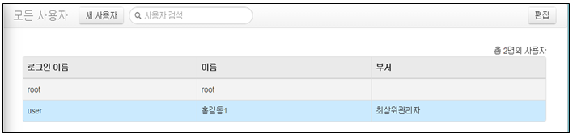

2) 삭제하고자 하는 사용자를 선택합니다.

* root 사용자는 최상위 사용자로서 삭제할 수 없다.

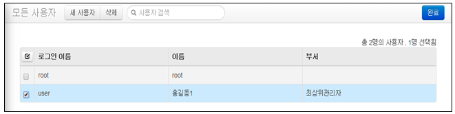

3) "삭제" 메뉴를 선택하여 선택한 사용자를 삭제합니다.

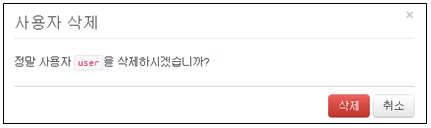

4) "완료" 메뉴를 선택하여 사용자 삭제를 완료합니다.

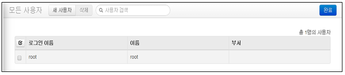

