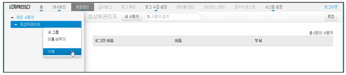

## 6.3. 그룹

그룹은 사용자 관리에서 사용되며 사용자를 분류/관리할 때 사용됩니다. 그룹을 분류할 경우는 사용자 계정의 권한 및 용도, 편의성을 고려하여 관리합니다.

그룹의 관리는 메인메뉴의 "계정관리" 메뉴를 사용하여 관리합니다.

* 메인메뉴에서 "계정관리" 메뉴를 선택합니다.

### 6.3.1. 그룹 추가

* "모든 사용자" 메뉴를 선택하여 "새그룹" 메뉴를 선택합니다.

* 신규로 생성할 그룹의 이름을 입력합니다.

### 6.3.2. 그룹 이름 변경

* 생성된 그룹의 이름을 변경하기 위하여 그룹을 선택한 후 "이름바꾸기" 메뉴를 선택합니다.

* 변경할 그룹의 이름을 입력합니다.

### 6.3.3. 그룹 삭제

* 생성된 그룹을 삭제하기 위하여 그룹을 선택한 후 "삭제" 메뉴를 선택합니다.

* "삭제" 메뉴를 선택하여 삭제를 완료합니다.

