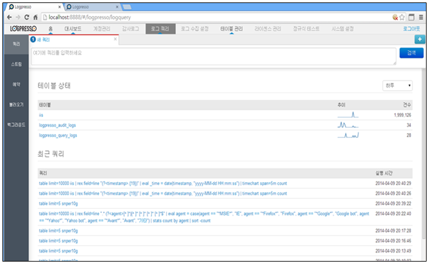

# 8장. 쿼리

쿼리는 로그를 수집하여 저장된 테이블의 데이터를 추출하거나 입력되는 데이터에 대하여 의미있는 데이터를 추출하기 위하여 정규표현식 명령어와 함수들을 사용합니다.

로그쿼리는 메인메뉴의 "로그쿼리" 메뉴를 선택하여 사용합니다.

로그쿼리 메인 화면은 아래의 기능을 제공 및 표현합니다.

1) 쿼리를 입력할 수 있는 창을 제공합니다.
2) 테이블의 이름과 추이, 건수 등의 테이블 상태 정보를 제공합니다.
3) 쿼리 명령어에 대한 히스토리를 제공합니다.

* 메인메뉴의 "로그쿼리"를 선택합니다.

