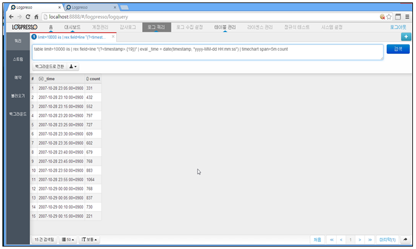
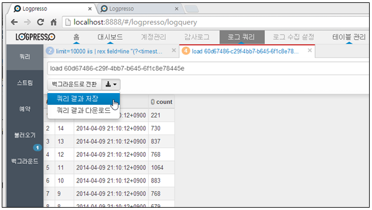
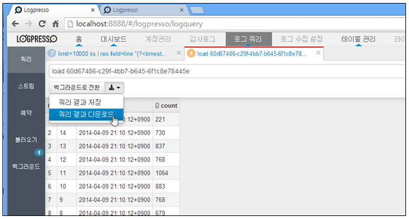
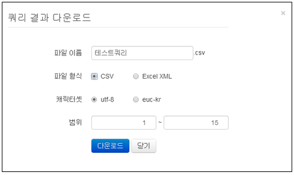

## 8.1. 비정형 쿼리

비정형 쿼리는 수집하여 저장된 로그의 데이터에서 쿼리명령어 및 함수를 사용하여 추출하는 것을 말합니다. 테이블에 저장되어 있는 데이터는 쿼리 명령어와 함수를 사용하여 다양하고, 의미있는 데이터로 추출 됩니다.

비정형 쿼리 명령어 입력은 메인메뉴의 "로그쿼리" 메인화면에서 왼쪽 상단의 "쿼리" 메뉴를 선택하여 사용합니다.

* 메인메뉴에서 "로그쿼리" 메뉴를 선택한 후 왼쪽의 "쿼리" 메뉴를 선택합니다.

1) 쿼리 명령어 입력 및 검색

쿼리 입력 창에 쿼리명령어(table, fulltext,.....)와 함수를 적절히 입력합니다. 쿼리 명령어 입력이 완료되면 오른쪽의 "검색" 메뉴를 선택하여 쿼리 명령어의 결과를 확인 합니다.

2) 쿼리 입력 창 추가

쿼리 입력 창을 추가할 경우는 오른쪽의 "+" 메뉴를 선택하여 입력 창을 추가할 수 있습니다.

3) 백그라운드로 전환

쿼리 입력 창에 입력한 쿼리의 결과가 오래 걸릴 경우 다른 작업을 위해서 현재 쿼리 진행 중인 쿼리를 백그라운드로 전환할 수 있습니다. 백그라운도 전환된 쿼리는 계속 수행이 됩니다.
쿼리가 완료된 후에도 백그라운드 쿼리에 보관되므로 쿼리 백업 히스토리 처럼 사용할 수도 있습니다.

4) 쿼리 결과 저장

쿼리 입력 창에 입력한 명령어의 결과를 보관하여 필요 시에 결과를 재 확인할 수 있습니다. 쿼리결과 저장위치는 시스템의 저장위치에 저장됩니다.

5) 쿼리 결과 다운로드

쿼리의 결과를 PC에 저장할 수 있는 다운로드 기능을 제공합니다.

* "쿼리결과 다운로드" 메뉴를 선택합니다.

* 다운로드할 쿼리 결과에 대하여 PC에 저장할 "파일 이름", "파일형식", "범위"를 입력/선택한 후 "다운로드" 메뉴를 선택하여 다운로드를 완료합니다.

