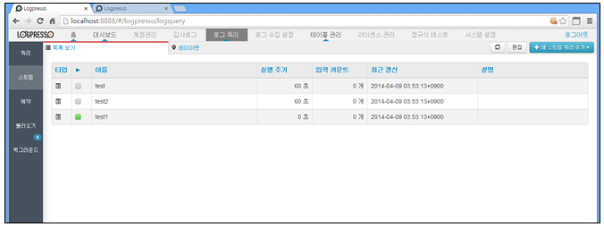
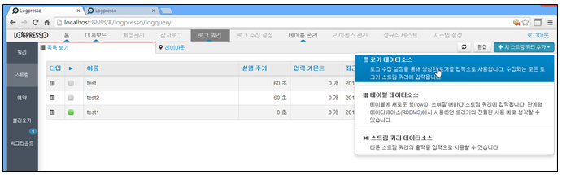
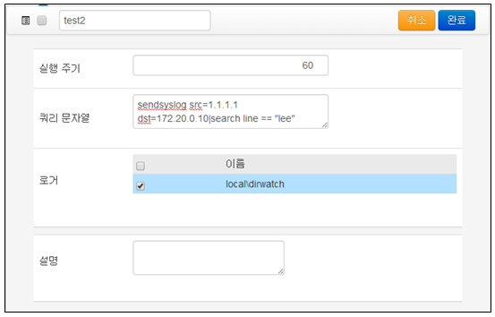
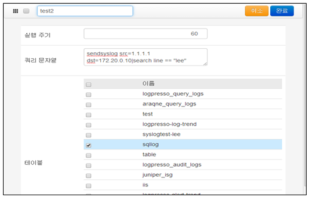
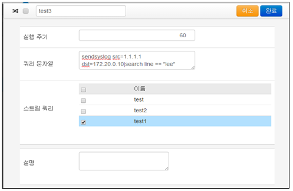
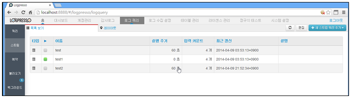
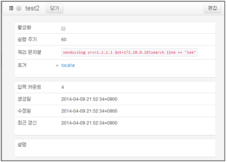
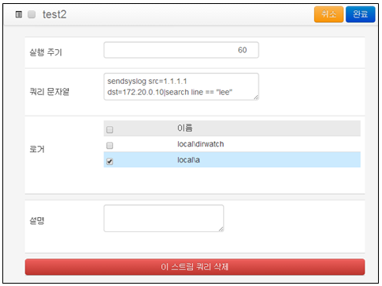
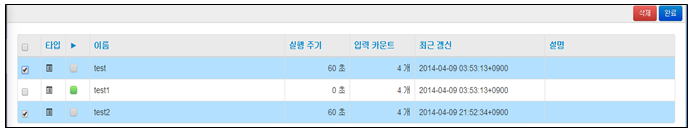
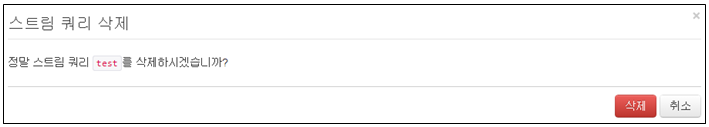

## 8.2. 스트림 쿼리

스트림 쿼리는 데이터 스트림을 입력으로 하는 쿼리를 설정하여, 실시간으로 이벤트 처리나 통계 분석을 수행할 수 있습니다. 일정 기간마다 실행되는 스케줄 쿼리와 달리, 스트림 쿼리는 연속적으로 입력 순서를 보장하면서 쿼리를 수행하는 특징을 가지고 있습니다.

예를 들어 10분마다 스트림에 대한 통계를 생성하려는 경우, 스케줄 쿼리로는 미묘한 시간 차이로 인해 10분 마다 생성된 결과의 합이 전체와 일치하지 않을 수 있습니다. 반면, 스트림 쿼리는 연속적인 데이터 입력에 대해 쿼리가 실행되므로 순서와 정합성을 보장합니다.

스트림 쿼리를 사용하여 특정 시간 단위의 통계를 산출하여 중간 통계 테이블에 저장하고, 이 테이블을 쿼리하여 최종적인 통계 결과를 쿼리하도록 설계하면, 디스크를 거의 사용하지 않으면서 대용량 데이터 스트림에 대하여 실시간으로 통계 결과를 계산할 수 있습니다. 특히, 그루비 스크립팅을 이용하면 고도로 복잡한 실시간 분석 및 가공이 가능합니다.

"로그쿼리" 메인화면에서 왼쪽 상단의 "스트림" 메뉴를 선택하여 사용합니다.

스트림 쿼리는 입력으로 3가지의 스트림 유형을 지원합니다.

* 로거: 로그 수집 설정을 통해 생성한 로거를 입력으로 사용합니다. 수집되는 모든 로그가 스트림 쿼리에 입력됩니다.
* 테이블: 테이블에 새로운 행(row)이 쓰여질 때마다 스트림 쿼리에 입력됩니다. 관계형 데이터베이스(RDBMS)에서 사용하던 트리거의 진화된 사용 예로 생각할 수 있습니다.
* 스트림 쿼리: 다른 스트림 쿼리의 출력을 입력으로 사용할 수 있습니다. 비정형 로그에 대하여 파싱을 수행하는 스트림 쿼리를 앞단에 두고, 해당 스트림 쿼리를 입력으로 사용하는 다수의 분석용 스트림 쿼리를 배치하는 시나리오를 예로 들 수 있습니다.

### 8.2.1. 스트림 쿼리 추가

스트림 쿼리 메인화면에서 오른쪽 상단의 "새 스트림쿼리추가" 메뉴를 선택하여 새로운 스트림 쿼리를 추가합니다.

* 스트림쿼리 메인화면에서 "새 스트림 쿼리 추가" 메뉴를 선택합니다.

1) 로그 데이터 소스

"새 스트림쿼리 추가" 메뉴에서 "로거데이터소스" 메뉴를 선택하여 등록된 로거로부터 수집되는 데이터를 입력 값으로 하여 쿼리 문자열의 쿼리를 수행합니다.

* 스트림 쿼리 입력 값을 압력한 후 "완료" 메뉴를 선택하여 스트림 쿼리 등록을 완료합니다.

* 이름: 스트림 쿼리의 유일한 이름을 입력합니다.
* 실행주기: 실행 시간을 입력합니다.(단위: 초)
* 쿼리 문자열: 입력값을 처리하는 쿼리 문자열을 입력합니다.
* 로거: 입력값의 소스인 로거를 선택합니다.
* 설명: 등록하는 스트림 쿼리에 대한 상세 설명을 입력합니다.

2) 테이블 데이터 소스

"새 스트림쿼리 추가" 메뉴에서 "테이블데이터소스" 메뉴를 선택하여 테이블로부터 수집되는 데이터를 입력 값으로 하여 쿼리 문자열의 쿼리를 수행합니다.

* 스트림 쿼리 입력 값을 압력한 후 "완료" 메뉴를 선택하여 스트림 쿼리 등록을 완료합니다.

* 이름: 스트림 쿼리의 유일한 이름을 입력합니다.
* 실행주기: 실행 시간을 입력합니다.(단위: 초)
* 쿼리 문자열: 입력값을 처리하는 쿼리 문자열을 입력합니다.
* 테이블: 입력값의 소스인 테이블을 선택합니다.
* 설명: 등록하는 스트림 쿼리에 대한 상세 설명을 입력합니다.

3) 스트림 쿼리 데이터 소스

"새 스트림쿼리 추가" 메뉴에서 "스트림쿼리데이터소스" 메뉴를 선택하여 스트림쿼리로부터 수집되는 데이터를 입력 값으로 하여 쿼리 문자열의 쿼리를 수행합니다.

* 스트림 쿼리 입력 값을 압력한 후 "완료" 메뉴를 선택하여 스트림 쿼리 등록을 완료합니다.

* 이름: 스트림 쿼리의 유일한 이름을 입력합니다.
* 실행주기: 실행 시간을 입력합니다.(단위: 초)
* 쿼리 문자열: 입력값을 처리하는 쿼리 문자열을 입력합니다.
* 스트림쿼리: 입력값의 소스인 스트림쿼리를 선택합니다.
* 설명: 등록하는 스트림 쿼리에 대한 상세 설명을 입력합니다.

### 8.2.2. 스트림 쿼리 변경

1) 스트림쿼리 메인메뉴에서 변경하고자 하는 등록된 스트림 쿼리를 선택합니다.

2) 선택한 스트림 쿼리 선택 화면에서 "편집" 메뉴를 선택한합니다.

3) 변경 화면에서 변경할 "실행주기", "쿼리문자열", "로거"에 대한 변경 내용을 적용한 후 "완료" 메뉴를 선택하여 변경을 완료합니다. 아래의 "이 스트림 쿼리 삭제" 메뉴를 선택하여 선택한 스트림 쿼리를 삭제할 수도 있습니다.

### 8.2.3. 스트림 쿼리 활성화/비활성화

스트림쿼리 메인메뉴에서 등록된 스트림 쿼리를 선택한 후 "활성화" 메뉴를 선택/비선택하여 등록된 스트림 쿼리의 상태를 변경할 수 있습니다. 선택이 해제되어 있으면 동작을 하지 않습니다.

### 8.2.4. 스트림 쿼리 삭제

* 스트림 쿼리 등록 화면에서 "편집" 메뉴를 선택합니다.

* 삭제하고자 하는 스트림쿼리를 선택합니다.

* "삭제" 메뉴를 선택하여 삭제를 완료합니다.

