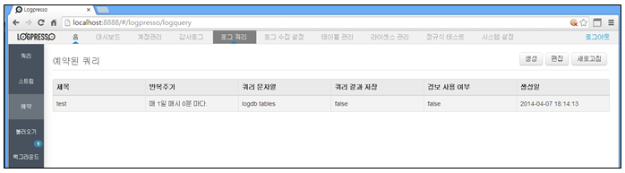
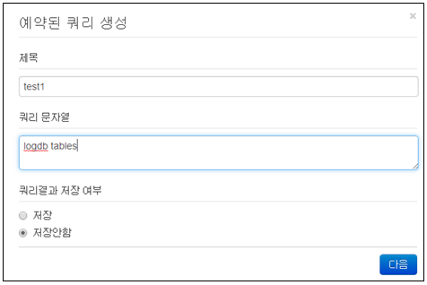
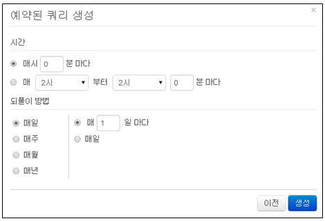
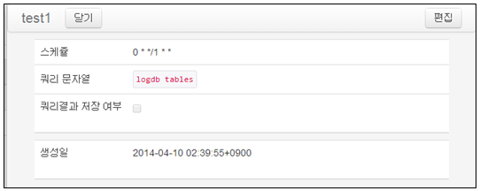
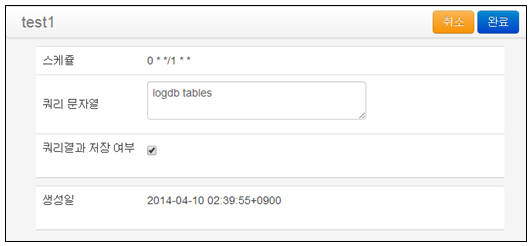
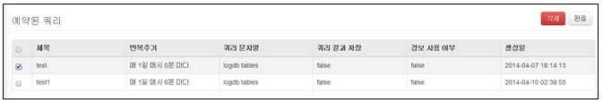

## 8.3. 스케줄 쿼리

예약된 쿼리를 통해 주기적으로 쿼리를 실행하고, 그 결과에 대해 조건을 걸어 경보 메일을 발송할 수 있습니다.

로그쿼리 메인메뉴의 왼쪽 "예약" 메뉴를 선택하여 사용합니다.

1) 스케줄 쿼리 생성

* 예약 메인메뉴에서 "생성" 메뉴를 선택합니다.

* 예약된 쿼리 생성 메뉴에서 "제목", "쿼리문자열", "저장여부"에 대한 값을 입력/선택한 후 "다음" 메뉴를 선택합니다.

* 실행할 시간에 대한 설정을 한 후 "생성" 메뉴를 선택하여 생성을 완료합니다.

2) 스케줄 쿼리 편집

* 스케줄쿼리 메인화면에서 등록된 스케줄쿼리를 선택합니다.

* 쿼리 정보 화면에서 "편집" 메뉴를 선택합니다.

* 변경 내용인 "쿼리문자열", '저장여부"를 변경 후 "완료" 메뉴를 선택하여 변경을 완료합니다.

3) 스케줄 쿼리 삭제

* 스케줄 쿼리 메인화면에서 '편집" 메뉴를 선택합니다.

* 삭제하길 원하는 등록된 항목을 선택한 후 "삭제" 메뉴를 선택하여 삭제을 완료합니다.

