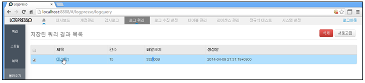
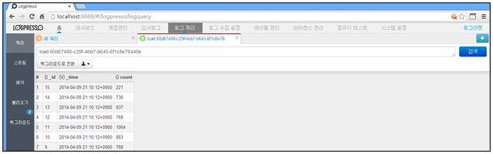
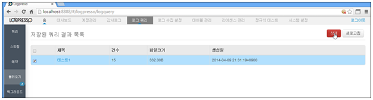

## 8.4. 저장된 쿼리 결과

저장된 쿼리의 결과를 관리합니다. 저장된 쿼리 결과는 로그쿼리 메인화면의 "불러오기" 메뉴화면에서 관리되며 저장된 쿼리 리스트를 선택하여 "쿼리" 화면에서 다시 확인할 수 있습니다.

로그쿼리 메인메뉴의 왼쪽 "불러오기" 메뉴를 선택하여 사용합니다.

1) 저장된 쿼리 보기

* 불러오기 메인메뉴에서 관리되는 저장된 쿼리를 선택합니다.

* 저장된 쿼리 결과를 "쿼리" 화면에서 확인합니다.

* 저장된 쿼리 관리화면에서 등록된 저장된 쿼리 항목을 선택한 후 "삭제" 메뉴를 선택하여 삭제를 완료합니다.

