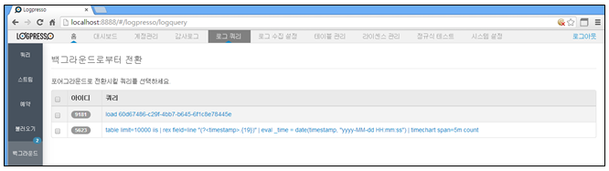
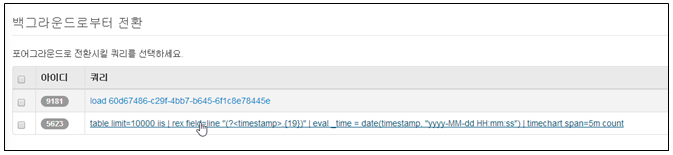
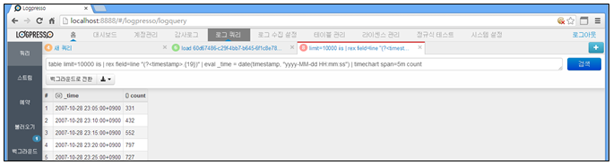

## 8.5. 백그라운드 쿼리

쿼리화면에서 쿼리의 실행 시간이 오래걸릴 경우이거나 결과가 출력되었지만 수행한 쿼리를 백그라운드로 전환할 수 있는데 백그라운드로 전환된 쿼리들을 관리하는 기능을 수행합니다.

백그라운드 관리화면에서는 삭제의 개념이 없이 포어그라운드로 전환하는 것이 곧 백그라운드에서의 삭제와 같다.

로그쿼리 메인메뉴의 왼쪽 "백그라운드" 메뉴를 선택하여 사용합니다.

* 로그쿼리 메인메뉴에서 "백그라운드"를 선택합니다.

* 쿼리 메뉴에서 백그라운드로 전환되어 등록된 쿼리 리스트를 선택하여 다시 포어그라운드로 전환합니다.

* 포어그라운드로 전환된 쿼리는 "쿼리" 화면에서 확인하거나 재사용할 수 있습니다.

