# 9장. 로그 수집 설정

로그프레소에 내장된 여러가지 유형의 로그 수집기를 이용하여 데이터 원본을 구성할 수 있는데, 이를 로거(Logger)라고 부릅니다. 로그프레소는 로그 수집과 로그 저장 단계가 분리되어 있습니다. 따라서 로그에 대한 실시간 수집 및 분석만 수행하고 저장을 하지 않거나, 수집된 모든 로그를 특정한 테이블에 저장하도록 구성할 수 있습니다.

로거는 크게 액티브 로거와 패시브 로거로 구분됩니다. 액티브 로거는 설정된 주기에 따라 일정한 간격으로 동일한 동작을 반복 수행하는 로거를 의미합니다. 가령, 파일에서 로그를 수집하는 경우, 설정된 주기마다 파일의 증가분을 확인하여 로그를 읽어들입니다. 혹은 데이터베이스에서 일정 주기마다 테이블의 데이터를 읽어오는 예를 생각할 수 있습니다. 패시브 로거는 별도의 주기 없이 수동적으로 입력을 받아들이는 로거이다. 가령 UDP 패킷을 수신해서 로깅하는 경우에는 별도의 실행 주기가 필요하지 않습니다.

서버 혹은 sentry(에이전트)를 설치하여 로그를 수집하기위한 로그수집설정에 대한 관리는 "로그수집 설정" 메뉴에서 합니다.

* 메인메뉴에서 "로그수집 설정" 메뉴를 선택합니다.

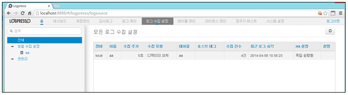

1) 로그수집 설정 추가

* "수집설정추가" 메뉴 선택 후 "독립실행형/프라이머리로거" 메뉴를 선택합니다.

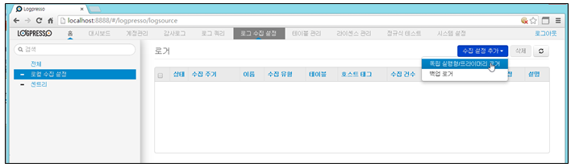

* 로그수집 유형을 선택한 후 "다음" 메뉴를 선택합니다.

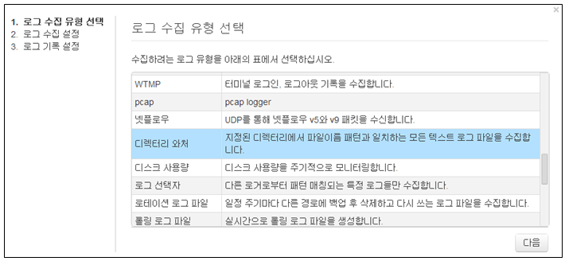

* 선택한 로그수집 유형에 대한 입력 값을 입력한 후 "다음"을 선택합니다.
	\- 로그유형별 입력 값은 선택한 유형별로 다르다.

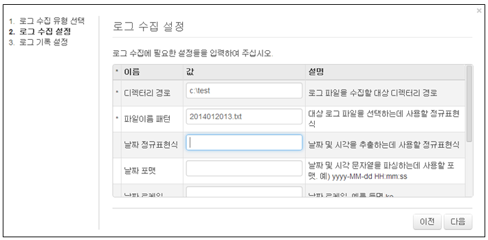

* 로그기록 설정 메뉴에서 등록하여 사용할 "로거이름"을 입력합니다.

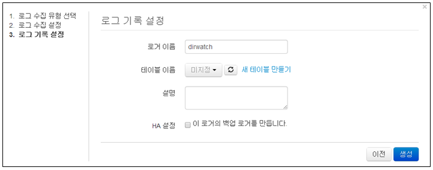

* 로그기록 설정 메뉴에서 "새테이블만들기" 메뉴를 선택하여 수집한 로그를 저장할 테이블을 생성합니다.
	\- 저장할 테이블이 이미 만들어져 있을 경우는 건너띈다.

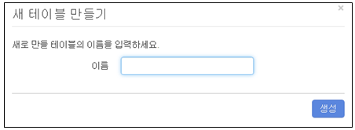

* 수집된 로그를 저장할 테이블 이름을 선택합니다.

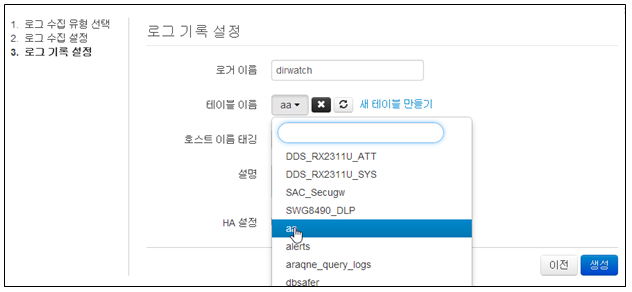

* 로그기록 설정 메뉴 완료화면. 완료 후 "생성" 메뉴를 선택합니다.
	\- 호스트태깅 : 테이블에 저장된 로그를 구별할 필요가 있을 경우 입력합니다.

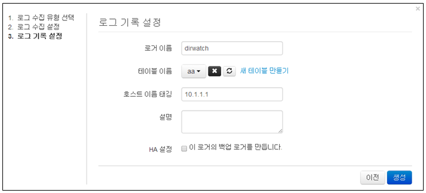

* 로그수집 로거가 등록완료된 화면

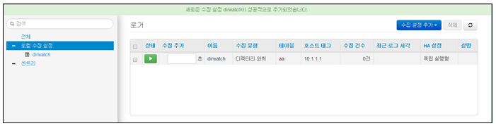

* 등록된 로거화면에서 "수집주기"에 반복적으로 수집할 시간을 입력한 후 "녹색" 아이콘을 선택하여 로그를 수집합니다.
	\- "수집주기"를 입력해야 수집 실행이됩니다.(단위:초)

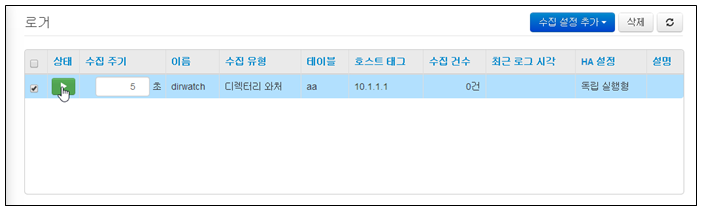

* 수집로거가 구동중인 화면으로 수집주기에 따라서 로그를 수집합니다.

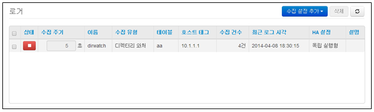

2) 로그수집 설정 삭제

* 등록된 수집로거 중에서 삭제할 로거를 선택한 후 "삭제" 메뉴를 선택합니다.
	\- 구동 중인 로거는 로거를 중지한 후에 삭제가 가능하다.

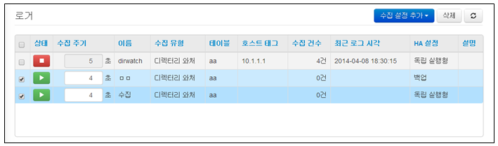

* "삭제" 메뉴를 선택하여 삭제를 완료합니다.

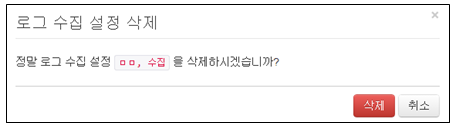

3) 로그수집 중지

* 로그 수집을 중지하기 위해서는 중지하고자 하는 로거이름의 상태항목에 있는 "빨간색" 아이콘을 선택하여 중지합니다.

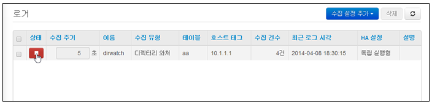

