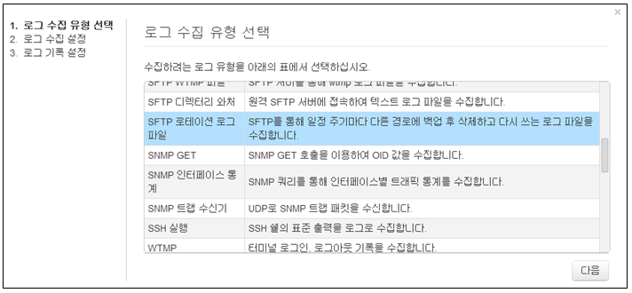
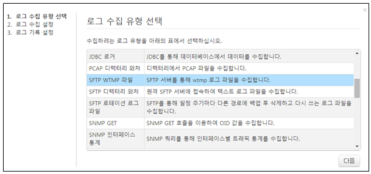

## 9.2. 유형별 로그수집 설정

### 9.2.1. FTP 디렉터리 와처

FTP 디렉토리 와치 (ftp-dirwatch) 로거는 FTP를 통해 원격지에서 롤링되지 않는 텍스트 로그 파일을 일정 주기마다 수집하려고 할 때 사용합니다. 가령 일자별 혹은 시간대별로 순차 생성되는 로그 파일을 수집할 때 사용합니다.

1) 로그수집유형에서 "FTP 디렉토리 와처" 유형을 선택한 후 "다음" 메뉴를 선택합니다.

2) FTP 디렉토리와처 입력 값을 입력합니다.

* FTP 프로파일: FTP 접속 설정 프로파일의 이름을 입력합니다. (13.3. FTP 설정 참조)
* 디렉터리 경로: 로그 파일이 위치하는 파일시스템 경로를 입력합니다.
* 파일이름 패턴: 디렉터리 경로에 존재하는 파일 중 이름이 정규표현식 패턴에 일치하는 경우에만 수집합니다. 정규표현식 그룹을 쓰는 경우 파일 이름에서 날짜 문자열을 추출합니다.
* 날짜 정규표현식: 로그에서 날짜 문자열을 추출합니다. 정규표현식 그룹으로 묶인 모든 부분을 이어붙여서 하나의 날짜 문자열을 만들어냅니다. 파일이름 정규표현식의 그룹으로 추출된 날짜문자열은 가장 앞 부분에 위치합니다.
* 날짜 포맷: 날짜 문자열을 파싱하는데 사용할 날짜 포맷을 설정합니다. (예: yyyy-MM-dd HH:mm:ss)
* 날짜 로케일: 날짜 문자열의 로케일. 가령 날짜 파싱 포맷의 지시자 중 MMM의 해석은 로케일에 따라 “Jan” 혹은 “1월”로 해석됩니다.  기본값은 en입니다.
* 시작 구분 정규식:  로그의 시작 부분을 인식하는 정규표현식을 지정합니다. 멀티라인 로그의 경우에 사용되며, 지정하지 않으면 줄 단위로 읽어들입니다.
* 끝 구분 정규식:  로그의 끝 부분을 인식하는 정규표현식을 지정합니다. 멀티라인 로그의 경우에 사용되며, 지정하지 않으면 줄 단위로 읽어들입니다.
* 문자집합: 문자집합 코드를 입력합니다. 기본값은 utf-8입니다.

3) 로거이름 입력 및 로그를 저장할 테이블을 선택한 후 "생성" 메뉴를 선택하여 완료합니다.

### 9.2.2. FTP 로테이션 로그파일

FTP 로테이션 (ftp-rotation) 로거는 FTP 서버를 통해서 주기적으로 로테이션 되는 텍스트 로그 파일을 일정 주기마다 수집하려고 할 때 사용합니다.

1) 로그수집유형에서 "FTP 로테이션 로그파일" 유형을 선택한 후 "다음" 메뉴를 선택합니다.

2) FTP 로테이션 로그파일 입력 값을 입력합니다.

* FTP 프로파일: FTP 접속 설정 프로파일의 이름을 입력합니다. (13.3. FTP 연동 설정 참조)
* 파일 경로: 주기적으로 로테이션 되는 텍스트 로그 파일의 절대 경로를 입력합니다.
* 문자집합: 텍스트 파일 해석에 사용할 문자집합 코드를 입력합니다. 기본값은 utf-8입니다.
* 날짜 정규표현식: 로그에서 날짜 문자열을 추출합니다. 정규표현식 그룹으로 묶인 모든 부분을 이어붙여서 하나의 날짜 문자열을 만들어냅니다.
* 날짜 패턴: 날짜 문자열을 파싱하는데 사용할 날짜 포맷을 설정합니다. (예: yyyy-MM-dd HH:mm:ss)
* 날짜 로케일: 날짜 문자열의 로케일. 가령 날짜 파싱 포맷의 지시자 중 MMM의 해석은 로케일에 따라 “Jan” 혹은 “1월”로 해석됩니다.  기본값은 en입니다.
* 로그 시작 구분 정규식:  로그의 시작 부분을 인식하는 정규표현식을 지정합니다. 멀티라인 로그의 경우에 사용되며, 지정하지 않으면 줄 단위로 읽어들입니다.
* 로그 끝 구분 정규식:  로그의 끝 부분을 인식하는 정규표현식을 지정합니다. 멀티라인 로그의 경우에 사용되며, 지정하지 않으면 줄 단위로 읽어들입니다.

3) 로거이름 입력 및 로그를 저장할 테이블을 선택한 후 "생성" 메뉴를 선택하여 완료합니다.

### 9.2.3. HDFS 텍스트 파일 출력

로그프레소에서 수집하는 로그를 HDFS 파일로 실시간 출력할 수 있습니다. 지정된 파일 경로가 존재하지 않으면 자동으로 생성합니다. 또한 일정 파일 크기, 로그 갯수, 유휴 시간에 도달하면 자동으로 파일을 닫고 새로운 파일에 쓰도록 설정할 수 있습니다. 동작 주기마다 HDFS 플러시를 수행합니다.

1) 로그수집유형에서 "HDFS 텍스트 파일 출력" 유형을 선택한 후 "다음" 메뉴를 선택합니다.

2) HDFS 로그 파일 출력 입력 값을 입력합니다.

* 원본 로거 이름 목록: 출력할 원본 수집 설정 이름 목록을 쉼표로 구분하여 입력합니다. HDFS 텍스트 파일 출력 로거는 원본으로 지정한 수집기에서 수집되는 모든 로그를 HDFS 파일로 출력합니다.
*  HDFS 사이트: 미리 설정한 HDFS 사이트 이름을 지정합니다.
* HDFS 경로: 출력할 HDFS 디렉터리 경로를 지정합니다.
* 파일 이름 접두어: 파일 이름 타임스탬프 앞에 붙일 문자열을 지정합니다.
* 파일 이름 접미어: 파일 이름 타임스탬프 뒤에 붙일 문자열을 지정합니다. 주로 .을 포함한 확장자를 설정합니다.
* 롤링 기준 크기: 파일을 닫고 새로 여는 기준 파일 크기를 바이트 단위로 설정합니다. 미설정 시 파일 크기 기준으로는 롤링하지 않습니다.
* 롤링 기준 건수: 파일을 닫고 새로 여는 기준 로그 건수를 설정합니다. 미설정 시 로그건수 기준으로는 롤링하지 않습니다.
* 유휴 기준 시간 (초): 로그가 들어오지 않는 상태로 기준 시간이 지나면 파일을 닫고 새로 열도록 설정합니다. 미설정 시 유휴 시간 기준으로는 롤링하지 않습니다.

3) 로거이름 입력 및 로그를 저장할 테이블을 선택한 후 "생성" 메뉴를 선택하여 완료합니다.

### 9.2.4. HDFS 텍스트 파일

HDFS 사이트 설정이 완료된 후, 로그 수집 설정을 통해 HDFS에 적재되는 파일을 실시간으로 수집할 수 있습니다. 다른 프로세스에서 HDFS 파일을 아직 닫지 않았거나 마지막 HDFS 블럭이 디스크로 플러시되지 않은 상태이더라도, 해당 데이터를 읽어들일 수 있습니다.

HDFS 텍스트 파일 수집 (hdfs-text) 로거는 HDFS에서 읽어온다는 점을 제외하면 디렉터리 로그 파일 수집 설정과 동일합니다.

1) 로그수집유형에서 "HDFS 텍스트 파일" 유형을 선택한 후 "다음" 메뉴를 선택합니다.

2) HDFS 텍스트 파일 입력 값을 입력합니다.

* HDFS 사이트: 미리 설정한 HDFS 사이트 이름을 지정합니다.
* 디렉터리 경로: 로그 파일이 위치하는 HDFS 경로를 의미합니다.
* 파일이름 패턴: HDFS 디렉터리 경로에 존재하는 파일 중 파일 이름이 정규표현식 패턴에 일치하는 경우에만 수집합니다. 정규표현식 그룹을 쓰는 경우 파일 이름에서 날짜 문자열을 추출합니다.
* 날짜 정규표현식: 로그에서 날짜 문자열을 추출합니다. 정규표현식 그룹으로 묶인 모든 부분을 이어붙여서 하나의 날짜 문자열을 만들어냅니다. 파일이름 정규표현식의 그룹으로 추출된 날짜문자열은 가장 앞 부분에 위치합니다.
* 날짜 포맷: 날짜 문자열을 파싱하는데 사용할 날짜 포맷을 설정합니다. (예: yyyy-MM-dd HH:mm:ss)
* 날짜 로케일: 날짜 문자열의 로케일. 가령 날짜 파싱 포맷의 지시자 중 MMM의 해석은 로케일에 따라 “Jan” 혹은 “1월”로 해석됩니다.  기본값은 en입니다.
* 로그 시작 정규식:  로그의 시작 부분을 인식하는 정규표현식을 지정합니다. 멀티라인 로그의 경우에 사용되며, 지정하지 않으면 줄 단위로 읽어들입니다.
* 로그 끝 정규식:  로그의 끝 부분을 인식하는 정규표현식을 지정합니다. 멀티라인 로그의 경우에 사용되며, 지정하지 않으면 줄 단위로 읽어들입니다.
* 문자집합: 텍스트 파일 해석에 사용할 문자집합 코드를 입력합니다. 기본값은 utf-8입니다.

3) 로거이름 입력 및 로그를 저장할 테이블을 선택한 후 "생성" 메뉴를 선택하여 완료합니다.

### 9.2.5. JDBC 로거

JDBC 로거는 SQL 쿼리를 사용하여 데이터베이스의 테이블나 뷰에서 데이터를 수집하려고 할 때 사용합니다.

1) 로그수집유형에서 "JDBC 로거" 유형을 선택한 후 "다음" 메뉴를 선택합니다.

2) JDBC 로거 입력 값을 입력합니다.

* JDBC 프로파일: JDBC 접속 프로파일의 이름을 입력합니다. (JDBC 연동 설정 참조)
* SQL: 데이터 수집에 사용할 SQL 문장을 입력합니다. $where 매크로를 사용할 수 있습니다.
* 조건절: $where 매크로에 삽입될 조건절을 입력합니다. 물음표(?)를 위치 지정자 (place holder)로 사용할 수 있습니다. 위치 지정자는 마지막 기준 컬럼 값으로 대치됩니다. 입력할 때 where 문자열까지 포함해야 합니다.
* 기준 열: 매 조회 시 마지막으로 수집했던 행 이후부터 가져올 수 있도록, 검색 기준이 되는 컬럼 이름을 입력합니다. 가령 시퀀스, IDENTITY, auto\_increment로 지정된 컬럼, 혹은 증가하는 타임스탬프 컬럼의 이름을 입력합니다.
* 날짜 컬럼: 데이터가 수집된 날짜를 가지고 있는 컬럼의 이름을 지정합니다.  지정되지 않을 경우 로거가 수집한 날짜를 저장합니다.
* 날짜 형식: 날짜 컬럼이 SQL 시간 형식이 아닌 문자열이라면 날짜의 형태를 지정할 수 있습니다.(예. yyyyMMdd HH:mm:ss).

3) 로거이름 입력 및 로그를 저장할 테이블을 선택한 후 "생성" 메뉴를 선택하여 완료합니다.

4) 고려사항

* 기준 컬럼으로 검색할 때 인덱스를 타는지 확인합니다. 인덱스를 타지 않는다면 수천만건 이상 들어있는 테이블의 경우 지속적으로 테이블 풀스캔 부하가 걸릴 수 있습니다.
* 한 번에 가져오는 갯수를 제한합니다. 가령, 오라클의 경우 rownum을 사용하여 가져올 행 갯수를 제한할 수 있습니다. 이를 고려하지 않으면 초기 적재 시에 너무 많은 데이터를 한 번에 가져오려고 시도하면서 문제가 발생할 수 있습니다. JDBC 로거는 지정된 주기별로 쿼리를 수행하지만, 한 번 수집할 때 더 이상 새로운 값이 없을 때까지 쿼리를 반복 수행하므로 가져오는 행 갯수를 제한하는 것이 좋습니다.
* 필요한 컬럼만 SELECT 절에 명시적으로 지정합니다. JDBC 로거는 조회되는 모든 컬럼 값을 키/값 형태로 수집합니다. 불필요한 컬럼을 제외하면 더 나은 성능을 기대할 수 있습니다.

### 9.2.6. SFTP 디렉터리 와처

SFTP 디렉토리 와치 (sftp-dirwatch) 로거는 SFTP를 통해 원격지에서 롤링되지 않는 텍스트 로그 파일을 일정 주기마다 수집하려고 할 때 사용합니다. 가령 일자별 혹은 시간대별로 순차 생성되는 로그 파일을 수집할 때 사용합니다.

1) 로그수집유형에서 "SFTP 디렉터리 와처" 유형을 선택한 후 "다음" 메뉴를 선택합니다.

2) SFTP 디렉터리 와처 입력 값을 입력합니다.

* SSH 프로파일: SSH 접속 설정 프로파일의 이름을 입력합니다. (13.4. SSH 설정 참조)
* 디렉터리 경로: 로그 파일이 위치하는 파일시스템 경로를 입력합니다.
* 파일이름 패턴: 디렉터리 경로에 존재하는 파일 중 이름이 정규표현식 패턴에 일치하는 경우에만 수집합니다. 정규표현식 그룹을 쓰는 경우 파일 이름에서 날짜 문자열을 추출합니다.
* 날짜 표현 정규표현식: 로그에서 날짜 문자열을 추출합니다. 정규표현식 그룹으로 묶인 모든 부분을 이어붙여서 하나의 날짜 문자열을 만들어냅니다. 파일이름 정규표현식의 그룹으로 추출된 날짜문자열은 가장 앞 부분에 위치합니다.
* 날짜 포맷: 날짜 문자열을 파싱하는데 사용할 날짜 포맷을 설정합니다. (예: yyyy-MM-dd HH:mm:ss)
* 날짜 로케일: 날짜 문자열의 로케일. 가령 날짜 파싱 포맷의 지시자 중 MMM의 해석은 로케일에 따라 “Jan” 혹은 “1월”로 해석됩니다.  기본값은 en입니다.
* 로그 구분 정규식:  로그의 시작 부분을 인식하는 정규표현식을 지정합니다. 멀티라인 로그의 경우에 사용되며, 지정하지 않으면 줄 단위로 읽어들입니다.
* 로그 구분 정규식:  로그의 끝 부분을 인식하는 정규표현식을 지정합니다. 멀티라인 로그의 경우에 사용되며, 지정하지 않으면 줄 단위로 읽어들입니다.
* 문자집합: 문자집합 코드를 입력합니다. 기본값은 utf-8입니다.

3) 로거이름 입력 및 로그를 저장할 테이블을 선택한 후 "생성" 메뉴를 선택하여 완료합니다.

### 9.2.7. SFTP 로테이션 로그 파일

SFTP 로테이션 (sftp-rotation) 로거는 SFTP 서버를 통해서 주기적으로 로테이션 되는 텍스트 로그 파일을 일정 주기마다 수집하려고 할 때 사용합니다. 흔히 리눅스 서버에서는 logrotate 프로그램을 사용하여 일정 주기로 기존 파일의 이름을 변경하여 백업 보관하고 로그 파일을 새로 생성합니다. SFTP 로테이션 로거는 이런 시나리오에서 사용됩니다.

1) 로그수집유형에서 "SFTP 로테이션 로그 파일" 유형을 선택한 후 "다음" 메뉴를 선택합니다.

2) SFTP 로테이션 로그 파일 입력 값을 입력합니다.

* SSH 프로파일: SSH 접속 설정 프로파일의 이름을 입력합니다. (13.4. SSH 설정 참조)
* 파일 경로: 주기적으로 로테이션 되는 텍스트 로그 파일의 절대 경로를 입력합니다.
* 문자집합: 텍스트 파일 해석에 사용할 문자집합 코드를 입력합니다. 기본값은 utf-8입니다.
* 날짜 정규식: 로그에서 날짜 문자열을 추출합니다. 정규표현식 그룹으로 묶인 모든 부분을 이어붙여서 하나의 날짜 문자열을 만들어냅니다.
* 날짜 패턴: 날짜 문자열을 파싱하는데 사용할 날짜 포맷을 설정합니다. (예: yyyy-MM-dd HH:mm:ss)
* 날짜 로케일: 날짜 문자열의 로케일. 가령 날짜 파싱 포맷의 지시자 중 MMM의 해석은 로케일에 따라 “Jan” 혹은 “1월”로 해석됩니다.  기본값은 en입니다.
* 로그 시작 구분 정규식:  로그의 시작 부분을 인식하는 정규표현식을 지정합니다. 멀티라인 로그의 경우에 사용되며, 지정하지 않으면 줄 단위로 읽어들입니다.
* 로그 끝 구분 정규식:  로그의 끝 부분을 인식하는 정규표현식을 지정합니다. 멀티라인 로그의 경우에 사용되며, 지정하지 않으면 줄 단위로 읽어들입니다.

3) 로거이름 입력 및 로그를 저장할 테이블을 선택한 후 "생성" 메뉴를 선택하여 완료합니다.

### 9.2.8. SNMP 트랩 수신기

SNMP 서버와 로거를 이용하여 실시간으로 SNMP 패킷을 수집하고 테이블에 저장할 수 있습니다.

1) 로그수집유형에서 "SNMP 트랩 수신기" 유형을 선택한 후 "다음" 메뉴를 선택합니다.

2) SNMP 트랩 수신기 입력 값을 입력합니다.

* 원격지 IP 주소를 입력합니다.

3) 로거이름 입력 및 로그를 저장할 테이블을 선택한 후 "생성" 메뉴를 선택하여 완료합니다.

### 9.2.9. 디렉터리 와처

디렉토리 와치 (dirwatch) 로거는 롤링되지 않는 텍스트 로그 파일을 일정 주기마다 수집하려고 할 때 사용합니다. 가령 일자별 혹은 시간대별로 순차 생성되는 로그 파일을 수집할 때 사용합니다.

1) 로그수집유형에서 "디렉터리 와처" 유형을 선택한 후 "다음" 메뉴를 선택합니다.

2) 디렉터리 와처 입력 값을 입력합니다.

* 디렉터리 경로: 로그 파일이 위치하는 파일시스템 경로를 의미합니다.
* 파일이름 패턴: 디렉터리 경로에 존재하는 파일 중 이름이 정규표현식 패턴에 일치하는 경우에만 수집합니다. 정규표현식 그룹을 쓰는 경우 파일 이름에서 날짜 문자열을 추출합니다.
* 날짜 정규표현식: 로그에서 날짜 문자열을 추출합니다. 정규표현식 그룹으로 묶인 모든 부분을 이어붙여서 하나의 날짜 문자열을 만들어냅니다. 파일이름 정규표현식의 그룹으로 추출된 날짜문자열은 가장 앞 부분에 위치합니다.
* 날짜 포맷: 날짜 문자열을 파싱하는데 사용할 날짜 포맷을 설정합니다. (예: yyyy-MM-dd HH:mm:ss)
* 날짜 로케일: 날짜 문자열의 로케일. 가령 날짜 파싱 포맷의 지시자 중 MMM의 해석은 로케일에 따라 “Jan” 혹은 “1월”로 해석됩니다.  기본값은 en입니다.
* 로그 시작 정규식:  로그의 시작 부분을 인식하는 정규표현식을 지정합니다. 멀티라인 로그의 경우에 사용되며, 지정하지 않으면 줄 단위로 읽어들입니다.
* 로그 끝 정규식:  로그의 끝 부분을 인식하는 정규표현식을 지정합니다. 멀티라인 로그의 경우에 사용되며, 지정하지 않으면 줄 단위로 읽어들입니다.
* 문자집합: 텍스트 파일 해석에 사용할 문자집합 코드를 입력합니다. 기본값은 utf-8입니다.

3) 로거이름 입력 및 로그를 저장할 테이블을 선택한 후 "생성" 메뉴를 선택하여 완료합니다.

### 9.2.10. 로테이션 로그 파일

로테이션 (rotation) 로거는 주기적으로 로테이션 되는 텍스트 로그 파일을 일정 주기마다 수집하려고 할 때 사용합니다.

1) 로그수집유형에서 "로테이션 로그 파일" 유형을 선택한 후 "다음" 메뉴를 선택합니다.

2) 로테이션 로그 파일 입력 값을 입력합니다.

* 파일 경로: 주기적으로 로테이션 되는 텍스트 로그 파일의 절대 경로를 입력합니다.
* 문자집합: 텍스트 파일 해석에 사용할 문자집합 코드를 입력합니다. 기본값은 utf-8입니다.
* 날짜 정규식: 로그에서 날짜 문자열을 추출합니다. 정규표현식 그룹으로 묶인 모든 부분을 이어붙여서 하나의 날짜 문자열을 만들어냅니다.
* 날짜 패턴: 날짜 문자열을 파싱하는데 사용할 날짜 포맷을 설정합니다. (예: yyyy-MM-dd HH:mm:ss)
* 날짜 로케일: 날짜 문자열의 로케일. 가령 날짜 파싱 포맷의 지시자 중 MMM의 해석은 로케일에 따라 “Jan” 혹은 “1월”로 해석됩니다.  기본값은 en입니다.
* 로그 시작 구분 정규식:  로그의 시작 부분을 인식하는 정규표현식을 지정합니다. 멀티라인 로그의 경우에 사용되며, 지정하지 않으면 줄 단위로 읽어들입니다.
* 로그 끝 구분 정규식:  로그의 끝 부분을 인식하는 정규표현식을 지정합니다. 멀티라인 로그의 경우에 사용되며, 지정하지 않으면 줄 단위로 읽어들입니다.

3) 로거이름 입력 및 로그를 저장할 테이블을 선택한 후 "생성" 메뉴를 선택하여 완료합니다.

### 9.2.11. 시스로그 수집기

시스로그 서버와 로거를 이용하여 실시간으로 시스로그를 수집하고 테이블에 저장할 수 있습니다.

1) 로그수집유형에서 "시스로그 수집기" 유형을 선택한 후 "다음" 메뉴를 선택합니다.

2) 시스로그 수집기 입력 값을 입력합니다.

* 원격지 IP : 원격지 IP를 입력합니다.
* 시스로그 설비 목록 : PRI (\<123> 같은 시스로그 헤더 부분)가 없는 경우 -1, 그렇지 않으면 쉼표 (,)로 facility 값을 이어붙여서 입력하면 됩니다. 가령 facility에 구분없이 해당 장비에서 발생하는 모든 시스로그를 수신하려고 한다면, RFC 5424에 나온대로 -1부터 23까지 모두 입력하면 됩니다. 아무 값도 입력하지 않으면 모든 facility을 입력한 것과 같다.

3) 로거이름 입력 및 로그를 저장할 테이블을 선택한 후 "생성" 메뉴를 선택하여 완료합니다.

### 9.2.12. 정규표현식 로그 선택자

정규표현식 선택자 (regex-selector) 로거는 다른 로거에서 수집하는 데이터 중 정규표현식과 일치하는 데이터만 선택적으로 가져오려고 할 때 사용합니다.

1) 로그수집유형에서 "정규표현식 로그 선택자" 유형을 선택한 후 "다음" 메뉴를 선택합니다.

2) 정규표현식 로그 선택자 입력 값을 입력합니다.

* 원본 로거 이름: 네임스페이스를 포함한 원본 로거 이름을 입력합니다.
* 정규표현식 패턴: 원본 데이터의 line 필드 값과 비교할 정규표현식을 입력합니다.
* 매칭 결과 반전: 정규표현식이 매칭되지 않는 데이터를 수집하려면  true를 설정합니다. 미설정 시 패턴 매칭된 데이터를 수집합니다.

3) 로거이름 입력 및 로그를 저장할 테이블을 선택한 후 "생성" 메뉴를 선택하여 완료합니다.

### 9.2.13. SNMP GET

SNMP GET (snmpget) 로거는 SNMP 에이전트를 대상으로 쿼리를 수행한 결과를 수집합니다.

1) 로그수집유형에서 "SNMP GET" 유형을 선택한 후 "다음" 메뉴를 선택합니다.

2) SNMP GET 입력 값을 입력합니다.

* SNMP 버전: v1, v2c 중 하나를 입력합니다.
* IP 주소: SNMP 에이전트의 호스트 이름 혹은 IP 주소를 입력합니다.
* SNMP 포트: SNMP 쿼리를 수행할 때 사용할 UDP 포트 번호를 입력합니다. 미설정 시 기본값으로 161이 설정됩니다.
* SNMP 커뮤니티: SNMP 인증에 사용할 커뮤니티 문자열을 입력합니다. 읽기 전용으로는  관례적으로 public이 흔히 사용됩니다.
* OID 매핑 목록: 수집할 대상 Object ID와 필드 이름의 쌍을 쉼표로 구분하여 입력합니다. 로그 수집 시 OID가 지정한 필드 이름으로 변환되어 값과 함께 기록됩니다.
* 쿼리 타임아웃: 초 단위로 쿼리 응답 만료시간을 지정합니다. 미설정 시 5초로 지정됩니다.
* 재시도 횟수: 쿼리 실패 시 몇 번 재시도 할 것인지 지정합니다. 미설정 시 2회로 지정됩니다.

3) 로거이름 입력 및 로그를 저장할 테이블을 선택한 후 "생성" 메뉴를 선택하여 완료합니다.

### 9.2.14. 시스로그 전달자

시스로그 전송자 (syslog-send) 로거는 다른 로거에서 수집하는 데이터를 시스로그 서버로 전송합니다.

1) 로그수집유형에서 "시스로그 전달자" 유형을 선택한 후 "다음" 메뉴를 선택합니다.

2) 시스로그 전달자 입력 값을 입력합니다.

* 원본 로거 이름: 네임스페이스를 포함한 원본 로거 이름을 입력합니다.
* 시스로그 서버 주소: 시스로그 서버의 IP를 입력받습니다.
* 시스로그 서버 포트: 시스로그 서버의 포트를 지정합니다. 지정하지 않을 경우 514로 지정됩니다.
* 로그 인코딩: 데이터의 인코딩 형식을 지정합니다. 지정하지 않을 경우 UTF-8로 지정됩니다.
* 로그 필드 이름: 전송할 필드 이름 목록을 쉼표로 구분하여 입력합니다. 미지정 시 모든 필드가 전달됩니다.
* 전달 형식: 데이터의 형식을 지정합니다. TXT, CSV, JSON 형식을 지원하며 미지정 시 TXT로 지정됩니다.
* 원본 로거 이름 태깅: true로 설정한 경우 원본 로거의 이름을 태깅하여 전달합니다. 미지정 시 false로 지정됩니다.

3) 로거이름 입력 및 로그를 저장할 테이블을 선택한 후 "생성" 메뉴를 선택하여 완료합니다.

### 9.2.15. GZIP 디렉터리 와처
GZIP디렉터리 와치 (gzip-dirwatch) 로거는 롤링되지 않는 gzip 압축 파일을 일정 주기마다 수집하려고 할 때 사용합니다. 가령 일자별 혹은 시간대별로 순차 생성되는 로그 파일을 수집할 때 사용합니다.
1)	로그수집유형에서 "GZIP 디렉터리 와처" 유형을 선택한 후 "다음" 메뉴를 선택합니다.

2)	gzip디렉터리 와처 입력 값을 입력합니다.

* 디렉터리 경로: gzip 파일이 위치하는 파일시스템 경로를 의미합니다.
* 파일이름 패턴: 디렉터리 경로에 존재하는 파일 중 이름이 정규표현식 패턴에 일치하는 경우에만 수집합니다. 정규표현식 그룹을 쓰는 경우 파일 이름에서 날짜 문자열을 추출합니다.
* 날짜 정규표현식: 로그에서 날짜 문자열을 추출합니다. 정규표현식 그룹으로 묶인 모든 부분을 이어붙여서 하나의 날짜 문자열을 만들어냅니다. 파일이름 정규표현식의 그룹으로 추출된 날짜문자열은 가장 앞 부분에 위치합니다.
* 날짜 포맷: 날짜 문자열을 파싱하는데 사용할 날짜 포맷을 설정합니다. (예: yyyy-MM-dd HH:mm:ss)
* 날짜 로케일: 날짜 문자열의 로케일. 가령 날짜 파싱 포맷의 지시자 중 MMM의 해석은 로케일에 따라 “Jan” 혹은 “1월”로 해석됩니다. 기본값은 en입니다.
* 로그 시작 정규식: 로그의 시작 부분을 인식하는 정규표현식을 지정합니다. 멀티라인 로그의 경우에 사용되며, 지정하지 않으면 줄 단위로 읽어들입니다.
* 로그 끝 정규식: 로그의 끝 부분을 인식하는 정규표현식을 지정합니다. 멀티라인 로그의 경우에 사용되며, 지정하지 않으면 줄 단위로 읽어들입니다.
* 문자집합: gzip 압축 해제된 텍스트 파일의 문자 인코딩 방식
* GZIP 파일 삭제: 수집 완료된 GZIP 파일의 삭제 여부, true 혹은 false

3)	로거이름 입력 및 로그를 저장할 테이블을 선택한 후 "생성" 메뉴를 선택하여 완료합니다.

### 9.2.16. HDFS 시퀀스 파일 출력
HDFS 시퀀스 파일 포맷은 하둡의 맵리듀스 작업 시 기본으로 사용되는 바이너리 파일입니다. 개체 타입을 보존하기 때문에 쉽게 자바 개체 스트림을 쓰고 읽을 수 있으며, 레코드 단위, 블럭 단위 압축을 지원합니다.

1)	로그수집유형에서 "HDFS 시퀀스 파일 출력" 유형을 선택한 후 "다음" 메뉴를 선택합니다.

2)	HDFS 시퀀스 파일 출력 입력 값을 입력합니다.

* 원본 로거 이름 목록: 출력할 원본 수집 설정 이름 목록을 쉼표로 구분하여 입력합니다. HDFS 텍스트 파일 출력 로거는 원본으로 지정한 수집기에서 수집되는 모든 로그를 HDFS 파일로 출력합니다.
* HDFS 사이트: 미리 설정한 HDFS 사이트 이름을 지정합니다.
* HDFS 경로: 출력할 HDFS 디렉터리 경로를 지정합니다.
* 파일 이름 접두어: 파일 이름 타임스탬프 앞에 붙일 문자열을 지정합니다.
* 파일 이름 접미어: 파일 이름 타임스탬프 뒤에 붙일 문자열을 지정합니다. 주로 .을 포함한 확장자를 설정합니다.
* 키 타입: 시퀀스 파일의 키 타입을 지정합니다. 미설정 시 LongWritable로 기록됩니다.
* 키 필드 이름: 시퀀스 파일에 기록할 키 필드 이름을 지정합니다. 미설정 시 1부터 증가하는 카운터가 키 값으로 기록됩니다.
* 값 타입: 시퀀스 파일의 값 타입을 지정합니다. 미설정 시 MapWritable로 기록됩니다.
* 값 필드 이름: 시퀀스 파일에 기록할 값 필드 이름을 지정합니다. 미설정 시 데이터 전체가 MapWritable로 묶여 기록됩니다.
* 압축 유형: record 혹은 block을 설정합니다. 미설정 시 압축하지 않습니다.
* 롤링 기준 건수: 파일을 닫고 새로 여는 기준 로그 건수를 설정합니다. 미설정 시 로그 건수 기준으로는 롤링하지 않습니다.
* 유휴 기준 시간 (초): 로그가 들어오지 않는 상태로 기준 시간이 지나면 파일을 닫고 새로 열도록 설정합니다. 미 설정 시 유휴 시간 기준으로는 롤링하지 않습니다.

3)	로거이름 입력 및 로그를 저장할 테이블을 선택한 후 "생성" 메뉴를 선택하여 완료합니다.

### 9.2.17. SFTP WTMP 파일

SFTP 프로토콜을 통하여 원격 서버의 WTMP 포멧의 파일을 연동합니다.

1)	로그수집유형에서 "SFTP WTMP 파일" 유형을 선택한 후 "다음" 메뉴를 선택합니다.

2)	SFTP WTMP 파일 입력 값을 입력합니다.

* SSH 프로파일: WTMP 파일을 수집할 서버의 접속 정보 관련하여 생성한 SSH 프로파일 이름을 입력합니다.
* 파일 경로: WTMP 파일의 경로을 입력합니다.

3)	로거이름 입력 및 로그를 저장할 테이블을 선택한 후 "생성" 메뉴를 선택하여 완료합니다.

### 9.2.18. SNMP 인터페이스 통계

SNMP 쿼리를 통해 인터페이스별 트래픽 통계를 수집합니다.

1)	로그수집유형에서 "SNMP 인터페이스 통계" 유형을 선택한 후 "다음" 메뉴를 선택합니다.

2)	SNMP 인터페이스 통계 입력 값을 입력합니다.

* 대상 에이전트 IP주소: 대상 네트워크 장비의 주소
* 대상 에이전트 SNMP 포트: 대상 네트워크 장비의 포트
* Community 문자열: 대상 네트워크 장비의 Community 문자열(예: public).
* SNMP 버전: 대상 장비가 인식하는 SNMP 버전. 기본값 2

3)	로거이름 입력 및 로그를 저장할 테이블을 선택한 후 "생성" 메뉴를 선택하여 완료합니다.

