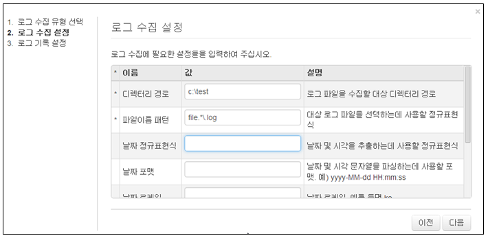

## 9.3. 센트리 에이전트

센트리는 자체적으로 로그를 수집하는 설정을 등록할 수 있는 기능이 없고 서버와 연결되어 서버로부터 로그 수집에 대한 로거를 관리 받습니다. 서버의 "로그수집설정" 메뉴를 사용하여 센트리에서 수집할 로그 수집 유형별로 로그를 수집하여 서버로 전달합니다. 서버와 센트리의 통신은 SSL 통신을 기본으로 합니다.

센트리에서 수집하는 로그수집 유형은 서버의 로그 수집유형 설정 방법과 같다. 센트리가 수집한 로그는 서버로 전달되어 서버의 테이블에 저장되어 관리됩니다.

1) 서버의 메인메뉴에서 "로그수집설정" 메뉴에서 센트리의 로그 수집을 설정합니다.

* "로그수집설정" 메인메뉴의 왼쪽에서 "센트리" 항목에 연결되어 있는 "linux"를 선택합니다.
	\- linux는 센트리 에이전트의 연결이름입니다.
* 센트리 메인 메뉴에서 "로그수집" 메뉴를 선택한 후 "수집설정추가" 메뉴를 선택합니다.

2) 로그수집유형에서 "디렉터리 와처" 유형을 선택한 후 "다음" 메뉴를 선택합니다.

3) 디렉터리 와처 입력 값을 입력합니다.

* 디렉터리 경로: 로그 파일이 위치하는 파일시스템 경로를 의미합니다.
* 파일이름 패턴: 디렉터리 경로에 존재하는 파일 중 이름이 정규표현식 패턴에 일치하는 경우에만 수집합니다. 정규표현식 그룹을 쓰는 경우 파일 이름에서 날짜 문자열을 추출합니다.
* 날짜 정규표현식: 로그에서 날짜 문자열을 추출합니다. 정규표현식 그룹으로 묶인 모든 부분을 이어붙여서 하나의 날짜 문자열을 만들어낸다. 파일이름 정규표현식의 그룹으로 추출된 날짜문자열은 가장 앞 부분에 위치합니다.
* 날짜 포맷: 날짜 문자열을 파싱하는데 사용할 날짜 포맷을 설정합니다. (예: yyyy-MM-dd HH:mm:ss)
* 날짜 로케일: 날짜 문자열의 로케일. 가령 날짜 파싱 포맷의 지시자 중 MMM의 해석은 로케일에 따라 “Jan” 혹은 “1월”로 해석됩니다.  기본값은 en입니다.
* 로그 시작 정규식:  로그의 시작 부분을 인식하는 정규표현식을 지정합니다. 멀티라인 로그의 경우에 사용되며, 지정하지 않으면 줄 단위로 읽어들입니다.
* 로그 끝 정규식:  로그의 끝 부분을 인식하는 정규표현식을 지정합니다. 멀티라인 로그의 경우에 사용되며, 지정하지 않으면 줄 단위로 읽어들입니다.
* 문자집합: 텍스트 파일 해석에 사용할 문자집합 코드를 입력합니다. 기본값은 utf-8입니다.

3) 로거이름 입력 및 로그를 저장할 테이블을 선택한 후 "생성" 메뉴를 선택하여 완료합니다.

